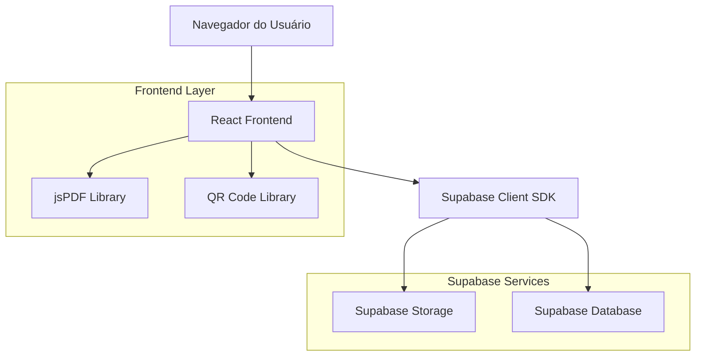

# MIT License
# Autor atual: David Assef
# Descrição: Arquitetura Técnica - Sistema de Assinaturas e Recibos ReciboFast
# Data: 06-09-2025

# Arquitetura Técnica - Sistema de Assinaturas e Recibos

## 1. Arquitetura Geral



## 2. Stack Tecnológico

- **Frontend**: React@18 + TypeScript + Vite + Tailwind CSS
- **Storage**: Supabase Storage (buckets: signatures, receipts)
- **Database**: Supabase PostgreSQL
- **PDF Generation**: jsPDF@2.5.1
- **QR Code**: qrcode@1.5.3
- **Image Processing**: Canvas API nativa
- **State Management**: Zustand (existente)
- **Validation**: Zod (existente)

## 3. Definições de Rotas

| Rota | Propósito |
|------|----------|
| /assinaturas | Página de gerenciamento de assinaturas digitais |
| /recibos/gerar | Página de geração de novos recibos |
| /recibos/historico | Histórico de recibos gerados |
| /recibos/verificar | Verificação de autenticidade de recibos |

## 4. Estrutura de Componentes

### 4.1 Componentes de Assinatura

```typescript
// Componente principal de upload
interface SignatureUploadProps {
  onUploadSuccess: (signature: Signature) => void;
  maxFileSize?: number;
  acceptedFormats?: string[];
}

// Galeria de assinaturas
interface SignatureGalleryProps {
  signatures: Signature[];
  selectedId?: string;
  onSelect: (signature: Signature) => void;
  onDelete: (id: string) => void;
}

// Preview de assinatura
interface SignaturePreviewProps {
  signature: Signature;
  scale?: number;
  onScaleChange?: (scale: number) => void;
}
```

### 4.2 Componentes de Recibo

```typescript
// Formulário de recibo
interface ReceiptFormProps {
  onSubmit: (data: ReceiptData) => void;
  initialData?: Partial<ReceiptData>;
}

// Gerador de PDF
interface PDFGeneratorProps {
  receiptData: ReceiptData;
  signature: Signature;
  onGenerate: (pdfBlob: Blob) => void;
}

// Visualizador de recibo
interface ReceiptViewerProps {
  receipt: Receipt;
  showActions?: boolean;
}
```

## 5. Tipos TypeScript

### 5.1 Tipos de Assinatura

```typescript
interface Signature {
  id: string;
  user_id: string;
  name: string;
  file_path: string;
  file_url: string;
  file_size: number;
  mime_type: string;
  width: number;
  height: number;
  is_active: boolean;
  created_at: string;
  updated_at: string;
}

interface SignatureUploadData {
  name: string;
  file: File;
}

interface SignatureValidation {
  isValid: boolean;
  errors: string[];
  warnings: string[];
}
```

### 5.2 Tipos de Recibo

```typescript
interface ReceiptData {
  tenant_name: string;
  tenant_document: string;
  property_address: string;
  amount: number;
  competence_month: number;
  competence_year: number;
  due_date: string;
  payment_date: string;
  observations?: string;
  signature_id: string;
}

interface Receipt {
  id: string;
  user_id: string;
  receipt_number: string;
  tenant_name: string;
  tenant_document: string;
  property_address: string;
  amount: number;
  competence_month: number;
  competence_year: number;
  due_date: string;
  payment_date: string;
  observations?: string;
  signature_id: string;
  pdf_path?: string;
  pdf_url?: string;
  qr_code: string;
  hash: string;
  created_at: string;
}

interface PDFTemplate {
  pageSize: 'a4' | 'letter';
  orientation: 'portrait' | 'landscape';
  margins: {
    top: number;
    right: number;
    bottom: number;
    left: number;
  };
  fonts: {
    title: number;
    subtitle: number;
    body: number;
  };
}
```

## 6. Serviços e APIs

### 6.1 Serviço de Assinaturas

```typescript
class SignatureService {
  // Upload de assinatura
  async uploadSignature(data: SignatureUploadData): Promise<Signature>
  
  // Listar assinaturas do usuário
  async getUserSignatures(): Promise<Signature[]>
  
  // Obter assinatura por ID
  async getSignature(id: string): Promise<Signature>
  
  // Definir assinatura ativa
  async setActiveSignature(id: string): Promise<void>
  
  // Excluir assinatura
  async deleteSignature(id: string): Promise<void>
  
  // Validar arquivo de assinatura
  validateSignatureFile(file: File): SignatureValidation
}
```

### 6.2 Serviço de Recibos

```typescript
class ReceiptService {
  // Gerar recibo
  async generateReceipt(data: ReceiptData): Promise<Receipt>
  
  // Listar recibos do usuário
  async getUserReceipts(filters?: ReceiptFilters): Promise<Receipt[]>
  
  // Obter recibo por ID
  async getReceipt(id: string): Promise<Receipt>
  
  // Verificar autenticidade
  async verifyReceipt(hash: string): Promise<Receipt | null>
  
  // Gerar PDF
  async generatePDF(receipt: Receipt, signature: Signature): Promise<Blob>
}
```

## 7. Estrutura do Banco de Dados

### 7.1 Tabela de Assinaturas

```sql
CREATE TABLE rf_signatures (
    id UUID PRIMARY KEY DEFAULT gen_random_uuid(),
    user_id UUID NOT NULL REFERENCES auth.users(id) ON DELETE CASCADE,
    name VARCHAR(255) NOT NULL,
    file_path TEXT NOT NULL,
    file_url TEXT,
    file_size INTEGER NOT NULL,
    mime_type VARCHAR(50) NOT NULL,
    width INTEGER NOT NULL,
    height INTEGER NOT NULL,
    is_active BOOLEAN DEFAULT false,
    created_at TIMESTAMP WITH TIME ZONE DEFAULT NOW(),
    updated_at TIMESTAMP WITH TIME ZONE DEFAULT NOW()
);

-- Índices
CREATE INDEX idx_signatures_user_id ON rf_signatures(user_id);
CREATE INDEX idx_signatures_active ON rf_signatures(user_id, is_active) WHERE is_active = true;

-- RLS Policies
ALTER TABLE rf_signatures ENABLE ROW LEVEL SECURITY;

CREATE POLICY "Users can view own signatures" ON rf_signatures
    FOR SELECT USING (auth.uid() = user_id);

CREATE POLICY "Users can insert own signatures" ON rf_signatures
    FOR INSERT WITH CHECK (auth.uid() = user_id);

CREATE POLICY "Users can update own signatures" ON rf_signatures
    FOR UPDATE USING (auth.uid() = user_id);

CREATE POLICY "Users can delete own signatures" ON rf_signatures
    FOR DELETE USING (auth.uid() = user_id);
```

### 7.2 Tabela de Recibos

```sql
CREATE TABLE rf_receipts (
    id UUID PRIMARY KEY DEFAULT gen_random_uuid(),
    user_id UUID NOT NULL REFERENCES auth.users(id) ON DELETE CASCADE,
    receipt_number VARCHAR(50) NOT NULL,
    tenant_name VARCHAR(255) NOT NULL,
    tenant_document VARCHAR(50) NOT NULL,
    property_address TEXT NOT NULL,
    amount DECIMAL(10,2) NOT NULL,
    competence_month INTEGER NOT NULL CHECK (competence_month BETWEEN 1 AND 12),
    competence_year INTEGER NOT NULL CHECK (competence_year >= 2020),
    due_date DATE NOT NULL,
    payment_date DATE NOT NULL,
    observations TEXT,
    signature_id UUID NOT NULL REFERENCES rf_signatures(id),
    pdf_path TEXT,
    pdf_url TEXT,
    qr_code TEXT NOT NULL,
    hash VARCHAR(64) NOT NULL UNIQUE,
    created_at TIMESTAMP WITH TIME ZONE DEFAULT NOW()
);

-- Índices
CREATE INDEX idx_receipts_user_id ON rf_receipts(user_id);
CREATE INDEX idx_receipts_hash ON rf_receipts(hash);
CREATE INDEX idx_receipts_date ON rf_receipts(user_id, created_at DESC);
CREATE UNIQUE INDEX idx_receipts_number_user ON rf_receipts(user_id, receipt_number);

-- RLS Policies
ALTER TABLE rf_receipts ENABLE ROW LEVEL SECURITY;

CREATE POLICY "Users can view own receipts" ON rf_receipts
    FOR SELECT USING (auth.uid() = user_id);

CREATE POLICY "Users can insert own receipts" ON rf_receipts
    FOR INSERT WITH CHECK (auth.uid() = user_id);

-- Policy para verificação pública de recibos (apenas leitura por hash)
CREATE POLICY "Public can verify receipts by hash" ON rf_receipts
    FOR SELECT USING (true);
```

## 8. Configuração do Storage

### 8.1 Buckets do Supabase

```sql
-- Bucket para assinaturas
INSERT INTO storage.buckets (id, name, public, file_size_limit, allowed_mime_types)
VALUES (
    'signatures',
    'signatures',
    false,
    2097152, -- 2MB
    ARRAY['image/png']
);

-- Bucket para recibos (opcional)
INSERT INTO storage.buckets (id, name, public, file_size_limit, allowed_mime_types)
VALUES (
    'receipts',
    'receipts',
    false,
    10485760, -- 10MB
    ARRAY['application/pdf']
);
```

### 8.2 Políticas de Storage

```sql
-- Políticas para bucket signatures
CREATE POLICY "Users can upload own signatures" ON storage.objects
    FOR INSERT WITH CHECK (
        bucket_id = 'signatures' AND 
        auth.uid()::text = (storage.foldername(name))[1]
    );

CREATE POLICY "Users can view own signatures" ON storage.objects
    FOR SELECT USING (
        bucket_id = 'signatures' AND 
        auth.uid()::text = (storage.foldername(name))[1]
    );

CREATE POLICY "Users can delete own signatures" ON storage.objects
    FOR DELETE USING (
        bucket_id = 'signatures' AND 
        auth.uid()::text = (storage.foldername(name))[1]
    );

-- Políticas para bucket receipts
CREATE POLICY "Users can upload own receipts" ON storage.objects
    FOR INSERT WITH CHECK (
        bucket_id = 'receipts' AND 
        auth.uid()::text = (storage.foldername(name))[1]
    );

CREATE POLICY "Users can view own receipts" ON storage.objects
    FOR SELECT USING (
        bucket_id = 'receipts' AND 
        auth.uid()::text = (storage.foldername(name))[1]
    );
```

## 9. Validações e Segurança

### 9.1 Validações de Upload

- **Formato**: Apenas PNG aceito
- **Tamanho**: Máximo 2MB por arquivo
- **Dimensões**: Mínimo 100x50px, máximo 2000x1000px
- **Transparência**: Verificação de canal alpha
- **Conteúdo**: Validação básica de estrutura PNG

### 9.2 Segurança

- **Autenticação**: JWT Supabase obrigatório
- **Autorização**: RLS por user_id
- **Sanitização**: Nomes de arquivo limpos
- **Rate Limiting**: Máximo 10 uploads por hora
- **Validação**: Verificação de MIME type no servidor

## 10. Performance e Otimização

### 10.1 Estratégias de Cache

- **Assinaturas**: Cache local com IndexedDB
- **Thumbnails**: Geração automática e cache
- **PDFs**: Cache temporário no localStorage

### 10.2 Otimizações

- **Lazy Loading**: Componentes carregados sob demanda
- **Image Compression**: Redimensionamento automático
- **PDF Streaming**: Geração progressiva para arquivos grandes
- **Debounce**: Validações com delay para melhor UX
