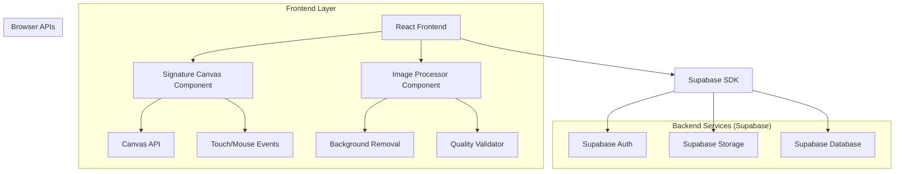
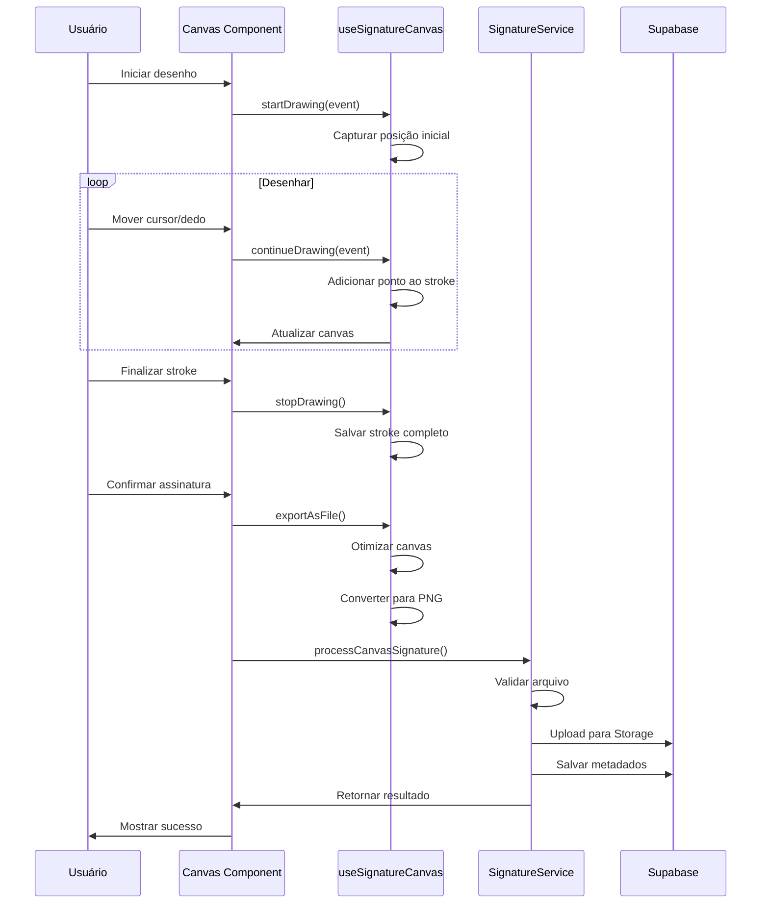
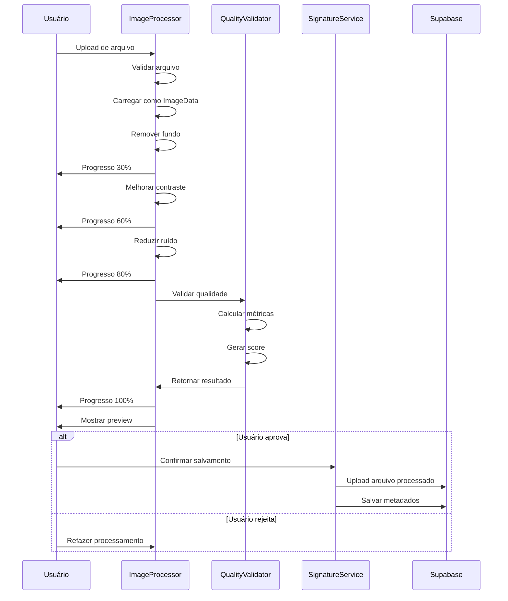

# MIT License
# Autor atual: David Assef
# Descrição: Arquitetura técnica detalhada para o sistema de assinaturas digitais
# Data: 30-01-2025

# 🏗️ ARQUITETURA TÉCNICA - SISTEMA DE ASSINATURAS DIGITAIS

## 1. Arquitetura Geral



## 2. Stack Tecnológico

- **Frontend**: React@18 + TypeScript + Vite + Tailwind CSS
- **Canvas**: HTML5 Canvas API + Touch Events
- **Processamento**: Client-side image processing libraries
- **Backend**: Supabase (Auth + Storage + PostgreSQL)
- **Validação**: Zod para schemas TypeScript
- **UI Components**: shadcn/ui + Lucide React icons

## 3. Definições de Rotas

| Rota | Propósito | Componente Principal |
|------|-----------|---------------------|
| /signatures | Página de gerenciamento de assinaturas | SignaturesPage |
| /signatures (modal) | Modal de criação de assinatura | SignatureCreationModal |
| /signatures/canvas (modal) | Interface de desenho digital | SignatureCanvasModal |
| /signatures/upload (modal) | Interface de upload melhorada | SignatureUploadModal |

## 4. Componentes React Detalhados

### 4.1 Componentes Principais

```typescript
// SignatureCreationModal.tsx
export interface SignatureCreationModalProps {
  isOpen: boolean;
  onClose: () => void;
  onSuccess: (signatureId: string) => void;
}

// SignatureCanvasModal.tsx
export interface SignatureCanvasModalProps {
  isOpen: boolean;
  onClose: () => void;
  onSave: (canvasData: SignatureCanvasData) => Promise<void>;
  canvasConfig?: {
    width: number;
    height: number;
    strokeWidth: number;
    strokeColor: string;
  };
}

// ImageProcessor.tsx
export interface ImageProcessorProps {
  imageFile: File;
  onProcessingStart: () => void;
  onProcessingProgress: (progress: number) => void;
  onProcessingComplete: (result: ProcessedImageResult) => void;
  onProcessingError: (error: ProcessingError) => void;
}

// SignaturePreviewModal.tsx
export interface SignaturePreviewModalProps {
  isOpen: boolean;
  signatureData: {
    imageUrl: string;
    metadata: SignatureMetadata;
    qualityScore: number;
  };
  onConfirm: () => Promise<void>;
  onReject: () => void;
  onClose: () => void;
}
```

### 4.2 Hooks Personalizados

```typescript
// useSignatureCanvas.ts
export interface UseSignatureCanvasReturn {
  // Canvas reference
  canvasRef: RefObject<HTMLCanvasElement>;
  
  // Drawing state
  isDrawing: boolean;
  currentStroke: Point[];
  allStrokes: Stroke[];
  
  // Canvas settings
  strokeWidth: number;
  strokeColor: string;
  canvasSize: { width: number; height: number };
  
  // Drawing methods
  startDrawing: (event: MouseEvent | TouchEvent) => void;
  continueDrawing: (event: MouseEvent | TouchEvent) => void;
  stopDrawing: () => void;
  
  // Canvas operations
  clearCanvas: () => void;
  undoLastStroke: () => void;
  redoStroke: () => void;
  
  // Settings
  setStrokeWidth: (width: number) => void;
  setStrokeColor: (color: string) => void;
  
  // Export
  exportAsFile: (fileName: string) => Promise<File>;
  exportAsDataURL: () => string;
  
  // Validation
  hasContent: boolean;
  isValidSignature: boolean;
}

// useImageProcessing.ts
export interface UseImageProcessingReturn {
  // Processing state
  isProcessing: boolean;
  processingStep: ProcessingStep;
  progress: number;
  
  // Results
  originalImage: string | null;
  processedImage: string | null;
  processingResult: ProcessingResult | null;
  
  // Methods
  processImage: (file: File) => Promise<ProcessingResult>;
  removeBackground: (imageData: ImageData) => Promise<ImageData>;
  validateQuality: (imageData: ImageData) => QualityValidation;
  enhanceContrast: (imageData: ImageData) => ImageData;
  
  // Reset
  reset: () => void;
}

// useSignatureValidation.ts
export interface UseSignatureValidationReturn {
  validateFile: (file: File) => FileValidationResult;
  validateCanvas: (canvas: HTMLCanvasElement) => CanvasValidationResult;
  validateQuality: (imageData: ImageData) => QualityValidationResult;
  
  // Real-time validation
  isValidating: boolean;
  validationErrors: ValidationError[];
  validationWarnings: ValidationWarning[];
}
```

## 5. Serviços e Utilitários

### 5.1 SignatureService Estendido

```typescript
// services/signatureService.ts
class SignatureServiceExtended extends SignatureService {
  /**
   * Processa canvas para criar arquivo de assinatura
   */
  async processCanvasSignature(
    canvas: HTMLCanvasElement,
    userId: string,
    metadata: CanvasMetadata
  ): Promise<SignatureUploadResponse> {
    try {
      // 1. Validar canvas
      const validation = this.validateCanvas(canvas);
      if (!validation.isValid) {
        return { success: false, errors: validation.errors };
      }
      
      // 2. Otimizar canvas (trim, resize)
      const optimizedCanvas = await this.optimizeCanvas(canvas);
      
      // 3. Converter para arquivo PNG
      const file = await this.canvasToFile(optimizedCanvas, `signature_${Date.now()}.png`);
      
      // 4. Upload usando método existente
      return await this.uploadSignature(file, userId);
    } catch (error) {
      console.error('Erro ao processar assinatura do canvas:', error);
      return { success: false, message: 'Erro interno do servidor' };
    }
  }
  
  /**
   * Processa imagem para remover fundo
   */
  async processImageSignature(
    file: File,
    userId: string
  ): Promise<ProcessedSignatureResult> {
    try {
      // 1. Validação inicial
      const fileValidation = this.validateSignatureFile(file);
      if (!fileValidation.isValid) {
        return { success: false, errors: fileValidation.errors };
      }
      
      // 2. Carregar imagem
      const imageData = await this.loadImageData(file);
      
      // 3. Processar imagem
      const processingSteps = [
        this.removeBackground,
        this.enhanceContrast,
        this.removeNoise,
        this.optimizeDimensions
      ];
      
      let processedData = imageData;
      for (const step of processingSteps) {
        processedData = await step(processedData);
      }
      
      // 4. Validar qualidade
      const qualityResult = this.validateQuality(processedData);
      
      // 5. Criar arquivo processado
      const processedFile = await this.imageDataToFile(
        processedData,
        `processed_${file.name}`
      );
      
      // 6. Upload
      const uploadResult = await this.uploadSignature(processedFile, userId);
      
      return {
        ...uploadResult,
        qualityScore: qualityResult.score,
        processingMetadata: {
          originalDimensions: { width: imageData.width, height: imageData.height },
          processedDimensions: { width: processedData.width, height: processedData.height },
          qualityChecks: qualityResult.checks,
          processingSteps: ['background_removal', 'contrast_enhancement', 'noise_reduction']
        }
      };
    } catch (error) {
      console.error('Erro ao processar imagem:', error);
      return { success: false, message: 'Erro no processamento da imagem' };
    }
  }
  
  /**
   * Otimiza canvas removendo espaços vazios
   */
  private async optimizeCanvas(canvas: HTMLCanvasElement): Promise<HTMLCanvasElement> {
    const ctx = canvas.getContext('2d')!;
    const imageData = ctx.getImageData(0, 0, canvas.width, canvas.height);
    
    // Encontrar bounding box do conteúdo
    const bounds = this.findContentBounds(imageData);
    
    // Criar novo canvas otimizado
    const optimizedCanvas = document.createElement('canvas');
    const optimizedCtx = optimizedCanvas.getContext('2d')!;
    
    // Adicionar padding
    const padding = 20;
    optimizedCanvas.width = bounds.width + (padding * 2);
    optimizedCanvas.height = bounds.height + (padding * 2);
    
    // Copiar conteúdo
    optimizedCtx.drawImage(
      canvas,
      bounds.x, bounds.y, bounds.width, bounds.height,
      padding, padding, bounds.width, bounds.height
    );
    
    return optimizedCanvas;
  }
  
  /**
   * Remove fundo de imagem
   */
  private async removeBackground(imageData: ImageData): Promise<ImageData> {
    const data = imageData.data;
    const width = imageData.width;
    const height = imageData.height;
    
    // Algoritmo de remoção de fundo baseado em limiar
    const threshold = 240;
    const tolerance = 30;
    
    for (let i = 0; i < data.length; i += 4) {
      const r = data[i];
      const g = data[i + 1];
      const b = data[i + 2];
      
      // Calcular luminância
      const luminance = 0.299 * r + 0.587 * g + 0.114 * b;
      
      // Se pixel é muito claro, tornar transparente
      if (luminance > threshold) {
        data[i + 3] = 0; // Alpha = 0
      } else if (luminance > threshold - tolerance) {
        // Transição suave para bordas
        const alpha = Math.max(0, 255 - ((luminance - (threshold - tolerance)) / tolerance) * 255);
        data[i + 3] = alpha;
      }
    }
    
    return imageData;
  }
  
  /**
   * Valida qualidade da assinatura
   */
  private validateQuality(imageData: ImageData): QualityValidationResult {
    const metrics = {
      contrast: this.calculateContrast(imageData),
      sharpness: this.calculateSharpness(imageData),
      coverage: this.calculateCoverage(imageData),
      aspectRatio: this.calculateAspectRatio(imageData)
    };
    
    // Calcular score ponderado
    const weights = { contrast: 0.3, sharpness: 0.25, coverage: 0.25, aspectRatio: 0.2 };
    const score = Object.entries(metrics).reduce((total, [key, value]) => {
      return total + (value * weights[key as keyof typeof weights]);
    }, 0);
    
    // Gerar checks e sugestões
    const checks: string[] = [];
    const suggestions: string[] = [];
    
    if (metrics.contrast > 70) checks.push('contrast_good');
    else suggestions.push('Use uma caneta mais escura ou papel mais claro');
    
    if (metrics.sharpness > 60) checks.push('sharpness_good');
    else suggestions.push('Mantenha a câmera mais estável');
    
    if (metrics.coverage > 10 && metrics.coverage < 80) checks.push('coverage_adequate');
    else suggestions.push('Ajuste o tamanho da assinatura na imagem');
    
    return {
      score: Math.round(score),
      isLegible: score >= 60,
      metrics,
      checks,
      suggestions
    };
  }
}
```

### 5.2 Processamento de Imagem

```typescript
// utils/imageProcessing.ts
export class ImageProcessor {
  /**
   * Carrega arquivo como ImageData
   */
  static async loadImageData(file: File): Promise<ImageData> {
    return new Promise((resolve, reject) => {
      const img = new Image();
      const canvas = document.createElement('canvas');
      const ctx = canvas.getContext('2d')!;
      
      img.onload = () => {
        canvas.width = img.width;
        canvas.height = img.height;
        ctx.drawImage(img, 0, 0);
        
        const imageData = ctx.getImageData(0, 0, canvas.width, canvas.height);
        resolve(imageData);
      };
      
      img.onerror = () => reject(new Error('Erro ao carregar imagem'));
      img.src = URL.createObjectURL(file);
    });
  }
  
  /**
   * Converte ImageData para File
   */
  static async imageDataToFile(imageData: ImageData, fileName: string): Promise<File> {
    const canvas = document.createElement('canvas');
    const ctx = canvas.getContext('2d')!;
    
    canvas.width = imageData.width;
    canvas.height = imageData.height;
    ctx.putImageData(imageData, 0, 0);
    
    return new Promise((resolve) => {
      canvas.toBlob((blob) => {
        const file = new File([blob!], fileName, { type: 'image/png' });
        resolve(file);
      }, 'image/png');
    });
  }
  
  /**
   * Encontra bounds do conteúdo na imagem
   */
  static findContentBounds(imageData: ImageData): ContentBounds {
    const { data, width, height } = imageData;
    let minX = width, minY = height, maxX = 0, maxY = 0;
    
    for (let y = 0; y < height; y++) {
      for (let x = 0; x < width; x++) {
        const alpha = data[(y * width + x) * 4 + 3];
        
        if (alpha > 0) {
          minX = Math.min(minX, x);
          minY = Math.min(minY, y);
          maxX = Math.max(maxX, x);
          maxY = Math.max(maxY, y);
        }
      }
    }
    
    return {
      x: minX,
      y: minY,
      width: maxX - minX + 1,
      height: maxY - minY + 1
    };
  }
  
  /**
   * Calcula contraste da imagem
   */
  static calculateContrast(imageData: ImageData): number {
    const { data } = imageData;
    let sum = 0;
    let sumSquares = 0;
    let count = 0;
    
    for (let i = 0; i < data.length; i += 4) {
      const alpha = data[i + 3];
      if (alpha > 0) {
        const luminance = 0.299 * data[i] + 0.587 * data[i + 1] + 0.114 * data[i + 2];
        sum += luminance;
        sumSquares += luminance * luminance;
        count++;
      }
    }
    
    if (count === 0) return 0;
    
    const mean = sum / count;
    const variance = (sumSquares / count) - (mean * mean);
    const standardDeviation = Math.sqrt(variance);
    
    // Normalizar para 0-100
    return Math.min(100, (standardDeviation / 128) * 100);
  }
  
  /**
   * Calcula nitidez usando detecção de bordas
   */
  static calculateSharpness(imageData: ImageData): number {
    const { data, width, height } = imageData;
    const sobelX = [-1, 0, 1, -2, 0, 2, -1, 0, 1];
    const sobelY = [-1, -2, -1, 0, 0, 0, 1, 2, 1];
    
    let edgeStrength = 0;
    let pixelCount = 0;
    
    for (let y = 1; y < height - 1; y++) {
      for (let x = 1; x < width - 1; x++) {
        let gx = 0, gy = 0;
        
        for (let ky = -1; ky <= 1; ky++) {
          for (let kx = -1; kx <= 1; kx++) {
            const idx = ((y + ky) * width + (x + kx)) * 4;
            const luminance = 0.299 * data[idx] + 0.587 * data[idx + 1] + 0.114 * data[idx + 2];
            const kernelIdx = (ky + 1) * 3 + (kx + 1);
            
            gx += luminance * sobelX[kernelIdx];
            gy += luminance * sobelY[kernelIdx];
          }
        }
        
        const magnitude = Math.sqrt(gx * gx + gy * gy);
        edgeStrength += magnitude;
        pixelCount++;
      }
    }
    
    const averageEdgeStrength = edgeStrength / pixelCount;
    return Math.min(100, (averageEdgeStrength / 255) * 100);
  }
}
```

## 6. Estrutura de Dados

### 6.1 Tipos TypeScript Estendidos

```typescript
// types/signatureExtended.ts

// Canvas-related types
export interface Point {
  x: number;
  y: number;
  pressure?: number;
  timestamp: number;
}

export interface Stroke {
  points: Point[];
  strokeWidth: number;
  strokeColor: string;
  startTime: number;
  endTime: number;
}

export interface SignatureCanvasData {
  strokes: Stroke[];
  canvasSize: { width: number; height: number };
  metadata: CanvasMetadata;
}

export interface CanvasMetadata {
  deviceType: 'mouse' | 'touch' | 'pen';
  hasPressure: boolean;
  totalDrawTime: number;
  strokeCount: number;
  averageStrokeLength: number;
}

// Processing-related types
export interface ProcessingStep {
  name: string;
  description: string;
  progress: number;
  completed: boolean;
}

export interface ProcessingResult {
  success: boolean;
  originalImageUrl: string;
  processedImageUrl: string;
  qualityScore: number;
  processingTime: number;
  metadata: ProcessingMetadata;
}

export interface ProcessingMetadata {
  backgroundRemoved: boolean;
  contrastEnhanced: boolean;
  noiseReduced: boolean;
  dimensionsOptimized: boolean;
  originalSize: { width: number; height: number; fileSize: number };
  processedSize: { width: number; height: number; fileSize: number };
  qualityMetrics: QualityMetrics;
}

export interface QualityMetrics {
  contrast: number;
  sharpness: number;
  coverage: number;
  aspectRatio: number;
  overallScore: number;
}

// Validation types
export interface ValidationError {
  code: string;
  message: string;
  severity: 'error' | 'warning' | 'info';
}

export interface FileValidationResult {
  isValid: boolean;
  errors: ValidationError[];
  warnings: ValidationError[];
  fileInfo: {
    size: number;
    type: string;
    dimensions: { width: number; height: number };
  };
}

export interface QualityValidationResult {
  score: number;
  isLegible: boolean;
  metrics: QualityMetrics;
  checks: string[];
  suggestions: string[];
}

// Extended signature type
export interface SignatureExtended extends Signature {
  creation_method: 'upload' | 'canvas';
  quality_score?: number;
  processing_metadata?: ProcessingMetadata;
  canvas_data?: SignatureCanvasData;
}
```

### 6.2 Configurações e Constantes

```typescript
// config/signatureConfig.ts
export const SIGNATURE_CONFIG = {
  // File constraints
  maxFileSize: 2 * 1024 * 1024, // 2MB
  allowedMimeTypes: ['image/png'],
  minDimensions: { width: 100, height: 50 },
  maxDimensions: { width: 2000, height: 1000 },
  
  // Canvas settings
  canvas: {
    defaultSize: { width: 400, height: 200 },
    minSize: { width: 200, height: 100 },
    maxSize: { width: 800, height: 400 },
    defaultStrokeWidth: 2,
    minStrokeWidth: 1,
    maxStrokeWidth: 10,
    defaultStrokeColor: '#000000',
    backgroundColor: '#ffffff'
  },
  
  // Processing settings
  processing: {
    backgroundThreshold: 240,
    contrastEnhancement: 1.2,
    noiseReductionRadius: 1,
    qualityThreshold: 60
  },
  
  // Validation thresholds
  validation: {
    minQualityScore: 40,
    minContrast: 30,
    minSharpness: 25,
    minCoverage: 5,
    maxCoverage: 85
  }
} as const;

export const PROCESSING_STEPS = [
  { name: 'loading', description: 'Carregando imagem...', weight: 10 },
  { name: 'background_removal', description: 'Removendo fundo...', weight: 30 },
  { name: 'contrast_enhancement', description: 'Melhorando contraste...', weight: 20 },
  { name: 'noise_reduction', description: 'Reduzindo ruído...', weight: 15 },
  { name: 'quality_validation', description: 'Validando qualidade...', weight: 15 },
  { name: 'optimization', description: 'Otimizando resultado...', weight: 10 }
] as const;
```

## 7. Banco de Dados

### 7.1 Extensões da Tabela Signatures

```sql
-- Adicionar colunas para funcionalidades estendidas
ALTER TABLE signatures ADD COLUMN IF NOT EXISTS creation_method VARCHAR(10) DEFAULT 'upload' 
  CHECK (creation_method IN ('upload', 'canvas'));

ALTER TABLE signatures ADD COLUMN IF NOT EXISTS quality_score DECIMAL(5,2) 
  CHECK (quality_score >= 0 AND quality_score <= 100);

ALTER TABLE signatures ADD COLUMN IF NOT EXISTS processing_metadata JSONB;

ALTER TABLE signatures ADD COLUMN IF NOT EXISTS canvas_data JSONB;

-- Índices para performance
CREATE INDEX IF NOT EXISTS idx_signatures_creation_method ON signatures(creation_method);
CREATE INDEX IF NOT EXISTS idx_signatures_quality_score ON signatures(quality_score DESC);
CREATE INDEX IF NOT EXISTS idx_signatures_processing_metadata ON signatures USING GIN(processing_metadata);

-- Função para validar metadados
CREATE OR REPLACE FUNCTION validate_signature_metadata()
RETURNS TRIGGER AS $$
BEGIN
  -- Validar que canvas_data existe apenas para creation_method = 'canvas'
  IF NEW.creation_method = 'canvas' AND NEW.canvas_data IS NULL THEN
    RAISE EXCEPTION 'canvas_data é obrigatório para assinaturas do tipo canvas';
  END IF;
  
  -- Validar que processing_metadata existe para upload processado
  IF NEW.creation_method = 'upload' AND NEW.quality_score IS NOT NULL AND NEW.processing_metadata IS NULL THEN
    RAISE EXCEPTION 'processing_metadata é obrigatório para uploads processados';
  END IF;
  
  RETURN NEW;
END;
$$ LANGUAGE plpgsql;

-- Trigger para validação
CREATE TRIGGER validate_signature_metadata_trigger
  BEFORE INSERT OR UPDATE ON signatures
  FOR EACH ROW EXECUTE FUNCTION validate_signature_metadata();
```

### 7.2 Estrutura de Metadados JSONB

```sql
-- Exemplo de processing_metadata para upload
{
  "background_removed": true,
  "contrast_enhanced": true,
  "noise_reduced": true,
  "original_dimensions": {
    "width": 800,
    "height": 400
  },
  "processed_dimensions": {
    "width": 600,
    "height": 200
  },
  "quality_metrics": {
    "contrast": 75.5,
    "sharpness": 68.2,
    "coverage": 45.8,
    "aspect_ratio": 85.0
  },
  "processing_steps": [
    "background_removal",
    "contrast_enhancement",
    "noise_reduction"
  ],
  "processing_time_ms": 2340
}

-- Exemplo de canvas_data para desenho digital
{
  "strokes": [
    {
      "points": [
        {"x": 10, "y": 20, "timestamp": 1643723400000},
        {"x": 15, "y": 25, "timestamp": 1643723400050}
      ],
      "stroke_width": 2,
      "stroke_color": "#000000",
      "start_time": 1643723400000,
      "end_time": 1643723401000
    }
  ],
  "canvas_size": {
    "width": 400,
    "height": 200
  },
  "device_metadata": {
    "type": "touch",
    "has_pressure": false,
    "total_draw_time": 15000,
    "stroke_count": 12
  }
}
```

## 8. Fluxos de Dados

### 8.1 Fluxo de Criação por Canvas



### 8.2 Fluxo de Processamento de Imagem



## 9. Otimizações de Performance

### 9.1 Canvas Performance

```typescript
// Otimizações para canvas responsivo
class CanvasOptimizer {
  private static readonly RAF_THROTTLE = 16; // ~60fps
  
  /**
   * Throttle de eventos de desenho para 60fps
   */
  static throttleDrawing(callback: Function): Function {
    let lastTime = 0;
    
    return function(this: any, ...args: any[]) {
      const now = performance.now();
      if (now - lastTime >= CanvasOptimizer.RAF_THROTTLE) {
        lastTime = now;
        requestAnimationFrame(() => callback.apply(this, args));
      }
    };
  }
  
  /**
   * Otimiza redraw do canvas
   */
  static optimizedRedraw(canvas: HTMLCanvasElement, strokes: Stroke[]) {
    const ctx = canvas.getContext('2d')!;
    
    // Usar compositing para melhor performance
    ctx.globalCompositeOperation = 'source-over';
    
    // Limpar apenas área necessária
    ctx.clearRect(0, 0, canvas.width, canvas.height);
    
    // Desenhar strokes em batch
    ctx.beginPath();
    strokes.forEach(stroke => {
      ctx.strokeStyle = stroke.strokeColor;
      ctx.lineWidth = stroke.strokeWidth;
      ctx.lineCap = 'round';
      ctx.lineJoin = 'round';
      
      stroke.points.forEach((point, index) => {
        if (index === 0) {
          ctx.moveTo(point.x, point.y);
        } else {
          ctx.lineTo(point.x, point.y);
        }
      });
    });
    ctx.stroke();
  }
}
```

### 9.2 Image Processing Performance

```typescript
// Web Workers para processamento pesado
// workers/imageProcessor.worker.ts
self.onmessage = function(e) {
  const { imageData, operation, params } = e.data;
  
  let result;
  switch (operation) {
    case 'removeBackground':
      result = removeBackgroundWorker(imageData, params);
      break;
    case 'enhanceContrast':
      result = enhanceContrastWorker(imageData, params);
      break;
    case 'calculateQuality':
      result = calculateQualityWorker(imageData);
      break;
  }
  
  self.postMessage({ result, operation });
};

function removeBackgroundWorker(imageData: ImageData, params: any): ImageData {
  // Processamento em worker thread
  const data = imageData.data;
  const threshold = params.threshold || 240;
  
  for (let i = 0; i < data.length; i += 4) {
    const luminance = 0.299 * data[i] + 0.587 * data[i + 1] + 0.114 * data[i + 2];
    if (luminance > threshold) {
      data[i + 3] = 0;
    }
  }
  
  return imageData;
}
```

## 10. Testes e Validação

### 10.1 Testes de Componentes

```typescript
// __tests__/SignatureCanvas.test.tsx
import { render, fireEvent, screen } from '@testing-library/react';
import { SignatureCanvas } from '../components/SignatureCanvas';

describe('SignatureCanvas', () => {
  it('deve iniciar desenho ao clicar', () => {
    const onSignatureComplete = jest.fn();
    render(<SignatureCanvas onSignatureComplete={onSignatureComplete} />);
    
    const canvas = screen.getByRole('img'); // Canvas tem role img
    fireEvent.mouseDown(canvas, { clientX: 10, clientY: 10 });
    
    expect(canvas).toHaveAttribute('data-drawing', 'true');
  });
  
  it('deve capturar pontos durante o desenho', () => {
    const onSignatureComplete = jest.fn();
    const { container } = render(<SignatureCanvas onSignatureComplete={onSignatureComplete} />);
    
    const canvas = container.querySelector('canvas')!;
    
    // Simular sequência de desenho
    fireEvent.mouseDown(canvas, { clientX: 10, clientY: 10 });
    fireEvent.mouseMove(canvas, { clientX: 20, clientY: 20 });
    fireEvent.mouseMove(canvas, { clientX: 30, clientY: 30 });
    fireEvent.mouseUp(canvas);
    
    // Verificar se stroke foi capturado
    expect(onSignatureComplete).not.toHaveBeenCalled(); // Ainda não finalizou
  });
  
  it('deve exportar assinatura como arquivo', async () => {
    const onSignatureComplete = jest.fn();
    render(<SignatureCanvas onSignatureComplete={onSignatureComplete} />);
    
    // Simular desenho e finalização
    // ... código de desenho ...
    
    const exportButton = screen.getByText('Finalizar');
    fireEvent.click(exportButton);
    
    await waitFor(() => {
      expect(onSignatureComplete).toHaveBeenCalledWith(
        expect.objectContaining({
          strokes: expect.any(Array),
          canvasSize: expect.any(Object)
        })
      );
    });
  });
});
```

### 10.2 Testes de Processamento

```typescript
// __tests__/imageProcessing.test.ts
import { ImageProcessor } from '../utils/imageProcessing';

describe('ImageProcessor', () => {
  let mockImageData: ImageData;
  
  beforeEach(() => {
    // Criar ImageData mock
    const canvas = document.createElement('canvas');
    canvas.width = 100;
    canvas.height = 50;
    const ctx = canvas.getContext('2d')!;
    mockImageData = ctx.createImageData(100, 50);
  });
  
  it('deve calcular contraste corretamente', () => {
    // Preencher com dados de teste
    for (let i = 0; i < mockImageData.data.length; i += 4) {
      mockImageData.data[i] = 0;     // R
      mockImageData.data[i + 1] = 0; // G
      mockImageData.data[i + 2] = 0; // B
      mockImageData.data[i + 3] = 255; // A
    }
    
    const contrast = ImageProcessor.calculateContrast(mockImageData);
    expect(contrast).toBeGreaterThanOrEqual(0);
    expect(contrast).toBeLessThanOrEqual(100);
  });
  
  it('deve encontrar bounds do conteúdo', () => {
    // Criar conteúdo em área específica
    const bounds = ImageProcessor.findContentBounds(mockImageData);
    
    expect(bounds).toHaveProperty('x');
    expect(bounds).toHaveProperty('y');
    expect(bounds).toHaveProperty('width');
    expect(bounds).toHaveProperty('height');
  });
});
```

## 11. Monitoramento e Métricas

### 11.1 Métricas de Performance

```typescript
// utils/performanceMonitor.ts
export class PerformanceMonitor {
  private static metrics: Map<string, number[]> = new Map();
  
  static startTimer(operation: string): () => void {
    const startTime = performance.now();
    
    return () => {
      const duration = performance.now() - startTime;
      this.recordMetric(operation, duration);
    };
  }
  
  static recordMetric(operation: string, value: number) {
    if (!this.metrics.has(operation)) {
      this.metrics.set(operation, []);
    }
    
    const values = this.metrics.get(operation)!;
    values.push(value);
    
    // Manter apenas últimas 100 medições
    if (values.length > 100) {
      values.shift();
    }
  }
  
  static getMetrics(operation: string) {
    const values = this.metrics.get(operation) || [];
    if (values.length === 0) return null;
    
    const sorted = [...values].sort((a, b) => a - b);
    return {
      count: values.length,
      min: sorted[0],
      max: sorted[sorted.length - 1],
      avg: values.reduce((a, b) => a + b, 0) / values.length,
      p50: sorted[Math.floor(sorted.length * 0.5)],
      p95: sorted[Math.floor(sorted.length * 0.95)]
    };
  }
}

// Uso nos componentes
const processImage = async (file: File) => {
  const endTimer = PerformanceMonitor.startTimer('image_processing');
  
  try {
    const result = await imageProcessor.process(file);
    return result;
  } finally {
    endTimer();
  }
};
```

### 11.2 Error Tracking

```typescript
// utils/errorTracker.ts
export class ErrorTracker {
  static trackError(error: Error, context: string, metadata?: any) {
    const errorData = {
      message: error.message,
      stack: error.stack,
      context,
      metadata,
      timestamp: new Date().toISOString(),
      userAgent: navigator.userAgent,
      url: window.location.href
    };
    
    // Log local
    console.error('Error tracked:', errorData);
    
    // Enviar para serviço de monitoramento (opcional)
    // this.sendToMonitoringService(errorData);
  }
  
  static trackCanvasError(error: Error, canvasState: any) {
    this.trackError(error, 'canvas_drawing', {
      canvasSize: canvasState.canvasSize,
      strokeCount: canvasState.strokes?.length,
      isDrawing: canvasState.isDrawing
    });
  }
  
  static trackProcessingError(error: Error, fileInfo: any) {
    this.trackError(error, 'image_processing', {
      fileSize: fileInfo.size,
      fileType: fileInfo.type,
      dimensions: fileInfo.dimensions
    });
  }
}
```

---

**Status da Arquitetura**: 🏗️ Especificação Técnica Completa  
**Compatibilidade**: React 18+ | TypeScript 4.9+ | Supabase  
**Estimativa de Implementação**: 4 semanas  
**Próxima Etapa**: Implementação dos componentes de Canvas Digital