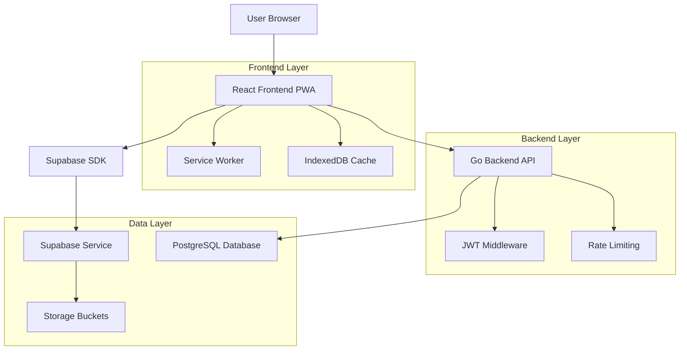
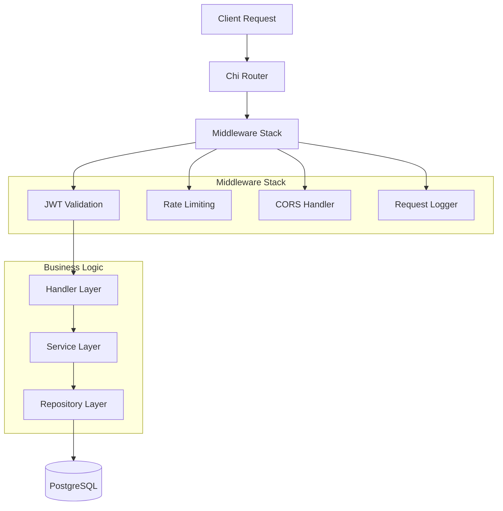
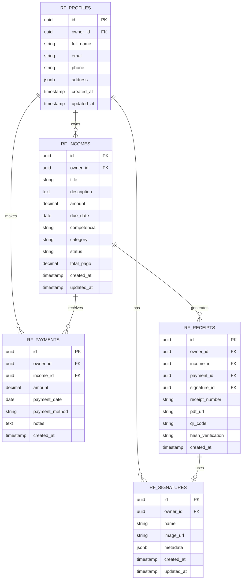

# MIT License
# Autor atual: David Assef
# Descrição: Documento de Arquitetura Técnica do ReciboFast
# Data: 30-08-2025

# 🏗️ ARQUITETURA TÉCNICA - RECIBOFAST

## 1. Architecture Design



## 2. Technology Description

- **Frontend**: React@18 + TypeScript + Vite + Tailwind CSS + PWA
- **Backend**: Go 1.23 + Chi Router + PostgreSQL
- **Database**: Supabase (PostgreSQL) + Row Level Security
- **Authentication**: Supabase Auth (Google OAuth + Email)
- **Storage**: Supabase Storage (assinaturas, recibos)
- **State Management**: Zustand + IndexedDB (Dexie)
- **Testing**: Vitest + Testing Library
- **Deployment**: Docker + Docker Compose

## 3. Route Definitions

| Route | Purpose |
|-------|----------|
| / | Página inicial com redirecionamento para dashboard ou login |
| /login | Página de autenticação com Google OAuth e email/senha |
| /dashboard | Dashboard principal com resumos financeiros e estatísticas |
| /receitas | Listagem e gerenciamento de receitas de aluguel |
| /receitas/nova | Formulário para criação de nova receita |
| /receitas/:id | Detalhes e edição de receita específica |
| /pagamentos | Histórico de pagamentos e baixas |
| /recibos | Listagem e geração de recibos em PDF |
| /recibos/:id | Visualização de recibo específico |
| /assinaturas | Gerenciamento de assinaturas digitais |
| /perfil | Configurações do usuário e dados pessoais |

## 4. API Definitions

### 4.1 Core API

**Autenticação**
```
POST /api/v1/auth/login
```
Request:
| Param Name | Param Type | isRequired | Description |
|------------|------------|------------|-------------|
| email | string | true | Email do usuário |
| password | string | true | Senha do usuário |

Response:
| Param Name | Param Type | Description |
|------------|------------|-------------|
| access_token | string | JWT token de acesso |
| user | object | Dados do usuário autenticado |

**Receitas**
```
GET /api/v1/incomes
POST /api/v1/incomes
GET /api/v1/incomes/{id}
PUT /api/v1/incomes/{id}
DELETE /api/v1/incomes/{id}
```

**Pagamentos**
```
POST /api/v1/payments
GET /api/v1/incomes/{id}/payments
```

**Sincronização**
```
GET /api/v1/sync/changes
```

Request:
| Param Name | Param Type | isRequired | Description |
|------------|------------|------------|-------------|
| since | string | false | Timestamp para sincronização incremental |
| cursor | string | false | Cursor para paginação |

Response:
| Param Name | Param Type | Description |
|------------|------------|-------------|
| changes | array | Lista de alterações desde o timestamp |
| cursor | string | Próximo cursor para paginação |
| has_more | boolean | Indica se há mais dados |

Example:
```json
{
  "since": "2025-01-21T10:00:00Z",
  "cursor": "eyJpZCI6MTIzfQ=="
}
```

## 5. Server Architecture Diagram



## 6. Data Model

### 6.1 Data Model Definition



### 6.2 Data Definition Language

**Tabela de Perfis (rf_profiles)**
```sql
-- Criar tabela
CREATE TABLE rf_profiles (
    id UUID PRIMARY KEY DEFAULT gen_random_uuid(),
    owner_id UUID NOT NULL REFERENCES auth.users(id) ON DELETE CASCADE,
    full_name VARCHAR(255) NOT NULL,
    email VARCHAR(255) NOT NULL,
    phone VARCHAR(20),
    address JSONB,
    created_at TIMESTAMP WITH TIME ZONE DEFAULT NOW(),
    updated_at TIMESTAMP WITH TIME ZONE DEFAULT NOW()
);

-- Criar índices
CREATE INDEX idx_rf_profiles_owner_id ON rf_profiles(owner_id);
CREATE INDEX idx_rf_profiles_email ON rf_profiles(email);

-- Políticas RLS
ALTER TABLE rf_profiles ENABLE ROW LEVEL SECURITY;
CREATE POLICY "Users can manage their own profiles" ON rf_profiles
    FOR ALL USING (owner_id = auth.uid());

-- Permissões
GRANT SELECT ON rf_profiles TO anon;
GRANT ALL PRIVILEGES ON rf_profiles TO authenticated;
```

**Tabela de Receitas (rf_incomes)**
```sql
-- Criar tabela
CREATE TABLE rf_incomes (
    id UUID PRIMARY KEY DEFAULT gen_random_uuid(),
    owner_id UUID NOT NULL REFERENCES auth.users(id) ON DELETE CASCADE,
    title VARCHAR(255) NOT NULL,
    description TEXT,
    amount DECIMAL(10,2) NOT NULL CHECK (amount > 0),
    due_date DATE NOT NULL,
    competencia VARCHAR(7) NOT NULL, -- YYYY-MM
    category VARCHAR(50) DEFAULT 'aluguel',
    status VARCHAR(20) DEFAULT 'pendente' CHECK (status IN ('pendente', 'pago', 'vencido')),
    total_pago DECIMAL(10,2) DEFAULT 0.00,
    created_at TIMESTAMP WITH TIME ZONE DEFAULT NOW(),
    updated_at TIMESTAMP WITH TIME ZONE DEFAULT NOW()
);

-- Criar índices
CREATE INDEX idx_rf_incomes_owner_id ON rf_incomes(owner_id);
CREATE INDEX idx_rf_incomes_due_date ON rf_incomes(due_date DESC);
CREATE INDEX idx_rf_incomes_competencia ON rf_incomes(competencia DESC);
CREATE INDEX idx_rf_incomes_status ON rf_incomes(status);

-- Trigger para atualizar updated_at
CREATE OR REPLACE FUNCTION update_updated_at_column()
RETURNS TRIGGER AS $$
BEGIN
    NEW.updated_at = NOW();
    RETURN NEW;
END;
$$ language 'plpgsql';

CREATE TRIGGER update_rf_incomes_updated_at
    BEFORE UPDATE ON rf_incomes
    FOR EACH ROW
    EXECUTE FUNCTION update_updated_at_column();

-- Políticas RLS
ALTER TABLE rf_incomes ENABLE ROW LEVEL SECURITY;
CREATE POLICY "Users can manage their own incomes" ON rf_incomes
    FOR ALL USING (owner_id = auth.uid());

-- Permissões
GRANT SELECT ON rf_incomes TO anon;
GRANT ALL PRIVILEGES ON rf_incomes TO authenticated;
```

**Tabela de Pagamentos (rf_payments)**
```sql
-- Criar tabela
CREATE TABLE rf_payments (
    id UUID PRIMARY KEY DEFAULT gen_random_uuid(),
    owner_id UUID NOT NULL REFERENCES auth.users(id) ON DELETE CASCADE,
    income_id UUID NOT NULL REFERENCES rf_incomes(id) ON DELETE CASCADE,
    amount DECIMAL(10,2) NOT NULL CHECK (amount > 0),
    payment_date DATE NOT NULL DEFAULT CURRENT_DATE,
    payment_method VARCHAR(50) DEFAULT 'dinheiro',
    notes TEXT,
    created_at TIMESTAMP WITH TIME ZONE DEFAULT NOW()
);

-- Criar índices
CREATE INDEX idx_rf_payments_owner_id ON rf_payments(owner_id);
CREATE INDEX idx_rf_payments_income_id ON rf_payments(income_id);
CREATE INDEX idx_rf_payments_date ON rf_payments(payment_date DESC);

-- Trigger para atualizar total_pago na receita
CREATE OR REPLACE FUNCTION update_income_total_pago()
RETURNS TRIGGER AS $$
BEGIN
    UPDATE rf_incomes 
    SET total_pago = (
        SELECT COALESCE(SUM(amount), 0) 
        FROM rf_payments 
        WHERE income_id = COALESCE(NEW.income_id, OLD.income_id)
    )
    WHERE id = COALESCE(NEW.income_id, OLD.income_id);
    
    RETURN COALESCE(NEW, OLD);
END;
$$ language 'plpgsql';

CREATE TRIGGER update_income_total_after_payment
    AFTER INSERT OR UPDATE OR DELETE ON rf_payments
    FOR EACH ROW
    EXECUTE FUNCTION update_income_total_pago();

-- Políticas RLS
ALTER TABLE rf_payments ENABLE ROW LEVEL SECURITY;
CREATE POLICY "Users can manage their own payments" ON rf_payments
    FOR ALL USING (owner_id = auth.uid());

-- Permissões
GRANT SELECT ON rf_payments TO anon;
GRANT ALL PRIVILEGES ON rf_payments TO authenticated;
```

**Buckets de Storage**
```sql
-- Criar buckets
INSERT INTO storage.buckets (id, name, public) VALUES 
('signatures', 'signatures', false),
('receipts', 'receipts', false);

-- Políticas para signatures
CREATE POLICY "Users can upload their own signatures" ON storage.objects
    FOR INSERT WITH CHECK (
        bucket_id = 'signatures' AND 
        auth.uid()::text = (storage.foldername(name))[1]
    );

CREATE POLICY "Users can view their own signatures" ON storage.objects
    FOR SELECT USING (
        bucket_id = 'signatures' AND 
        auth.uid()::text = (storage.foldername(name))[1]
    );

-- Políticas para receipts
CREATE POLICY "Users can upload their own receipts" ON storage.objects
    FOR INSERT WITH CHECK (
        bucket_id = 'receipts' AND 
        auth.uid()::text = (storage.foldername(name))[1]
    );

CREATE POLICY "Users can view their own receipts" ON storage.objects
    FOR SELECT USING (
        bucket_id = 'receipts' AND 
        auth.uid()::text = (storage.foldername(name))[1]
    );
```
