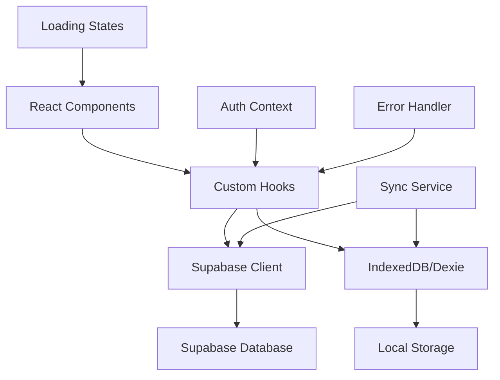

# MIT License
# Autor: David Assef
# Descrição: Documentação técnica da Fase 4 - CRUD Funcional de Receitas
# Data: 29-08-2025

# FASE 4 - CRUD FUNCIONAL DE RECEITAS

## 📋 Visão Geral

**Objetivo:** Implementar funcionalidades completas de CRUD para receitas, conectando o frontend React com o backend Supabase, incluindo sincronização offline e melhorias de UX.

**Status:** 🔄 Em Desenvolvimento  
**Prioridade:** Alta  
**Estimativa:** 2-3 semanas

## 🎯 Objetivos da Fase

### Funcionalidades Principais
- ✅ CRUD completo de receitas (Create, Read, Update, Delete)
- ✅ Integração frontend-backend via Supabase
- ✅ Sincronização offline com IndexedDB
- ✅ Validações de formulário robustas
- ✅ Estados de loading e feedback visual
- ✅ Sistema de notificações (toast)
- ✅ Tratamento de erros abrangente

## 🏗️ Arquitetura Técnica

### Stack Tecnológico
```
Frontend: React 18 + TypeScript + Vite
Backend: Supabase (PostgreSQL + Auth + Storage)
Cache Local: IndexedDB via Dexie
Estado Global: Zustand
Validação: Zod
Notificações: React Hot Toast
```

### Fluxo de Dados


## 📊 Estrutura de Dados

### Schema Supabase - Tabela `receitas`
```sql
CREATE TABLE receitas (
    id UUID PRIMARY KEY DEFAULT gen_random_uuid(),
    user_id UUID REFERENCES auth.users(id) ON DELETE CASCADE,
    titulo VARCHAR(255) NOT NULL,
    descricao TEXT,
    valor DECIMAL(10,2) NOT NULL CHECK (valor > 0),
    data_vencimento DATE NOT NULL,
    status VARCHAR(20) DEFAULT 'pendente' CHECK (status IN ('pendente', 'pago', 'vencido')),
    cliente_id UUID REFERENCES clientes(id),
    cliente_nome VARCHAR(255),
    categoria VARCHAR(100),
    observacoes TEXT,
    created_at TIMESTAMP WITH TIME ZONE DEFAULT NOW(),
    updated_at TIMESTAMP WITH TIME ZONE DEFAULT NOW(),
    synced_at TIMESTAMP WITH TIME ZONE
);

-- Índices para performance
CREATE INDEX idx_receitas_user_id ON receitas(user_id);
CREATE INDEX idx_receitas_status ON receitas(status);
CREATE INDEX idx_receitas_data_vencimento ON receitas(data_vencimento);
CREATE INDEX idx_receitas_cliente_id ON receitas(cliente_id);

-- RLS (Row Level Security)
ALTER TABLE receitas ENABLE ROW LEVEL SECURITY;

CREATE POLICY "Users can view own receitas" ON receitas
    FOR SELECT USING (auth.uid() = user_id);

CREATE POLICY "Users can insert own receitas" ON receitas
    FOR INSERT WITH CHECK (auth.uid() = user_id);

CREATE POLICY "Users can update own receitas" ON receitas
    FOR UPDATE USING (auth.uid() = user_id);

CREATE POLICY "Users can delete own receitas" ON receitas
    FOR DELETE USING (auth.uid() = user_id);
```

### TypeScript Interfaces
```typescript
// Tipos base
export interface Receita {
  id?: string;
  user_id?: string;
  titulo: string;
  descricao?: string;
  valor: number;
  data_vencimento: string;
  status: 'pendente' | 'pago' | 'vencido';
  cliente_id?: string;
  cliente_nome?: string;
  categoria?: string;
  observacoes?: string;
  created_at?: string;
  updated_at?: string;
  synced_at?: string;
}

// Tipos para formulários
export interface ReceitaFormData {
  titulo: string;
  descricao?: string;
  valor: string; // String para input, convertido para number
  data_vencimento: string;
  status: 'pendente' | 'pago' | 'vencido';
  cliente_nome?: string;
  categoria?: string;
  observacoes?: string;
}

// Tipos para filtros
export interface ReceitaFilters {
  status?: 'pendente' | 'pago' | 'vencido' | 'todos';
  data_inicio?: string;
  data_fim?: string;
  cliente?: string;
  categoria?: string;
  busca?: string;
}

// Tipos para paginação
export interface PaginationParams {
  page: number;
  limit: number;
  total?: number;
}

// Tipos para resposta da API
export interface ReceitasResponse {
  data: Receita[];
  count: number;
  page: number;
  limit: number;
  total_pages: number;
}
```

## 🔄 Sistema de Sincronização

### Estratégia Offline-First
```typescript
// Hook para sincronização
export const useSyncReceitas = () => {
  const [isSyncing, setIsSyncing] = useState(false);
  const [lastSync, setLastSync] = useState<Date | null>(null);
  
  const syncReceitas = async () => {
    setIsSyncing(true);
    try {
      // 1. Enviar mudanças locais para Supabase
      await syncLocalChangesToSupabase();
      
      // 2. Buscar mudanças do Supabase
      await syncSupabaseChangesToLocal();
      
      // 3. Resolver conflitos
      await resolveConflicts();
      
      setLastSync(new Date());
    } catch (error) {
      console.error('Erro na sincronização:', error);
      throw error;
    } finally {
      setIsSyncing(false);
    }
  };
  
  return { syncReceitas, isSyncing, lastSync };
};
```

### Resolução de Conflitos
```typescript
// Estratégia: Last Write Wins com timestamp
const resolveConflicts = async () => {
  const localReceitas = await receitasDB.getUnsyncedReceitas();
  const remoteReceitas = await supabase
    .from('receitas')
    .select('*')
    .gt('updated_at', lastSync);
    
  for (const localReceita of localReceitas) {
    const remoteReceita = remoteReceitas.find(r => r.id === localReceita.id);
    
    if (remoteReceita) {
      // Conflito detectado - usar timestamp mais recente
      const localTime = new Date(localReceita.updated_at!);
      const remoteTime = new Date(remoteReceita.updated_at!);
      
      if (remoteTime > localTime) {
        // Remoto é mais recente - atualizar local
        await receitasDB.update(localReceita.id!, remoteReceita);
      } else {
        // Local é mais recente - enviar para remoto
        await supabase
          .from('receitas')
          .update(localReceita)
          .eq('id', localReceita.id);
      }
    }
  }
};
```

## 🎨 Componentes e Hooks

### Hook Principal - useReceitas
```typescript
export const useReceitas = () => {
  const [receitas, setReceitas] = useState<Receita[]>([]);
  const [loading, setLoading] = useState(false);
  const [error, setError] = useState<string | null>(null);
  const { user } = useAuth();
  
  const fetchReceitas = async (filters?: ReceitaFilters) => {
    setLoading(true);
    setError(null);
    
    try {
      // Tentar buscar do Supabase primeiro
      const { data, error } = await supabase
        .from('receitas')
        .select('*')
        .eq('user_id', user?.id)
        .order('created_at', { ascending: false });
        
      if (error) throw error;
      
      setReceitas(data || []);
      
      // Atualizar cache local
      await receitasDB.bulkUpdate(data || []);
    } catch (err) {
      console.error('Erro ao buscar receitas:', err);
      
      // Fallback para dados locais
      const localReceitas = await receitasDB.getAll();
      setReceitas(localReceitas);
      
      setError('Dados carregados do cache local');
    } finally {
      setLoading(false);
    }
  };
  
  const createReceita = async (data: ReceitaFormData) => {
    setLoading(true);
    try {
      const receita: Receita = {
        ...data,
        valor: parseFloat(data.valor),
        user_id: user?.id,
        created_at: new Date().toISOString(),
        updated_at: new Date().toISOString()
      };
      
      // Salvar localmente primeiro
      const localId = await receitasDB.create(receita);
      
      // Tentar sincronizar com Supabase
      try {
        const { data: supabaseData, error } = await supabase
          .from('receitas')
          .insert(receita)
          .select()
          .single();
          
        if (error) throw error;
        
        // Atualizar com ID do Supabase
        await receitasDB.update(localId, { 
          ...supabaseData, 
          synced_at: new Date().toISOString() 
        });
        
        toast.success('Receita criada com sucesso!');
      } catch (syncError) {
        console.error('Erro na sincronização:', syncError);
        toast.success('Receita salva localmente. Será sincronizada quando possível.');
      }
      
      await fetchReceitas();
    } catch (err) {
      console.error('Erro ao criar receita:', err);
      setError('Erro ao criar receita');
      toast.error('Erro ao criar receita');
    } finally {
      setLoading(false);
    }
  };
  
  return {
    receitas,
    loading,
    error,
    fetchReceitas,
    createReceita,
    updateReceita,
    deleteReceita
  };
};
```

### Componente de Formulário
```typescript
interface ReceitaFormProps {
  receita?: Receita;
  onSubmit: (data: ReceitaFormData) => Promise<void>;
  onCancel: () => void;
}

export const ReceitaForm: React.FC<ReceitaFormProps> = ({
  receita,
  onSubmit,
  onCancel
}) => {
  const [formData, setFormData] = useState<ReceitaFormData>({
    titulo: receita?.titulo || '',
    descricao: receita?.descricao || '',
    valor: receita?.valor?.toString() || '',
    data_vencimento: receita?.data_vencimento || '',
    status: receita?.status || 'pendente',
    cliente_nome: receita?.cliente_nome || '',
    categoria: receita?.categoria || '',
    observacoes: receita?.observacoes || ''
  });
  
  const [errors, setErrors] = useState<Record<string, string>>({});
  const [isSubmitting, setIsSubmitting] = useState(false);
  
  const validateForm = (): boolean => {
    const newErrors: Record<string, string> = {};
    
    if (!formData.titulo.trim()) {
      newErrors.titulo = 'Título é obrigatório';
    }
    
    if (!formData.valor || parseFloat(formData.valor) <= 0) {
      newErrors.valor = 'Valor deve ser maior que zero';
    }
    
    if (!formData.data_vencimento) {
      newErrors.data_vencimento = 'Data de vencimento é obrigatória';
    }
    
    setErrors(newErrors);
    return Object.keys(newErrors).length === 0;
  };
  
  const handleSubmit = async (e: React.FormEvent) => {
    e.preventDefault();
    
    if (!validateForm()) return;
    
    setIsSubmitting(true);
    try {
      await onSubmit(formData);
    } catch (error) {
      console.error('Erro no formulário:', error);
    } finally {
      setIsSubmitting(false);
    }
  };
  
  return (
    <form onSubmit={handleSubmit} className="space-y-4">
      {/* Campos do formulário com validação */}
      <div className="flex gap-2">
        <button
          type="submit"
          disabled={isSubmitting}
          className="btn-primary"
        >
          {isSubmitting ? 'Salvando...' : 'Salvar'}
        </button>
        <button
          type="button"
          onClick={onCancel}
          className="btn-secondary"
        >
          Cancelar
        </button>
      </div>
    </form>
  );
};
```

## 🎯 Validações e Tratamento de Erros

### Schema de Validação com Zod
```typescript
import { z } from 'zod';

export const receitaSchema = z.object({
  titulo: z.string()
    .min(1, 'Título é obrigatório')
    .max(255, 'Título muito longo'),
  descricao: z.string().optional(),
  valor: z.number()
    .positive('Valor deve ser positivo')
    .max(999999.99, 'Valor muito alto'),
  data_vencimento: z.string()
    .refine(date => !isNaN(Date.parse(date)), 'Data inválida'),
  status: z.enum(['pendente', 'pago', 'vencido']),
  cliente_nome: z.string().optional(),
  categoria: z.string().optional(),
  observacoes: z.string().optional()
});

export type ReceitaValidated = z.infer<typeof receitaSchema>;
```

### Error Boundary
```typescript
export class ReceitasErrorBoundary extends React.Component<
  { children: React.ReactNode },
  { hasError: boolean; error?: Error }
> {
  constructor(props: { children: React.ReactNode }) {
    super(props);
    this.state = { hasError: false };
  }
  
  static getDerivedStateFromError(error: Error) {
    return { hasError: true, error };
  }
  
  componentDidCatch(error: Error, errorInfo: React.ErrorInfo) {
    console.error('Erro nas receitas:', error, errorInfo);
    // Enviar erro para serviço de monitoramento
  }
  
  render() {
    if (this.state.hasError) {
      return (
        <div className="error-fallback">
          <h2>Algo deu errado</h2>
          <p>Ocorreu um erro ao carregar as receitas.</p>
          <button onClick={() => window.location.reload()}>
            Recarregar página
          </button>
        </div>
      );
    }
    
    return this.props.children;
  }
}
```

## 🎨 Melhorias de UX

### Estados de Loading
```typescript
// Skeleton Loading
export const ReceitaSkeleton = () => (
  <div className="animate-pulse">
    <div className="h-4 bg-gray-200 rounded w-3/4 mb-2"></div>
    <div className="h-3 bg-gray-200 rounded w-1/2 mb-2"></div>
    <div className="h-3 bg-gray-200 rounded w-1/4"></div>
  </div>
);

// Loading States
export const LoadingStates = {
  IDLE: 'idle',
  LOADING: 'loading',
  SUCCESS: 'success',
  ERROR: 'error'
} as const;
```

### Sistema de Notificações
```typescript
// Toast personalizado
export const useToast = () => {
  const showSuccess = (message: string) => {
    toast.success(message, {
      duration: 3000,
      position: 'top-right',
      style: {
        background: '#10B981',
        color: '#fff'
      }
    });
  };
  
  const showError = (message: string) => {
    toast.error(message, {
      duration: 5000,
      position: 'top-right',
      style: {
        background: '#EF4444',
        color: '#fff'
      }
    });
  };
  
  const showInfo = (message: string) => {
    toast(message, {
      duration: 4000,
      position: 'top-right',
      icon: 'ℹ️'
    });
  };
  
  return { showSuccess, showError, showInfo };
};
```

## 📱 Responsividade e Acessibilidade

### Design Responsivo
```css
/* Breakpoints Tailwind */
.receitas-grid {
  @apply grid gap-4;
  @apply grid-cols-1 sm:grid-cols-2 lg:grid-cols-3 xl:grid-cols-4;
}

.receita-card {
  @apply bg-white rounded-lg shadow-sm border p-4;
  @apply hover:shadow-md transition-shadow;
  @apply focus-within:ring-2 focus-within:ring-blue-500;
}

/* Mobile First */
@media (max-width: 640px) {
  .receitas-header {
    @apply flex-col space-y-2;
  }
  
  .receitas-actions {
    @apply w-full justify-center;
  }
}
```

### Acessibilidade
```typescript
// ARIA labels e roles
export const ReceitaCard = ({ receita }: { receita: Receita }) => (
  <div
    role="article"
    aria-labelledby={`receita-${receita.id}-title`}
    className="receita-card"
  >
    <h3 id={`receita-${receita.id}-title`}>
      {receita.titulo}
    </h3>
    <p aria-label={`Valor: ${formatCurrency(receita.valor)}`}>
      {formatCurrency(receita.valor)}
    </p>
    <button
      aria-label={`Editar receita ${receita.titulo}`}
      onClick={() => handleEdit(receita)}
    >
      <Edit2 size={16} />
      <span className="sr-only">Editar</span>
    </button>
  </div>
);
```

## 🧪 Testes

### Testes Unitários
```typescript
// __tests__/useReceitas.test.ts
import { renderHook, act } from '@testing-library/react';
import { useReceitas } from '../hooks/useReceitas';

describe('useReceitas', () => {
  it('deve carregar receitas corretamente', async () => {
    const { result } = renderHook(() => useReceitas());
    
    expect(result.current.loading).toBe(false);
    expect(result.current.receitas).toEqual([]);
    
    await act(async () => {
      await result.current.fetchReceitas();
    });
    
    expect(result.current.receitas.length).toBeGreaterThan(0);
  });
  
  it('deve criar receita corretamente', async () => {
    const { result } = renderHook(() => useReceitas());
    
    const novaReceita = {
      titulo: 'Teste',
      valor: '100.00',
      data_vencimento: '2025-02-01',
      status: 'pendente' as const
    };
    
    await act(async () => {
      await result.current.createReceita(novaReceita);
    });
    
    expect(result.current.receitas).toContainEqual(
      expect.objectContaining({ titulo: 'Teste' })
    );
  });
});
```

### Testes de Integração
```typescript
// __tests__/ReceitasPage.integration.test.tsx
import { render, screen, fireEvent, waitFor } from '@testing-library/react';
import { ReceitasPage } from '../pages/Receitas';

describe('ReceitasPage Integration', () => {
  it('deve permitir criar nova receita', async () => {
    render(<ReceitasPage />);
    
    // Clicar no botão de nova receita
    fireEvent.click(screen.getByText('Nova Receita'));
    
    // Preencher formulário
    fireEvent.change(screen.getByLabelText('Título'), {
      target: { value: 'Receita Teste' }
    });
    
    fireEvent.change(screen.getByLabelText('Valor'), {
      target: { value: '150.00' }
    });
    
    // Submeter formulário
    fireEvent.click(screen.getByText('Salvar'));
    
    // Verificar se receita foi criada
    await waitFor(() => {
      expect(screen.getByText('Receita Teste')).toBeInTheDocument();
    });
  });
});
```

## 📈 Performance e Otimizações

### Lazy Loading e Code Splitting
```typescript
// Lazy loading de componentes
const ReceitaForm = lazy(() => import('./ReceitaForm'));
const ReceitaModal = lazy(() => import('./ReceitaModal'));

// Uso com Suspense
<Suspense fallback={<ReceitaSkeleton />}>
  <ReceitaForm />
</Suspense>
```

### Memoização
```typescript
// Memoizar componentes pesados
export const ReceitaCard = memo(({ receita }: { receita: Receita }) => {
  return (
    <div className="receita-card">
      {/* Conteúdo do card */}
    </div>
  );
});

// Memoizar cálculos
const totalReceitas = useMemo(() => {
  return receitas.reduce((total, receita) => total + receita.valor, 0);
}, [receitas]);
```

### Debounce para Busca
```typescript
export const useDebounce = (value: string, delay: number) => {
  const [debouncedValue, setDebouncedValue] = useState(value);
  
  useEffect(() => {
    const handler = setTimeout(() => {
      setDebouncedValue(value);
    }, delay);
    
    return () => {
      clearTimeout(handler);
    };
  }, [value, delay]);
  
  return debouncedValue;
};

// Uso na busca
const [searchTerm, setSearchTerm] = useState('');
const debouncedSearch = useDebounce(searchTerm, 300);

useEffect(() => {
  if (debouncedSearch) {
    fetchReceitas({ busca: debouncedSearch });
  }
}, [debouncedSearch]);
```

## 🚀 Plano de Implementação

### Semana 1: Fundação
- [ ] Configurar schema Supabase
- [ ] Implementar hooks básicos (useReceitas)
- [ ] Criar componentes de formulário
- [ ] Implementar validações

### Semana 2: Funcionalidades
- [ ] CRUD completo de receitas
- [ ] Sistema de sincronização offline
- [ ] Estados de loading e error handling
- [ ] Sistema de notificações

### Semana 3: Polimento
- [ ] Testes unitários e integração
- [ ] Otimizações de performance
- [ ] Melhorias de UX/UI
- [ ] Documentação final

## 📋 Checklist de Qualidade

### Funcionalidade
- [ ] CRUD completo funcionando
- [ ] Sincronização offline operacional
- [ ] Validações robustas
- [ ] Tratamento de erros abrangente

### Performance
- [ ] Lazy loading implementado
- [ ] Memoização adequada
- [ ] Debounce na busca
- [ ] Cache eficiente

### UX/UI
- [ ] Estados de loading
- [ ] Feedback visual adequado
- [ ] Responsividade completa
- [ ] Acessibilidade implementada

### Qualidade
- [ ] Testes unitários > 80% cobertura
- [ ] Testes de integração
- [ ] Linting sem erros
- [ ] TypeScript strict mode

---

**Próxima Fase:** Fase 5 - Contratos e Recibos  
**Estimativa de Conclusão:** 3 semanas a partir do início da implementação