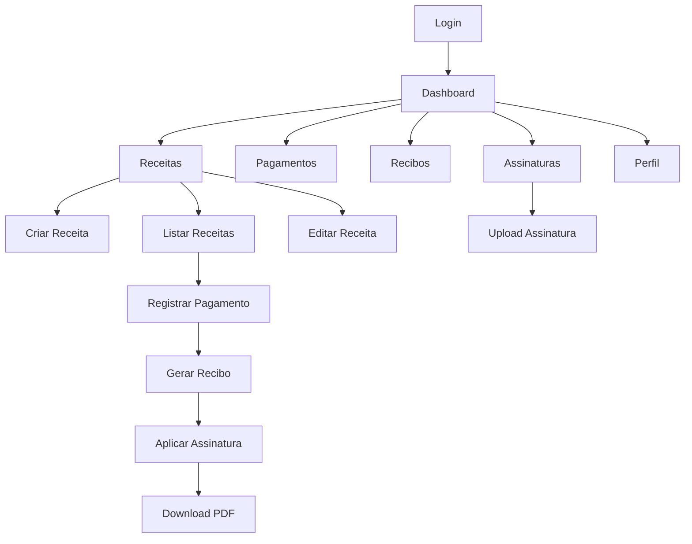

# MIT License
# Autor atual: David Assef
# Descrição: Documento de Requisitos de Produto (PRD) do ReciboFast
# Data: 30-08-2025

# 📋 DOCUMENTO DE REQUISITOS DE PRODUTO - RECIBOFAST

## 1. Product Overview

O ReciboFast é uma Progressive Web Application (PWA) para gestão de aluguéis e geração de recibos com assinatura digital, otimizada para performance em servidores freemium. O sistema permite que proprietários de imóveis gerenciem receitas de aluguel, registrem pagamentos e gerem recibos profissionais com assinatura digital e QR Code para verificação de autenticidade.

O produto resolve o problema de gestão manual de aluguéis e emissão de recibos, oferecendo uma solução digital completa para proprietários, administradoras de imóveis e inquilinos.

## 2. Core Features

### 2.1 User Roles

| Role | Registration Method | Core Permissions |
|------|---------------------|------------------|
| Proprietário | Email/Google OAuth | Pode criar receitas, registrar pagamentos, gerar recibos, gerenciar assinaturas |
| Inquilino | Acesso via link compartilhado | Pode visualizar recibos e fazer download |

### 2.2 Feature Module

Nosso sistema de gestão de aluguéis consiste nas seguintes páginas principais:

1. **Dashboard**: resumo financeiro, estatísticas de receitas e pagamentos, indicadores de performance.
2. **Receitas**: listagem, criação, edição e exclusão de receitas de aluguel com filtros avançados.
3. **Pagamentos**: registro de baixas totais e parciais, histórico de pagamentos por receita.
4. **Recibos**: geração de recibos em PDF com assinatura digital e QR Code.
5. **Assinaturas**: upload e gerenciamento de assinaturas digitais em formato PNG.
6. **Perfil**: configurações do usuário, dados pessoais e preferências do sistema.

### 2.3 Page Details

| Page Name | Module Name | Feature description |
|-----------|-------------|---------------------|
| Dashboard | Resumo Financeiro | Exibir estatísticas de receitas, pagamentos recebidos, valores em aberto e gráficos de performance mensal |
| Dashboard | Indicadores | Mostrar métricas como taxa de inadimplência, receita média, total de contratos ativos |
| Receitas | Listagem | Listar receitas com filtros por categoria, data, valor, status de pagamento e paginação |
| Receitas | Formulário CRUD | Criar, editar e excluir receitas com validação de campos obrigatórios (título, valor, data de vencimento) |
| Receitas | Ações Rápidas | Visualizar detalhes, duplicar receita, marcar como paga, gerar recibo |
| Pagamentos | Registro de Baixa | Registrar pagamentos totais ou parciais com data, valor e observações |
| Pagamentos | Histórico | Visualizar histórico completo de pagamentos por receita com detalhes |
| Recibos | Geração PDF | Gerar recibos profissionais em PDF com dados da receita e pagamento |
| Recibos | Assinatura Digital | Aplicar assinatura digital no recibo com posicionamento e escala ajustáveis |
| Recibos | QR Code | Incluir QR Code para verificação de autenticidade do recibo |
| Assinaturas | Upload | Fazer upload de assinatura em PNG com validação de formato e dimensões |
| Assinaturas | Gerenciamento | Visualizar, editar e excluir assinaturas cadastradas |
| Perfil | Dados Pessoais | Editar informações do usuário (nome, email, telefone, endereço) |
| Perfil | Configurações | Definir preferências do sistema e configurações de notificação |
| Login/Registro | Autenticação | Login via email/senha ou Google OAuth com validação de credenciais |

## 3. Core Process

### Fluxo Principal do Proprietário:
1. Usuário faz login via email ou Google OAuth
2. Acessa o Dashboard para visualizar resumo financeiro
3. Navega para Receitas e cria nova receita de aluguel
4. Quando recebe pagamento, registra baixa na receita
5. Gera recibo em PDF com assinatura digital
6. Compartilha recibo com inquilino via link ou download

### Fluxo do Inquilino:
1. Recebe link do recibo via WhatsApp/email
2. Acessa recibo sem necessidade de login
3. Visualiza detalhes do pagamento
4. Faz download do recibo em PDF
5. Verifica autenticidade via QR Code

## 4. User Interface Design

### 4.1 Design Style

- **Cores Primárias**: Azul (#3B82F6) e Verde (#10B981) para ações positivas
- **Cores Secundárias**: Cinza (#6B7280) para textos e Vermelho (#EF4444) para alertas
- **Estilo de Botões**: Arredondados com sombra sutil, efeito hover suave
- **Tipografia**: Inter como fonte principal, tamanhos 14px (corpo), 16px (títulos), 24px (cabeçalhos)
- **Layout**: Design limpo baseado em cards, navegação superior fixa
- **Ícones**: Lucide React para consistência visual

### 4.2 Page Design Overview

| Page Name | Module Name | UI Elements |
|-----------|-------------|-------------|
| Dashboard | Resumo Financeiro | Cards com estatísticas, gráficos de linha/barra, cores verde/azul, layout em grid responsivo |
| Receitas | Listagem | Tabela responsiva, filtros em sidebar, botões de ação coloridos, paginação inferior |
| Receitas | Formulário | Modal ou página dedicada, campos organizados em seções, validação visual em tempo real |
| Pagamentos | Registro | Modal com formulário compacto, campos de valor com máscara monetária, botões de confirmação |
| Recibos | Visualização | Preview do PDF, controles de zoom, botões de download e compartilhamento |
| Assinaturas | Upload | Área de drag-and-drop, preview da imagem, controles de redimensionamento |

### 4.3 Responsiveness

O produto é mobile-first com adaptação completa para desktop. Inclui otimização para touch em dispositivos móveis, navegação por gestos e interface adaptativa que reorganiza elementos conforme o tamanho da tela.
