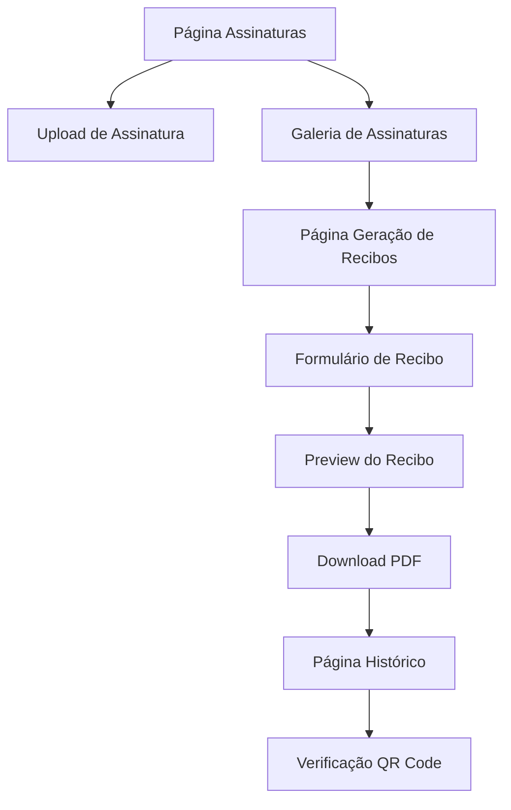

# MIT License
# Autor atual: David Assef
# Descrição: Documento de Requisitos do Produto - Sistema de Assinaturas e Recibos ReciboFast
# Data: 07-09-2025

# PRD - Sistema de Assinaturas e Recibos ReciboFast

## 1. Visão Geral do Produto

O Sistema de Assinaturas e Recibos é uma extensão do ReciboFast que permite aos usuários fazer upload de suas assinaturas digitais e gerar recibos profissionais em PDF com assinaturas aplicadas automaticamente. O sistema oferece funcionalidades de upload seguro, armazenamento em nuvem, geração de templates personalizados e verificação de autenticidade através de QR codes.

- **Problema a resolver**: Necessidade de gerar recibos profissionais com assinaturas digitais de forma rápida e segura
- **Público-alvo**: Proprietários de imóveis, profissionais autônomos e pequenas empresas que precisam emitir recibos
- **Valor de mercado**: Automatização e profissionalização do processo de emissão de recibos com validação digital

## 2. Funcionalidades Principais

### 2.1 Papéis de Usuário

| Papel | Método de Registro | Permissões Principais |
|-------|-------------------|----------------------|
| Usuário Autenticado | Login via Google/Email | Upload de assinaturas, geração de recibos, acesso ao histórico |

### 2.2 Módulos Funcionais

Nosso sistema de assinaturas e recibos consiste nas seguintes páginas principais:

1. **Página de Assinaturas**: gerenciamento de assinaturas, upload de imagens, preview e seleção
2. **Página de Geração de Recibos**: criação de recibos, aplicação de assinaturas, download de PDFs
3. **Página de Histórico**: visualização de recibos gerados, reimpressão e verificação

### 2.3 Detalhes das Páginas

| Página | Módulo | Descrição da Funcionalidade |
|--------|--------|--------------------------|
| Assinaturas | Upload de Assinatura | Fazer upload de imagens PNG, validar formato e dimensões, armazenar no Supabase Storage |
| Assinaturas | Galeria de Assinaturas | Visualizar assinaturas salvas, selecionar assinatura ativa, excluir assinaturas |
| Assinaturas | Preview e Ajuste | Visualizar preview da assinatura, ajustar escala e posicionamento |
| Geração de Recibos | Formulário de Recibo | Preencher dados do recibo (locatário, valor, competência, observações) |
| Geração de Recibos | Template PDF | Gerar PDF com layout profissional, aplicar assinatura selecionada |
| Geração de Recibos | QR Code | Gerar QR code para verificação de autenticidade do recibo |
| Histórico | Lista de Recibos | Visualizar recibos gerados, filtrar por data e valor |
| Histórico | Reimpressão | Baixar novamente recibos já gerados |
| Histórico | Verificação | Verificar autenticidade através de QR code ou hash |

## 3. Fluxos Principais

### Fluxo de Upload de Assinatura
1. Usuário acessa página de assinaturas
2. Clica em "Adicionar Nova Assinatura"
3. Seleciona arquivo PNG do dispositivo
4. Sistema valida formato, tamanho e dimensões
5. Preview da assinatura é exibido
6. Usuário confirma e assinatura é salva no storage

### Fluxo de Geração de Recibo
1. Usuário acessa página de geração de recibos
2. Preenche formulário com dados do recibo
3. Seleciona assinatura da galeria
4. Visualiza preview do recibo
5. Confirma geração do PDF
6. Sistema gera PDF, aplica assinatura e QR code
7. Usuário faz download do recibo

## 4. Design da Interface

### 4.1 Estilo de Design
- **Cores primárias**: Azul (#3B82F6) e Verde (#10B981)
- **Cores secundárias**: Cinza (#6B7280) e Branco (#FFFFFF)
- **Estilo de botões**: Arredondados com sombra sutil
- **Fonte**: Inter, tamanhos 14px (corpo), 18px (títulos), 24px (cabeçalhos)
- **Layout**: Cards com bordas arredondadas, navegação superior
- **Ícones**: Lucide React com estilo minimalista

### 4.2 Visão Geral das Páginas

| Página | Módulo | Elementos de UI |
|--------|--------|-----------------|
| Assinaturas | Upload | Área de drag-and-drop, botão de seleção, barra de progresso, preview da imagem |
| Assinaturas | Galeria | Grid de cards com thumbnails, botões de ação, indicador de assinatura ativa |
| Geração de Recibos | Formulário | Campos de entrada organizados, seletor de assinatura, botão de preview |
| Geração de Recibos | Preview | Modal com visualização do PDF, controles de zoom, botão de download |
| Histórico | Lista | Tabela responsiva, filtros de data, botões de ação por linha |

### 4.3 Responsividade
- **Desktop-first** com adaptação para mobile
- **Touch-friendly** para dispositivos móveis
- **Breakpoints**: 768px (tablet), 1024px (desktop)
- **Navegação mobile**: Menu hambúrguer com drawer lateral
