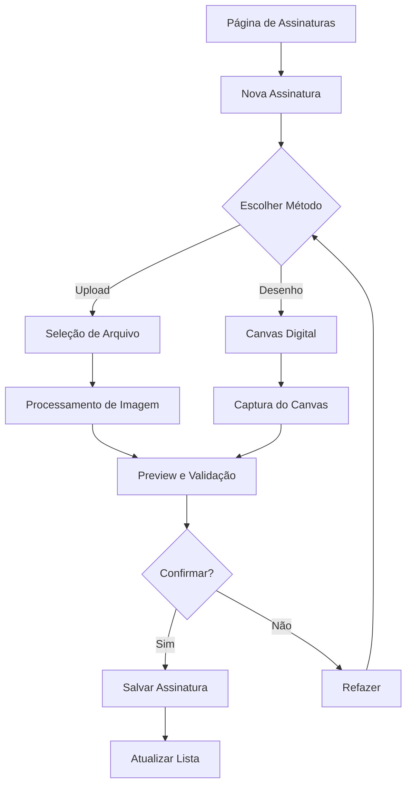
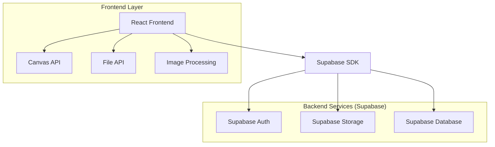
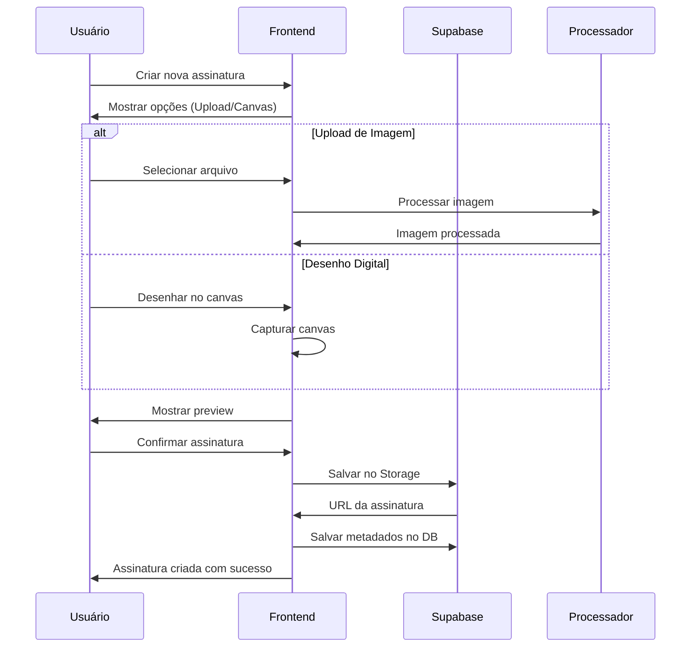

# MIT License
# Autor atual: David Assef
# Descrição: Documento técnico para implementação completa do sistema de assinaturas digitais
# Data: 07-09-2025

# 📝 SISTEMA DE ASSINATURAS DIGITAIS - RECIBOFAST

## 1. Visão Geral do Produto

O Sistema de Assinaturas Digitais do ReciboFast permite aos usuários criar, gerenciar e aplicar assinaturas digitais em recibos de aluguel. O sistema suporta dois métodos principais de criação de assinatura: upload de imagem (já implementado) e desenho digital na tela (nova funcionalidade), com processamento avançado de imagem e validação de qualidade.

- **Problema a resolver**: Necessidade de assinaturas digitais legíveis e profissionais para recibos de aluguel
- **Usuários-alvo**: Proprietários de imóveis, administradoras e inquilinos que precisam gerar recibos assinados
- **Valor do produto**: Automatização completa do processo de assinatura com validação de qualidade e integração seamless com geração de recibos

## 2. Funcionalidades Principais

### 2.1 Papéis de Usuário

| Papel | Método de Registro | Permissões Principais |
|-------|-------------------|----------------------|
| Usuário Autenticado | Email + senha via Supabase Auth | Criar, visualizar, editar e excluir suas próprias assinaturas |
| Usuário Anônimo | Não aplicável | Sem acesso ao sistema de assinaturas |

### 2.2 Módulos Funcionais

O sistema de assinaturas digitais consiste nas seguintes páginas principais:

1. **Página de Assinaturas**: gerenciamento completo de assinaturas, upload, preview e seleção de assinatura ativa
2. **Modal de Criação de Assinatura**: interface para escolher método de criação (upload ou desenho digital)
3. **Canvas de Desenho Digital**: área de desenho touchscreen para criação de assinatura digital
4. **Processador de Imagem**: ferramenta para remoção de fundo e isolamento de assinatura
5. **Preview e Confirmação**: visualização final antes do salvamento

### 2.3 Detalhes das Páginas

| Página | Módulo | Descrição da Funcionalidade |
|--------|--------|-----------------------------|
| Página de Assinaturas | Lista de Assinaturas | Exibir todas as assinaturas do usuário com preview, status ativo/inativo, opções de edição e exclusão |
| Página de Assinaturas | Botão Nova Assinatura | Abrir modal de seleção de método de criação (upload ou desenho digital) |
| Página de Assinaturas | Gerenciamento de Assinatura Ativa | Permitir seleção de uma assinatura como ativa para uso em recibos |
| Modal de Criação | Seleção de Método | Escolher entre "Upload de Imagem" ou "Desenho Digital" com instruções claras |
| Upload de Imagem | Validação de Arquivo | Validar formato PNG, tamanho máximo 2MB, dimensões mínimas e máximas |
| Upload de Imagem | Processamento de Imagem | Remover fundo automaticamente, isolar assinatura, validar legibilidade |
| Canvas Digital | Área de Desenho | Interface touchscreen/mouse para desenhar assinatura com ferramentas de pincel |
| Canvas Digital | Controles de Desenho | Botões para limpar, desfazer, ajustar espessura do traço |
| Preview e Confirmação | Visualização Final | Mostrar assinatura processada com opções de aprovar ou refazer |
| Preview e Confirmação | Salvamento | Salvar assinatura no Supabase Storage com metadados completos |

## 3. Fluxo Principal de Usuário

### Fluxo de Criação de Assinatura por Upload:
1. Usuário acessa página de assinaturas
2. Clica em "Nova Assinatura" → Modal de seleção
3. Escolhe "Upload de Imagem" → Interface de upload
4. Seleciona arquivo PNG da assinatura em papel
5. Sistema processa imagem (remove fundo, isola assinatura)
6. Sistema valida legibilidade e qualidade
7. Usuário visualiza preview e confirma ou refaz
8. Sistema salva assinatura com metadados

### Fluxo de Criação de Assinatura Digital:
1. Usuário acessa página de assinaturas
2. Clica em "Nova Assinatura" → Modal de seleção
3. Escolhe "Desenho Digital" → Canvas de desenho
4. Desenha assinatura na tela usando touch/mouse
5. Ajusta espessura, limpa ou desfaz conforme necessário
6. Finaliza desenho → Preview automático
7. Usuário visualiza resultado e confirma ou refaz
8. Sistema salva assinatura como PNG transparente



## 4. Design da Interface

### 4.1 Estilo de Design

- **Cores primárias**: Azul (#3B82F6) para ações principais, Verde (#10B981) para confirmações
- **Cores secundárias**: Cinza (#6B7280) para textos, Vermelho (#EF4444) para alertas
- **Estilo de botões**: Rounded corners (8px), sombras sutis, estados hover/active
- **Tipografia**: Inter ou system fonts, tamanhos 14px (corpo), 16px (títulos), 12px (legendas)
- **Layout**: Card-based design, navegação top-level, grid responsivo
- **Ícones**: Lucide React icons, estilo outline, tamanho 20px padrão

### 4.2 Visão Geral das Páginas

| Página | Módulo | Elementos de UI |
|--------|--------|----------------|
| Página de Assinaturas | Header | Título "Minhas Assinaturas", botão "+ Nova Assinatura" (azul, rounded) |
| Página de Assinaturas | Grid de Assinaturas | Cards 200x100px com preview, nome, status ativo, ações (editar/excluir) |
| Modal de Criação | Seleção de Método | Dois cards grandes com ícones, títulos e descrições dos métodos |
| Canvas Digital | Área de Desenho | Canvas 400x200px, fundo branco, borda cinza, cursor personalizado |
| Canvas Digital | Controles | Slider de espessura, botões Limpar/Desfazer, paleta de cores básica |
| Upload de Imagem | Zona de Drop | Área tracejada 300x200px, ícone de upload, texto "Arraste ou clique" |
| Preview | Visualização | Assinatura centralizada em fundo branco, dimensões reais, botões Confirmar/Refazer |

### 4.3 Responsividade

- **Desktop-first** com adaptação mobile
- **Breakpoints**: 768px (tablet), 640px (mobile)
- **Touch optimization**: Botões mínimo 44px, canvas com gestos touch nativos
- **Mobile adaptations**: Canvas fullscreen em mobile, controles em bottom sheet

## 5. Arquitetura Técnica

### 5.1 Diagrama de Arquitetura



### 5.2 Stack Tecnológico

- **Frontend**: React@18 + TypeScript + Vite + Tailwind CSS
- **Backend**: Supabase (Auth + Storage + Database)
- **Processamento de Imagem**: Canvas API + bibliotecas client-side
- **Validação**: Zod para schemas TypeScript

### 5.3 Rotas da Aplicação

| Rota | Propósito |
|------|----------|
| /signatures | Página principal de gerenciamento de assinaturas |
| /signatures/new | Modal/página de criação de nova assinatura |
| /signatures/canvas | Interface de desenho digital (pode ser modal) |
| /signatures/upload | Interface de upload de imagem (pode ser modal) |

## 6. Especificações Técnicas

### 6.1 Tipos TypeScript

```typescript
// Extensão dos tipos existentes
export interface SignatureCanvas {
  id?: string;
  width: number;
  height: number;
  strokeWidth: number;
  strokeColor: string;
  backgroundColor: string;
  paths: CanvasPath[];
}

export interface CanvasPath {
  points: Point[];
  strokeWidth: number;
  strokeColor: string;
  timestamp: number;
}

export interface Point {
  x: number;
  y: number;
  pressure?: number; // Para dispositivos com pressure sensitivity
}

export interface ImageProcessingResult {
  processedImageUrl: string;
  originalImageUrl: string;
  backgroundRemoved: boolean;
  qualityScore: number;
  isLegible: boolean;
  suggestedImprovements: string[];
}

export interface SignatureCreationMethod {
  type: 'upload' | 'canvas';
  title: string;
  description: string;
  icon: string;
  available: boolean;
}

// Extensão do tipo Signature existente
export interface SignatureExtended extends Signature {
  creation_method: 'upload' | 'canvas';
  quality_score?: number;
  processing_metadata?: {
    background_removed: boolean;
    original_dimensions: { width: number; height: number };
    processed_dimensions: { width: number; height: number };
    quality_checks: string[];
  };
}
```

### 6.2 Componentes React

```typescript
// Novos componentes a serem implementados

// Modal de seleção de método
export interface SignatureMethodSelectorProps {
  isOpen: boolean;
  onClose: () => void;
  onMethodSelect: (method: 'upload' | 'canvas') => void;
}

// Canvas de desenho digital
export interface SignatureCanvasProps {
  width?: number;
  height?: number;
  onSignatureComplete: (signatureData: SignatureCanvas) => void;
  onCancel: () => void;
  className?: string;
}

// Processador de imagem
export interface ImageProcessorProps {
  imageFile: File;
  onProcessingComplete: (result: ImageProcessingResult) => void;
  onProcessingError: (error: string) => void;
}

// Preview de confirmação
export interface SignaturePreviewModalProps {
  signatureUrl: string;
  signatureData: SignatureExtended;
  onConfirm: () => void;
  onReject: () => void;
  isOpen: boolean;
}
```

### 6.3 Serviços e Hooks

```typescript
// Extensão do signaturesService existente
class SignaturesServiceExtended {
  // Métodos existentes...
  
  /**
   * Processa imagem para remover fundo e isolar assinatura
   */
  async processSignatureImage(file: File): Promise<ImageProcessingResult>;
  
  /**
   * Converte canvas para arquivo PNG
   */
  async canvasToFile(canvas: HTMLCanvasElement, fileName: string): Promise<File>;
  
  /**
   * Valida qualidade da assinatura
   */
  validateSignatureQuality(imageData: ImageData): {
    score: number;
    isLegible: boolean;
    suggestions: string[];
  };
  
  /**
   * Remove fundo de imagem usando algoritmos client-side
   */
  async removeBackground(imageFile: File): Promise<Blob>;
}

// Hook para canvas de assinatura
export const useSignatureCanvas = () => {
  const [canvasRef, setCanvasRef] = useState<HTMLCanvasElement | null>(null);
  const [isDrawing, setIsDrawing] = useState(false);
  const [paths, setPaths] = useState<CanvasPath[]>([]);
  const [currentPath, setCurrentPath] = useState<Point[]>([]);
  const [strokeWidth, setStrokeWidth] = useState(2);
  const [strokeColor, setStrokeColor] = useState('#000000');
  
  // Métodos de desenho, limpar, desfazer, etc.
  const startDrawing: (event: MouseEvent | TouchEvent) => void;
  const draw: (event: MouseEvent | TouchEvent) => void;
  const stopDrawing: () => void;
  const clearCanvas: () => void;
  const undoLastPath: () => void;
  const exportCanvas: () => Promise<File>;
  
  return {
    canvasRef,
    setCanvasRef,
    isDrawing,
    paths,
    strokeWidth,
    setStrokeWidth,
    strokeColor,
    setStrokeColor,
    startDrawing,
    draw,
    stopDrawing,
    clearCanvas,
    undoLastPath,
    exportCanvas
  };
};

// Hook para processamento de imagem
export const useImageProcessing = () => {
  const [isProcessing, setIsProcessing] = useState(false);
  const [processingProgress, setProcessingProgress] = useState(0);
  
  const processImage: (file: File) => Promise<ImageProcessingResult>;
  const removeBackground: (file: File) => Promise<Blob>;
  const validateQuality: (imageData: ImageData) => QualityResult;
  
  return {
    isProcessing,
    processingProgress,
    processImage,
    removeBackground,
    validateQuality
  };
};
```

## 7. Modelo de Dados

### 7.1 Extensão da Tabela Signatures

```sql
-- Adicionar colunas à tabela signatures existente
ALTER TABLE signatures ADD COLUMN IF NOT EXISTS creation_method VARCHAR(10) DEFAULT 'upload' CHECK (creation_method IN ('upload', 'canvas'));
ALTER TABLE signatures ADD COLUMN IF NOT EXISTS quality_score DECIMAL(3,2);
ALTER TABLE signatures ADD COLUMN IF NOT EXISTS processing_metadata JSONB;

-- Índices para performance
CREATE INDEX IF NOT EXISTS idx_signatures_creation_method ON signatures(creation_method);
CREATE INDEX IF NOT EXISTS idx_signatures_quality_score ON signatures(quality_score DESC);
```

### 7.2 Estrutura de Metadados

```json
{
  "processing_metadata": {
    "background_removed": true,
    "original_dimensions": {
      "width": 800,
      "height": 400
    },
    "processed_dimensions": {
      "width": 600,
      "height": 200
    },
    "quality_checks": [
      "contrast_adequate",
      "edges_clear",
      "size_appropriate"
    ],
    "processing_steps": [
      "background_removal",
      "noise_reduction",
      "contrast_enhancement"
    ],
    "creation_timestamp": "2025-01-30T10:30:00Z",
    "device_info": {
      "type": "mobile",
      "touch_support": true,
      "pressure_support": false
    }
  }
}
```

## 8. Algoritmos de Processamento

### 8.1 Remoção de Fundo

```typescript
/**
 * Remove fundo de imagem de assinatura usando algoritmos client-side
 * Implementa detecção de bordas e segmentação por cor
 */
class BackgroundRemover {
  /**
   * Remove fundo branco/claro de assinatura
   */
  async removeWhiteBackground(imageData: ImageData): Promise<ImageData> {
    const data = imageData.data;
    const threshold = 240; // Limiar para considerar pixel como fundo
    
    for (let i = 0; i < data.length; i += 4) {
      const r = data[i];
      const g = data[i + 1];
      const b = data[i + 2];
      
      // Se pixel é muito claro (próximo do branco), tornar transparente
      if (r > threshold && g > threshold && b > threshold) {
        data[i + 3] = 0; // Alpha = 0 (transparente)
      }
    }
    
    return imageData;
  }
  
  /**
   * Detecta e remove fundo usando análise de histograma
   */
  async smartBackgroundRemoval(imageData: ImageData): Promise<ImageData> {
    // Implementar algoritmo mais sofisticado
    // 1. Análise de histograma para identificar cor de fundo dominante
    // 2. Detecção de bordas para preservar traços da assinatura
    // 3. Flood fill para remover áreas conectadas de fundo
    // 4. Suavização de bordas para resultado mais natural
  }
}
```

### 8.2 Validação de Qualidade

```typescript
/**
 * Valida qualidade e legibilidade da assinatura
 */
class SignatureQualityValidator {
  /**
   * Calcula score de qualidade (0-100)
   */
  calculateQualityScore(imageData: ImageData): number {
    const metrics = {
      contrast: this.calculateContrast(imageData),
      sharpness: this.calculateSharpness(imageData),
      completeness: this.calculateCompleteness(imageData),
      size: this.calculateSizeAdequacy(imageData)
    };
    
    // Peso dos fatores
    const weights = {
      contrast: 0.3,
      sharpness: 0.25,
      completeness: 0.25,
      size: 0.2
    };
    
    return Object.entries(metrics).reduce((score, [key, value]) => {
      return score + (value * weights[key as keyof typeof weights]);
    }, 0);
  }
  
  /**
   * Verifica se assinatura está legível
   */
  isLegible(imageData: ImageData): boolean {
    const qualityScore = this.calculateQualityScore(imageData);
    const minLegibilityScore = 60;
    
    return qualityScore >= minLegibilityScore;
  }
  
  /**
   * Gera sugestões de melhoria
   */
  generateSuggestions(imageData: ImageData): string[] {
    const suggestions: string[] = [];
    
    if (this.calculateContrast(imageData) < 50) {
      suggestions.push('Tente usar uma caneta mais escura ou papel mais claro');
    }
    
    if (this.calculateSharpness(imageData) < 40) {
      suggestions.push('Mantenha a câmera mais estável ao fotografar');
    }
    
    if (this.calculateCompleteness(imageData) < 70) {
      suggestions.push('Certifique-se de que toda a assinatura está visível na foto');
    }
    
    return suggestions;
  }
}
```

## 9. Fluxos de Integração

### 9.1 Integração com Sistema de Recibos

```typescript
/**
 * Integração da assinatura com geração de recibos
 */
interface ReceiptSignatureIntegration {
  /**
   * Aplica assinatura ativa ao recibo
   */
  applySignatureToReceipt(
    receiptData: ReceiptData,
    signatureId: string,
    position: { x: number; y: number },
    scale: number
  ): Promise<ReceiptWithSignature>;
  
  /**
   * Obtém assinatura ativa do usuário
   */
  getActiveSignature(userId: string): Promise<Signature | null>;
  
  /**
   * Valida se assinatura pode ser usada em recibo
   */
  validateSignatureForReceipt(signature: Signature): {
    isValid: boolean;
    issues: string[];
  };
}
```

### 9.2 Workflow Completo



## 10. Critérios de Aceitação

### 10.1 Funcionalidades Obrigatórias

- ✅ **Upload de PNG**: Sistema atual já implementado e funcional
- 🔄 **Canvas Digital**: Interface de desenho touchscreen/mouse responsiva
- 🔄 **Processamento de Imagem**: Remoção automática de fundo e isolamento de assinatura
- 🔄 **Validação de Qualidade**: Score de legibilidade e sugestões de melhoria
- 🔄 **Preview e Confirmação**: Visualização antes do salvamento com opção de refazer
- ✅ **Gerenciamento**: Lista, ativação, edição e exclusão de assinaturas
- ✅ **Integração Storage**: Armazenamento seguro no Supabase com RLS

### 10.2 Critérios de Performance

- **Upload**: Processamento de imagem < 5s para arquivos até 2MB
- **Canvas**: Resposta de desenho < 16ms (60fps) em dispositivos modernos
- **Processamento**: Remoção de fundo < 3s para imagens típicas
- **Validação**: Cálculo de qualidade < 1s
- **Preview**: Carregamento de preview < 2s

### 10.3 Critérios de Qualidade

- **Precisão**: Remoção de fundo com 90%+ de precisão em fundos brancos/claros
- **Legibilidade**: Detecção correta de assinaturas legíveis em 85%+ dos casos
- **Usabilidade**: Fluxo completo (criação → confirmação) em < 2 minutos
- **Compatibilidade**: Funcional em Chrome, Firefox, Safari (desktop e mobile)
- **Acessibilidade**: Suporte a teclado e screen readers

### 10.4 Critérios de Segurança

- **Validação**: 100% dos uploads validados (MIME, tamanho, dimensões)
- **Isolamento**: RLS garantindo acesso apenas às próprias assinaturas
- **Sanitização**: Processamento seguro de imagens sem execução de código
- **Auditoria**: Log de todas as operações de criação/modificação

## 11. Plano de Implementação

### 11.1 Fase 1: Canvas Digital (Semana 1-2)
- Implementar componente SignatureCanvas
- Desenvolver hook useSignatureCanvas
- Criar controles de desenho (espessura, cor, limpar, desfazer)
- Implementar captura e exportação do canvas
- Testes básicos de funcionalidade

### 11.2 Fase 2: Processamento de Imagem (Semana 2-3)
- Implementar algoritmos de remoção de fundo
- Desenvolver validador de qualidade
- Criar sistema de sugestões de melhoria
- Integrar processamento com upload existente
- Testes de precisão e performance

### 11.3 Fase 3: Interface e UX (Semana 3-4)
- Criar modal de seleção de método
- Implementar preview de confirmação
- Desenvolver feedback visual de processamento
- Otimizar responsividade mobile
- Testes de usabilidade

### 11.4 Fase 4: Integração e Polimento (Semana 4)
- Integrar com sistema de recibos existente
- Implementar metadados estendidos
- Otimizar performance e caching
- Testes de integração completos
- Documentação final

## 12. Riscos e Mitigações

### 12.1 Riscos Técnicos

| Risco | Probabilidade | Impacto | Mitigação |
|-------|---------------|---------|----------|
| Performance de processamento em dispositivos antigos | Média | Alto | Implementar fallbacks e processamento progressivo |
| Precisão de remoção de fundo em imagens complexas | Alta | Médio | Múltiplos algoritmos e validação manual opcional |
| Compatibilidade de Canvas API em browsers antigos | Baixa | Alto | Polyfills e detecção de features |
| Limitações de storage do Supabase | Baixa | Médio | Compressão inteligente e limpeza automática |

### 12.2 Riscos de Produto

| Risco | Probabilidade | Impacto | Mitigação |
|-------|---------------|---------|----------|
| Usuários preferem assinatura física | Média | Baixo | Manter ambas as opções disponíveis |
| Dificuldade de uso em dispositivos touch | Média | Alto | Testes extensivos de UX e tutoriais |
| Qualidade insatisfatória de assinaturas processadas | Alta | Alto | Sistema robusto de validação e feedback |

## 13. Métricas de Sucesso

### 13.1 Métricas de Adoção
- **Taxa de criação**: % de usuários que criam pelo menos uma assinatura
- **Preferência de método**: Distribuição entre upload vs canvas
- **Taxa de rejeição**: % de assinaturas rejeitadas na confirmação
- **Tempo de conclusão**: Tempo médio do fluxo completo

### 13.2 Métricas de Qualidade
- **Score médio de qualidade**: Média dos scores de assinaturas aprovadas
- **Taxa de reprocessamento**: % de usuários que refazem a assinatura
- **Satisfação**: Feedback qualitativo dos usuários
- **Uso em recibos**: % de recibos gerados com assinatura digital

### 13.3 Métricas Técnicas
- **Performance de processamento**: Tempo médio por operação
- **Taxa de erro**: % de falhas no processamento
- **Uso de storage**: Volume de dados armazenados
- **Carga do sistema**: Impacto na performance geral

---

**Status do Documento**: 📋 Especificação Completa  
**Próxima Ação**: Iniciar implementação da Fase 1 (Canvas Digital)  
**Responsável**: Equipe de Desenvolvimento  
**Prazo Estimado**: 4 semanas para implementação completa