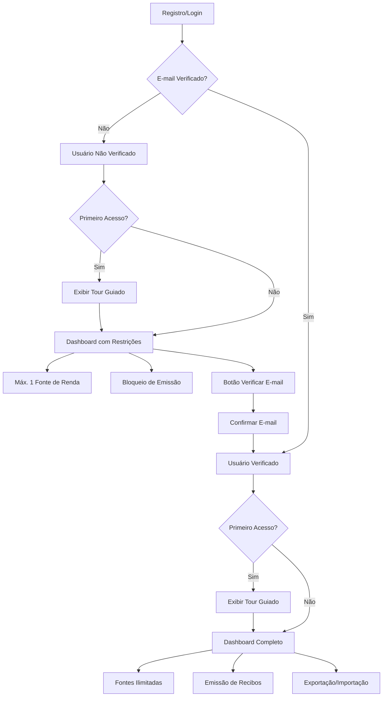
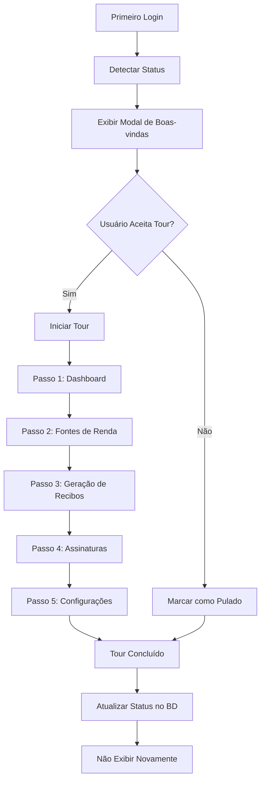

# MIT License
# Autor atual: David Assef
# Descrição: Documento de melhorias para autenticação, tour guiado e exportação de dados
# Data: 30-08-2025

# 📋 Melhorias de Autenticação, Tour Guiado e Exportação de Dados - ReciboFast

## 1. Visão Geral

Este documento especifica três melhorias importantes para o sistema ReciboFast:

1. **Validação de E-mail Opcional**: Sistema de restrições baseado no status de verificação de e-mail
2. **Tour Guiado Inicial**: Experiência de onboarding interativa para novos usuários
3. **Exportação/Importação de Dados**: Funcionalidade de backup e migração em formato Excel

### Objetivos
- Reduzir barreiras de entrada permitindo uso imediato sem validação obrigatória
- Melhorar experiência de onboarding com tour interativo
- Oferecer funcionalidades avançadas para usuários verificados
- Facilitar backup e migração de dados

## 2. Funcionalidades Principais

### 2.1 Papéis de Usuário

| Papel | Método de Registro | Permissões |
|-------|-------------------|------------|
| **Usuário Não Verificado** | Email/senha ou Google OAuth sem confirmação | • Acesso limitado<br>• 1 fonte de renda máximo<br>• Sem emissão de recibos<br>• Acesso ao tour |
| **Usuário Verificado** | Confirmação de e-mail obrigatória | • Acesso completo<br>• Fontes de renda ilimitadas<br>• Emissão de recibos<br>• Exportação/importação |

### 2.2 Módulos de Funcionalidade

#### A. Sistema de Validação de E-mail Opcional
- Gerenciamento de status de verificação
- Aplicação automática de restrições
- Interface para reenvio de confirmação
- Indicadores visuais de status

#### B. Tour Guiado Inicial
- Detecção de primeiro acesso
- Tour interativo passo-a-passo
- Demonstração de funcionalidades principais
- Opção de pular a qualquer momento

#### C. Sistema de Exportação/Importação
- Exportação de dados em Excel (Pandas)
- Importação com validação de dados
- Funcionalidade exclusiva para verificados
- Backup completo de dados do usuário

#### D. Dashboard de Status
- Indicadores de verificação
- Alertas sobre restrições
- Botões de ação contextuais

## 3. Especificações Técnicas

### 3.1 Estrutura de Dados

#### Extensão da Tabela de Usuários
```sql
-- Adicionar campos à tabela users existente
ALTER TABLE users ADD COLUMN IF NOT EXISTS email_verified BOOLEAN DEFAULT FALSE;
ALTER TABLE users ADD COLUMN IF NOT EXISTS first_login BOOLEAN DEFAULT TRUE;
ALTER TABLE users ADD COLUMN IF NOT EXISTS tour_completed BOOLEAN DEFAULT FALSE;
ALTER TABLE users ADD COLUMN IF NOT EXISTS verification_sent_at TIMESTAMP;
```

#### Nova Tabela para Controle de Restrições
```sql
CREATE TABLE user_restrictions (
  id UUID PRIMARY KEY DEFAULT gen_random_uuid(),
  user_id UUID REFERENCES users(id) ON DELETE CASCADE,
  restriction_type VARCHAR(50) NOT NULL,
  is_active BOOLEAN DEFAULT TRUE,
  created_at TIMESTAMP DEFAULT NOW(),
  updated_at TIMESTAMP DEFAULT NOW()
);
```

### 3.2 Tipos TypeScript

```typescript
// Tipos para status de usuário
export interface UserStatus {
  id: string;
  email_verified: boolean;
  first_login: boolean;
  tour_completed: boolean;
  verification_sent_at?: string;
}

// Tipos para restrições
export interface UserRestriction {
  id: string;
  user_id: string;
  restriction_type: 'max_income_sources' | 'receipt_generation';
  is_active: boolean;
  created_at: string;
}

// Tipos para tour
export interface TourStep {
  id: string;
  title: string;
  description: string;
  target: string;
  position: 'top' | 'bottom' | 'left' | 'right';
  action?: () => void;
}

// Tipos para exportação
export interface ExportData {
  income_sources: IncomeSource[];
  receipts: Receipt[];
  signatures: Signature[];
  user_profile: UserProfile;
}
```

### 3.3 Hooks Personalizados

#### useUserStatus Hook
```typescript
export const useUserStatus = () => {
  const { user } = useAuth();
  const [status, setStatus] = useState<UserStatus | null>(null);
  const [restrictions, setRestrictions] = useState<UserRestriction[]>([]);

  const checkEmailVerification = async () => {
    // Verificar status de e-mail no Supabase Auth
  };

  const resendVerification = async () => {
    // Reenviar e-mail de confirmação
  };

  const updateTourStatus = async (completed: boolean) => {
    // Atualizar status do tour
  };

  return {
    status,
    restrictions,
    checkEmailVerification,
    resendVerification,
    updateTourStatus,
    isVerified: status?.email_verified || false,
    isFirstLogin: status?.first_login || false
  };
};
```

#### useTour Hook
```typescript
export const useTour = () => {
  const [isActive, setIsActive] = useState(false);
  const [currentStep, setCurrentStep] = useState(0);
  const [steps] = useState<TourStep[]>(tourSteps);

  const startTour = () => setIsActive(true);
  const nextStep = () => setCurrentStep(prev => prev + 1);
  const prevStep = () => setCurrentStep(prev => prev - 1);
  const skipTour = () => {
    setIsActive(false);
    // Marcar tour como concluído
  };

  return {
    isActive,
    currentStep,
    steps,
    startTour,
    nextStep,
    prevStep,
    skipTour,
    isLastStep: currentStep === steps.length - 1
  };
};
```

#### useDataExport Hook
```typescript
export const useDataExport = () => {
  const { user } = useAuth();
  const [isExporting, setIsExporting] = useState(false);
  const [isImporting, setIsImporting] = useState(false);

  const exportData = async (): Promise<Blob> => {
    setIsExporting(true);
    try {
      // Buscar todos os dados do usuário
      const data = await fetchUserData(user.id);
      
      // Converter para Excel usando biblioteca
      const workbook = createExcelWorkbook(data);
      return workbook.writeToBuffer();
    } finally {
      setIsExporting(false);
    }
  };

  const importData = async (file: File): Promise<void> => {
    setIsImporting(true);
    try {
      // Validar e processar arquivo Excel
      const data = await parseExcelFile(file);
      await validateAndImportData(data);
    } finally {
      setIsImporting(false);
    }
  };

  return {
    exportData,
    importData,
    isExporting,
    isImporting
  };
};
```

## 4. Componentes da Interface

### 4.1 Componente de Status de Verificação
```typescript
export const VerificationStatus: React.FC = () => {
  const { status, resendVerification, isVerified } = useUserStatus();
  const [isSending, setIsSending] = useState(false);

  const handleResend = async () => {
    setIsSending(true);
    try {
      await resendVerification();
      toast.success('E-mail de confirmação enviado!');
    } catch (error) {
      toast.error('Erro ao enviar e-mail');
    } finally {
      setIsSending(false);
    }
  };

  if (isVerified) {
    return (
      <div className="flex items-center gap-2 text-green-600">
        <CheckCircle className="w-5 h-5" />
        <span>E-mail verificado</span>
      </div>
    );
  }

  return (
    <div className="bg-yellow-50 border border-yellow-200 rounded-lg p-4">
      <div className="flex items-center gap-2 text-yellow-800 mb-2">
        <AlertCircle className="w-5 h-5" />
        <span className="font-medium">E-mail não verificado</span>
      </div>
      <p className="text-sm text-yellow-700 mb-3">
        Verifique seu e-mail para desbloquear todas as funcionalidades.
      </p>
      <Button 
        onClick={handleResend} 
        disabled={isSending}
        size="sm"
        variant="outline"
      >
        {isSending ? 'Enviando...' : 'Reenviar confirmação'}
      </Button>
    </div>
  );
};
```

### 4.2 Componente de Tour Guiado
```typescript
export const GuidedTour: React.FC = () => {
  const { isActive, currentStep, steps, nextStep, prevStep, skipTour, isLastStep } = useTour();
  const { updateTourStatus } = useUserStatus();

  if (!isActive) return null;

  const currentStepData = steps[currentStep];

  const handleComplete = async () => {
    await updateTourStatus(true);
    setIsActive(false);
  };

  return (
    <div className="fixed inset-0 bg-black bg-opacity-50 z-50 flex items-center justify-center">
      <div className="bg-white rounded-lg p-6 max-w-md mx-4">
        <div className="flex justify-between items-center mb-4">
          <h3 className="text-lg font-semibold">{currentStepData.title}</h3>
          <Button variant="ghost" size="sm" onClick={skipTour}>
            <X className="w-4 h-4" />
          </Button>
        </div>
        
        <p className="text-gray-600 mb-6">{currentStepData.description}</p>
        
        <div className="flex justify-between items-center">
          <div className="text-sm text-gray-500">
            {currentStep + 1} de {steps.length}
          </div>
          
          <div className="flex gap-2">
            {currentStep > 0 && (
              <Button variant="outline" onClick={prevStep}>
                Anterior
              </Button>
            )}
            
            {isLastStep ? (
              <Button onClick={handleComplete}>
                Concluir
              </Button>
            ) : (
              <Button onClick={nextStep}>
                Próximo
              </Button>
            )}
          </div>
        </div>
      </div>
    </div>
  );
};
```

### 4.3 Componente de Exportação/Importação
```typescript
export const DataManagement: React.FC = () => {
  const { exportData, importData, isExporting, isImporting } = useDataExport();
  const { isVerified } = useUserStatus();
  const fileInputRef = useRef<HTMLInputElement>(null);

  if (!isVerified) {
    return (
      <div className="bg-gray-50 border border-gray-200 rounded-lg p-4">
        <div className="flex items-center gap-2 text-gray-600 mb-2">
          <Lock className="w-5 h-5" />
          <span className="font-medium">Funcionalidade Premium</span>
        </div>
        <p className="text-sm text-gray-600">
          Verifique seu e-mail para acessar as funcionalidades de exportação e importação.
        </p>
      </div>
    );
  }

  const handleExport = async () => {
    try {
      const blob = await exportData();
      const url = URL.createObjectURL(blob);
      const a = document.createElement('a');
      a.href = url;
      a.download = `recibofast-backup-${new Date().toISOString().split('T')[0]}.xlsx`;
      a.click();
      URL.revokeObjectURL(url);
      toast.success('Dados exportados com sucesso!');
    } catch (error) {
      toast.error('Erro ao exportar dados');
    }
  };

  const handleImport = async (event: React.ChangeEvent<HTMLInputElement>) => {
    const file = event.target.files?.[0];
    if (!file) return;

    try {
      await importData(file);
      toast.success('Dados importados com sucesso!');
    } catch (error) {
      toast.error('Erro ao importar dados');
    }
  };

  return (
    <div className="space-y-4">
      <h3 className="text-lg font-semibold">Gerenciamento de Dados</h3>
      
      <div className="grid grid-cols-1 md:grid-cols-2 gap-4">
        <Button 
          onClick={handleExport} 
          disabled={isExporting}
          className="flex items-center gap-2"
        >
          <Download className="w-4 h-4" />
          {isExporting ? 'Exportando...' : 'Exportar Dados'}
        </Button>
        
        <div>
          <input
            ref={fileInputRef}
            type="file"
            accept=".xlsx,.xls"
            onChange={handleImport}
            className="hidden"
          />
          <Button 
            onClick={() => fileInputRef.current?.click()}
            disabled={isImporting}
            variant="outline"
            className="flex items-center gap-2 w-full"
          >
            <Upload className="w-4 h-4" />
            {isImporting ? 'Importando...' : 'Importar Dados'}
          </Button>
        </div>
      </div>
    </div>
  );
};
```

## 5. Fluxos de Usuário

### 5.1 Fluxo de Usuário Não Verificado


### 5.2 Fluxo do Tour Guiado


## 6. Implementação por Etapas

### Fase 1: Estrutura Base (1-2 dias)
- [ ] Criar migrações de banco de dados
- [ ] Implementar tipos TypeScript
- [ ] Criar hooks básicos (useUserStatus, useTour)
- [ ] Configurar sistema de restrições

### Fase 2: Interface de Verificação (2-3 dias)
- [ ] Componente VerificationStatus
- [ ] Integração com Supabase Auth
- [ ] Sistema de reenvio de e-mail
- [ ] Indicadores visuais no dashboard

### Fase 3: Tour Guiado (3-4 dias)
- [ ] Componente GuidedTour
- [ ] Definir passos do tour
- [ ] Sistema de navegação
- [ ] Persistência de estado

### Fase 4: Sistema de Restrições (2-3 dias)
- [ ] Middleware de validação
- [ ] Bloqueios condicionais
- [ ] Mensagens explicativas
- [ ] Integração com componentes existentes

### Fase 5: Exportação/Importação (4-5 dias)
- [ ] Biblioteca de processamento Excel
- [ ] Componente DataManagement
- [ ] Validação de dados
- [ ] Sistema de backup/restauração

### Fase 6: Testes e Refinamentos (2-3 dias)
- [ ] Testes unitários
- [ ] Testes de integração
- [ ] Testes de usabilidade
- [ ] Ajustes de UX

## 7. Critérios de Aceitação

### Validação de E-mail Opcional
- [x] Usuários podem acessar sem confirmar e-mail
- [ ] Restrição de 1 fonte de renda para não verificados
- [ ] Bloqueio de emissão com modal explicativo
- [ ] Botão de reenvio funcional
- [ ] Remoção automática de restrições após verificação

### Tour Guiado
- [ ] Detecção automática de primeiro acesso
- [ ] Tour interativo com 5+ etapas
- [ ] Opção de pular funcional
- [ ] Responsivo em mobile e desktop
- [ ] Não exibir após conclusão

### Exportação/Importação
- [ ] Exportação em Excel funcional
- [ ] Importação com validação
- [ ] Exclusivo para verificados
- [ ] Feedback visual durante processamento
- [ ] Tratamento robusto de erros

## 8. Considerações de Segurança

### Validação de Dados
- Validar todos os dados de importação
- Sanitizar entradas do usuário
- Verificar permissões antes de operações

### Controle de Acesso
- RLS (Row Level Security) no Supabase
- Verificação de status no backend
- Tokens de autenticação válidos

### Proteção de Dados
- Criptografia de dados sensíveis
- Logs de auditoria para exportações
- Backup seguro de dados

## 9. Métricas de Sucesso

### Conversão
- Taxa de verificação de e-mail: > 60%
- Tempo médio para verificação: < 24h
- Taxa de conclusão do tour: > 70%

### Engajamento
- Uso de exportação por usuários verificados: > 30%
- Retenção de usuários não verificados: > 40%
- Satisfação com tour guiado: > 4.0/5.0

### Performance
- Tempo de exportação: < 10s
- Tempo de importação: < 30s
- Disponibilidade do sistema: > 99.5%

## 10. Dependências e Bibliotecas

### Frontend
```json
{
  "dependencies": {
    "xlsx": "^0.18.5",
    "file-saver": "^2.0.5",
    "react-joyride": "^2.5.2",
    "@supabase/supabase-js": "^2.39.0"
  },
  "devDependencies": {
    "@types/file-saver": "^2.0.5"
  }
}
```

### Backend (se necessário)
- Pandas (Python) para processamento Excel
- Openpyxl para manipulação de arquivos
- Celery para processamento assíncrono

---

**Documento criado em: 30-01-2025**  
**Autor: David Assef**  
**Versão: 1.0**  
**Status: Especificação Completa**