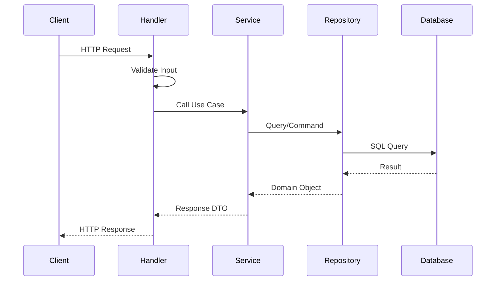

# MIT License
# Autor atual: David Assef
# Descrição: 01 arquitetura geral
# Data: 07-09-2025

# 🏗️ Arquitetura Geral - Backend ReciboFast

**Autor:** David Assef  
**Data:** 29-08-2025  
**Licença:** MIT License  

## 📋 Visão Geral

O backend do ReciboFast é construído em **Go (Golang)** seguindo os princípios de **Clean Architecture** e **Domain-Driven Design (DDD)**. A aplicação é estruturada em camadas bem definidas que promovem separação de responsabilidades, testabilidade e manutenibilidade.

## 🎯 Princípios Arquiteturais

### 1. Clean Architecture
- **Separação de Camadas**: Cada camada tem responsabilidades específicas
- **Inversão de Dependência**: Camadas internas não dependem de externas
- **Testabilidade**: Facilita testes unitários e de integração
- **Flexibilidade**: Permite mudanças sem impacto em outras camadas

### 2. Domain-Driven Design
- **Domínio Central**: Lógica de negócio isolada
- **Entidades**: Representam conceitos do negócio
- **Casos de Uso**: Orquestram operações do domínio
- **Repositórios**: Abstração para persistência

## 🏛️ Estrutura de Camadas

```
┌─────────────────────────────────────┐
│           Presentation Layer        │
│         (Handlers/Controllers)      │
├─────────────────────────────────────┤
│           Application Layer         │
│            (Use Cases)              │
├─────────────────────────────────────┤
│            Domain Layer             │
│        (Entities/Business)          │
├─────────────────────────────────────┤
│         Infrastructure Layer        │
│      (Database/External APIs)       │
└─────────────────────────────────────┘
```

### 📡 Presentation Layer (Handlers)
- **Responsabilidade**: Interface HTTP, validação de entrada, serialização
- **Localização**: `internal/handlers/`
- **Componentes**:
  - HTTP Handlers
  - Request/Response DTOs
  - Middleware de autenticação
  - Validação de entrada

### 🎯 Application Layer (Services)
- **Responsabilidade**: Orquestração de casos de uso, lógica de aplicação
- **Localização**: `internal/services/`
- **Componentes**:
  - Use Cases
  - Application Services
  - Coordenação entre domínios

### 💼 Domain Layer (Core)
- **Responsabilidade**: Regras de negócio, entidades, lógica central
- **Localização**: `internal/domain/` (a ser criado)
- **Componentes**:
  - Entidades de negócio
  - Value Objects
  - Domain Services
  - Interfaces de repositório

### 🔧 Infrastructure Layer
- **Responsabilidade**: Implementações concretas, banco de dados, APIs externas
- **Localização**: `internal/repositories/`, `internal/config/`
- **Componentes**:
  - Implementações de repositório
  - Configurações
  - Clientes de APIs externas
  - Logging

## 🚀 Fluxo de Requisição



## 🛠️ Tecnologias Utilizadas

### Core
- **Go 1.21+**: Linguagem principal
- **Gin Framework**: HTTP router e middleware
- **PostgreSQL**: Banco de dados principal
- **GORM**: ORM para Go

### Infraestrutura
- **Docker**: Containerização
- **Docker Compose**: Orquestração local
- **Environment Variables**: Configuração
- **Structured Logging**: Logs estruturados

### Qualidade
- **Go Testing**: Testes unitários
- **Testify**: Assertions e mocks
- **Go Modules**: Gerenciamento de dependências
- **golangci-lint**: Análise estática

## 📊 Padrões Implementados

### 1. Repository Pattern
```go
type ReceitaRepository interface {
    Create(receita *Receita) error
    FindByID(id string) (*Receita, error)
    Update(receita *Receita) error
    Delete(id string) error
}
```

### 2. Dependency Injection
```go
type Handler struct {
    receitaService ReceitaService
    logger        Logger
}
```

### 3. Error Handling
```go
type AppError struct {
    Code    string `json:"code"`
    Message string `json:"message"`
    Details string `json:"details,omitempty"`
}
```

## 🔒 Segurança

- **CORS**: Configurado para frontend
- **Rate Limiting**: Proteção contra spam
- **Input Validation**: Validação rigorosa
- **SQL Injection**: Prevenção via ORM
- **Environment Variables**: Secrets seguros

## 📈 Performance

- **Connection Pooling**: Pool de conexões DB
- **Graceful Shutdown**: Encerramento elegante
- **Health Checks**: Monitoramento de saúde
- **Structured Logging**: Logs eficientes
- **Middleware Chain**: Pipeline otimizado

## 🎯 Próximos Passos

1. **Implementar Domain Layer**: Criar entidades e value objects
2. **Adicionar Testes**: Cobertura completa de testes
3. **Métricas**: Implementar Prometheus/Grafana
4. **Cache**: Adicionar Redis para cache
5. **API Documentation**: Swagger/OpenAPI

---

## 📚 Referências

- [Clean Architecture - Robert Martin](https://blog.cleancoder.com/uncle-bob/2012/08/13/the-clean-architecture.html)
- [Domain-Driven Design](https://martinfowler.com/bliki/DomainDrivenDesign.html)
- [Go Best Practices](https://golang.org/doc/effective_go.html)
- [Gin Framework Documentation](https://gin-gonic.com/docs/)

---

*Última atualização: 29-08-2025*