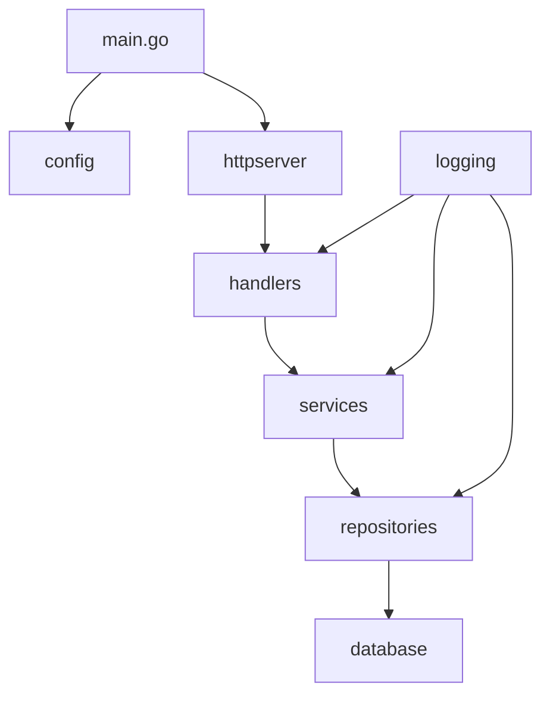

# 📁 Estrutura do Projeto - Backend ReciboFast

**Autor:** David Assef  
**Data:** 29-08-2025  
**Licença:** MIT License  

## 📋 Visão Geral

Este documento detalha a organização de pastas e arquivos do backend, explicando a responsabilidade de cada componente e as convenções adotadas.

## 🏗️ Estrutura Atual

```
backend/
├── cmd/                    # Pontos de entrada da aplicação
│   └── api/
│       └── main.go        # Entrada principal da API
├── internal/              # Código interno da aplicação
│   ├── config/           # Configurações da aplicação
│   │   └── config.go     # Estruturas de configuração
│   ├── context/          # Context personalizado
│   │   └── context.go    # Context com dados da requisição
│   ├── handlers/         # Camada de apresentação (HTTP)
│   │   ├── handlers.go   # Handler base e utilitários
│   │   ├── health.go     # Health check endpoints
│   │   ├── receitas.go   # Endpoints de receitas
│   │   └── sync.go       # Endpoints de sincronização
│   ├── httpserver/       # Configuração do servidor HTTP
│   │   ├── middleware.go # Middlewares customizados
│   │   └── router.go     # Configuração de rotas
│   ├── logging/          # Sistema de logs
│   │   └── logger.go     # Configuração do logger
│   ├── repositories/     # Camada de dados
│   │   └── db.go         # Configuração do banco de dados
│   └── services/         # Camada de aplicação
│       └── sync.go       # Serviços de sincronização
├── docs/                 # Documentação técnica
│   ├── INDICE.md        # Índice da documentação
│   └── *.md             # Documentos técnicos
├── .env                 # Variáveis de ambiente (local)
├── .env.example         # Template de variáveis
├── Dockerfile           # Configuração Docker
├── go.mod              # Dependências Go
└── go.sum              # Checksums das dependências
```

## 📂 Detalhamento das Pastas

### 🚀 `/cmd` - Pontos de Entrada

**Propósito**: Contém os executáveis da aplicação

- **`/cmd/api/main.go`**: Ponto de entrada principal da API
  - Inicialização da aplicação
  - Configuração de dependências
  - Start do servidor HTTP
  - Graceful shutdown

```go
// Exemplo de estrutura do main.go
func main() {
    // Carregar configurações
    // Inicializar logger
    // Conectar banco de dados
    // Configurar rotas
    // Iniciar servidor
}
```

### 🔧 `/internal` - Código Interno

**Propósito**: Código que não deve ser importado por outros projetos

#### `/internal/config`
- **Responsabilidade**: Gerenciamento de configurações
- **Arquivos**:
  - `config.go`: Estruturas de configuração e carregamento

```go
type Config struct {
    Server   ServerConfig
    Database DatabaseConfig
    Logger   LoggerConfig
}
```

#### `/internal/context`
- **Responsabilidade**: Context personalizado para requisições
- **Arquivos**:
  - `context.go`: Context com dados específicos da aplicação

#### `/internal/handlers`
- **Responsabilidade**: Camada de apresentação HTTP
- **Arquivos**:
  - `handlers.go`: Handler base e utilitários comuns
  - `health.go`: Endpoints de health check
  - `receitas.go`: CRUD de receitas
  - `sync.go`: Endpoints de sincronização

**Convenções**:
- Um arquivo por domínio/recurso
- Métodos HTTP como sufixos (Get, Post, Put, Delete)
- Validação de entrada
- Tratamento de erros padronizado

#### `/internal/httpserver`
- **Responsabilidade**: Configuração do servidor HTTP
- **Arquivos**:
  - `router.go`: Definição de rotas e grupos
  - `middleware.go`: Middlewares customizados

#### `/internal/logging`
- **Responsabilidade**: Sistema de logs estruturados
- **Arquivos**:
  - `logger.go`: Configuração e inicialização do logger

#### `/internal/repositories`
- **Responsabilidade**: Camada de acesso a dados
- **Arquivos**:
  - `db.go`: Configuração e conexão com banco
  - `*_repository.go`: Implementações específicas (futuro)

#### `/internal/services`
- **Responsabilidade**: Lógica de negócio e casos de uso
- **Arquivos**:
  - `sync.go`: Serviços de sincronização
  - `*_service.go`: Serviços específicos (futuro)

### 📚 `/docs` - Documentação

**Propósito**: Documentação técnica completa

- **Formato**: Markdown (.md)
- **Convenção**: Prefixo numérico para ordenação
- **Estrutura**: Título, descrição, exemplos, referências

## 🎯 Convenções de Nomenclatura

### Arquivos
- **Go Files**: `snake_case.go`
- **Packages**: `lowercase`
- **Interfaces**: `PascalCase` + sufixo `Interface` ou sem sufixo
- **Structs**: `PascalCase`
- **Functions**: `PascalCase` (públicas) ou `camelCase` (privadas)

### Pastas
- **Packages**: `lowercase`
- **Plurais**: Para coleções (`handlers`, `services`)
- **Singulares**: Para conceitos únicos (`config`, `logging`)

## 📦 Organização por Domínio

### Estrutura Atual (Simples)
```
handlers/
├── receitas.go
└── sync.go

services/
└── sync.go
```

### Estrutura Futura (Por Domínio)
```
internal/
├── receitas/
│   ├── handler.go
│   ├── service.go
│   ├── repository.go
│   └── models.go
├── usuarios/
│   ├── handler.go
│   ├── service.go
│   └── repository.go
└── shared/
    ├── errors/
    ├── middleware/
    └── utils/
```

## 🔄 Fluxo de Dependências



## 📋 Checklist de Organização

### ✅ Implementado
- [x] Separação por camadas
- [x] Configuração centralizada
- [x] Logging estruturado
- [x] Health checks
- [x] Middleware pipeline
- [x] Error handling básico

### 🔄 Em Desenvolvimento
- [ ] Domain layer completo
- [ ] Repository pattern
- [ ] Dependency injection
- [ ] Testes unitários
- [ ] Documentação API

### 🎯 Próximos Passos
- [ ] Refatorar para organização por domínio
- [ ] Implementar interfaces de repositório
- [ ] Adicionar camada de domínio
- [ ] Criar DTOs específicos
- [ ] Implementar validação robusta

## 🛠️ Ferramentas de Desenvolvimento

### Análise de Código
```bash
# Linting
golangci-lint run

# Formatação
go fmt ./...

# Testes
go test ./...

# Cobertura
go test -cover ./...
```

### Build e Deploy
```bash
# Build local
go build -o bin/api cmd/api/main.go

# Docker build
docker build -t recibo-fast-api .

# Docker compose
docker-compose up -d
```

## 📊 Métricas de Qualidade

- **Cobertura de Testes**: Meta 80%+
- **Complexidade Ciclomática**: Máximo 10
- **Linhas por Função**: Máximo 50
- **Dependências**: Mínimas e justificadas

---

## 📚 Referências

- [Go Project Layout](https://github.com/golang-standards/project-layout)
- [Clean Architecture in Go](https://blog.cleancoder.com/uncle-bob/2012/08/13/the-clean-architecture.html)
- [Go Code Review Comments](https://github.com/golang/go/wiki/CodeReviewComments)
- [Effective Go](https://golang.org/doc/effective_go.html)

---

*Última atualização: 29-08-2025*