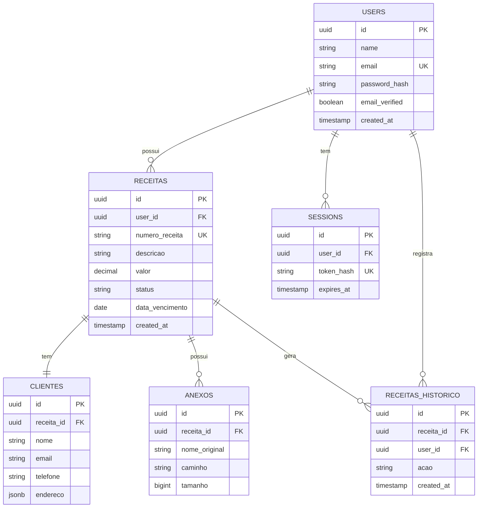

# MIT License
# Autor atual: David Assef
# Descrição: 05 banco dados
# Data: 07-09-2025

# 🗄️ Banco de Dados e Modelos - Backend ReciboFast

**Autor:** David Assef  
**Data:** 29-08-2025  
**Licença:** MIT License  

## 📋 Visão Geral

Este documento detalha a estrutura do banco de dados, modelos de dados, relacionamentos e estratégias de migração utilizadas no backend do ReciboFast.

## 🏗️ Arquitetura do Banco

### 🐘 PostgreSQL
- **Versão**: 15+
- **Encoding**: UTF-8
- **Timezone**: UTC
- **Connection Pool**: 20 conexões máximas
- **SSL Mode**: Require (produção)

### 📊 Estrutura Geral
```sql
-- Esquemas
CREATE SCHEMA IF NOT EXISTS public;
CREATE SCHEMA IF NOT EXISTS audit;
CREATE SCHEMA IF NOT EXISTS logs;

-- Extensions
CREATE EXTENSION IF NOT EXISTS "uuid-ossp";
CREATE EXTENSION IF NOT EXISTS "pgcrypto";
CREATE EXTENSION IF NOT EXISTS "pg_trgm";
```

## 📋 Modelos de Dados

### 👤 Usuários (users)

```sql
CREATE TABLE users (
    id UUID PRIMARY KEY DEFAULT uuid_generate_v4(),
    name VARCHAR(255) NOT NULL,
    email VARCHAR(255) UNIQUE NOT NULL,
    password_hash VARCHAR(255) NOT NULL,
    email_verified BOOLEAN DEFAULT FALSE,
    email_verified_at TIMESTAMP,
    avatar_url VARCHAR(500),
    timezone VARCHAR(50) DEFAULT 'America/Sao_Paulo',
    locale VARCHAR(10) DEFAULT 'pt-BR',
    status VARCHAR(20) DEFAULT 'active' CHECK (status IN ('active', 'inactive', 'suspended')),
    last_login_at TIMESTAMP,
    created_at TIMESTAMP DEFAULT CURRENT_TIMESTAMP,
    updated_at TIMESTAMP DEFAULT CURRENT_TIMESTAMP
);

-- Índices
CREATE INDEX idx_users_email ON users(email);
CREATE INDEX idx_users_status ON users(status);
CREATE INDEX idx_users_created_at ON users(created_at);
```

**Estrutura Go**:
```go
type User struct {
    ID              uuid.UUID  `json:"id" gorm:"type:uuid;primary_key;default:uuid_generate_v4()"`
    Name            string     `json:"name" gorm:"not null;size:255"`
    Email           string     `json:"email" gorm:"unique;not null;size:255"`
    PasswordHash    string     `json:"-" gorm:"not null;size:255"`
    EmailVerified   bool       `json:"email_verified" gorm:"default:false"`
    EmailVerifiedAt *time.Time `json:"email_verified_at"`
    AvatarURL       *string    `json:"avatar_url" gorm:"size:500"`
    Timezone        string     `json:"timezone" gorm:"default:'America/Sao_Paulo';size:50"`
    Locale          string     `json:"locale" gorm:"default:'pt-BR';size:10"`
    Status          string     `json:"status" gorm:"default:'active';size:20"`
    LastLoginAt     *time.Time `json:"last_login_at"`
    CreatedAt       time.Time  `json:"created_at" gorm:"default:CURRENT_TIMESTAMP"`
    UpdatedAt       time.Time  `json:"updated_at" gorm:"default:CURRENT_TIMESTAMP"`
    
    // Relacionamentos
    Receitas []Receita `json:"receitas,omitempty" gorm:"foreignKey:UserID"`
}
```

### 🧾 Receitas (receitas)

```sql
CREATE TABLE receitas (
    id UUID PRIMARY KEY DEFAULT uuid_generate_v4(),
    user_id UUID NOT NULL REFERENCES users(id) ON DELETE CASCADE,
    numero_receita VARCHAR(50) UNIQUE NOT NULL,
    descricao TEXT NOT NULL,
    valor DECIMAL(15,2) NOT NULL CHECK (valor > 0),
    status VARCHAR(20) DEFAULT 'pendente' CHECK (status IN ('pendente', 'pago', 'cancelado', 'vencido')),
    data_emissao DATE NOT NULL DEFAULT CURRENT_DATE,
    data_vencimento DATE NOT NULL,
    data_pagamento DATE,
    observacoes TEXT,
    tags TEXT[], -- Array de tags
    metadata JSONB, -- Dados adicionais flexíveis
    created_at TIMESTAMP DEFAULT CURRENT_TIMESTAMP,
    updated_at TIMESTAMP DEFAULT CURRENT_TIMESTAMP
);

-- Índices
CREATE INDEX idx_receitas_user_id ON receitas(user_id);
CREATE INDEX idx_receitas_status ON receitas(status);
CREATE INDEX idx_receitas_data_vencimento ON receitas(data_vencimento);
CREATE INDEX idx_receitas_numero ON receitas(numero_receita);
CREATE INDEX idx_receitas_valor ON receitas(valor);
CREATE INDEX idx_receitas_tags ON receitas USING GIN(tags);
CREATE INDEX idx_receitas_metadata ON receitas USING GIN(metadata);
CREATE INDEX idx_receitas_created_at ON receitas(created_at);

-- Índice composto para consultas frequentes
CREATE INDEX idx_receitas_user_status_data ON receitas(user_id, status, data_vencimento);
```

**Estrutura Go**:
```go
type Receita struct {
    ID              uuid.UUID      `json:"id" gorm:"type:uuid;primary_key;default:uuid_generate_v4()"`
    UserID          uuid.UUID      `json:"user_id" gorm:"type:uuid;not null"`
    NumeroReceita   string         `json:"numero_receita" gorm:"unique;not null;size:50"`
    Descricao       string         `json:"descricao" gorm:"not null;type:text"`
    Valor           decimal.Decimal `json:"valor" gorm:"type:decimal(15,2);not null"`
    Status          string         `json:"status" gorm:"default:'pendente';size:20"`
    DataEmissao     time.Time      `json:"data_emissao" gorm:"type:date;default:CURRENT_DATE"`
    DataVencimento  time.Time      `json:"data_vencimento" gorm:"type:date;not null"`
    DataPagamento   *time.Time     `json:"data_pagamento" gorm:"type:date"`
    Observacoes     *string        `json:"observacoes" gorm:"type:text"`
    Tags            pq.StringArray `json:"tags" gorm:"type:text[]"`
    Metadata        datatypes.JSON `json:"metadata" gorm:"type:jsonb"`
    CreatedAt       time.Time      `json:"created_at" gorm:"default:CURRENT_TIMESTAMP"`
    UpdatedAt       time.Time      `json:"updated_at" gorm:"default:CURRENT_TIMESTAMP"`
    
    // Relacionamentos
    User     User      `json:"user,omitempty" gorm:"foreignKey:UserID"`
    Cliente  *Cliente  `json:"cliente,omitempty" gorm:"foreignKey:ReceitaID"`
    Anexos   []Anexo   `json:"anexos,omitempty" gorm:"foreignKey:ReceitaID"`
    Historico []ReceitaHistorico `json:"historico,omitempty" gorm:"foreignKey:ReceitaID"`
}
```

### 👥 Clientes (clientes)

```sql
CREATE TABLE clientes (
    id UUID PRIMARY KEY DEFAULT uuid_generate_v4(),
    receita_id UUID NOT NULL REFERENCES receitas(id) ON DELETE CASCADE,
    nome VARCHAR(255) NOT NULL,
    email VARCHAR(255),
    telefone VARCHAR(20),
    documento VARCHAR(20), -- CPF/CNPJ
    tipo_documento VARCHAR(10) CHECK (tipo_documento IN ('cpf', 'cnpj')),
    endereco JSONB, -- Endereço completo em JSON
    created_at TIMESTAMP DEFAULT CURRENT_TIMESTAMP,
    updated_at TIMESTAMP DEFAULT CURRENT_TIMESTAMP
);

-- Índices
CREATE INDEX idx_clientes_receita_id ON clientes(receita_id);
CREATE INDEX idx_clientes_email ON clientes(email);
CREATE INDEX idx_clientes_documento ON clientes(documento);
```

**Estrutura Go**:
```go
type Cliente struct {
    ID             uuid.UUID      `json:"id" gorm:"type:uuid;primary_key;default:uuid_generate_v4()"`
    ReceitaID      uuid.UUID      `json:"receita_id" gorm:"type:uuid;not null"`
    Nome           string         `json:"nome" gorm:"not null;size:255"`
    Email          *string        `json:"email" gorm:"size:255"`
    Telefone       *string        `json:"telefone" gorm:"size:20"`
    Documento      *string        `json:"documento" gorm:"size:20"`
    TipoDocumento  *string        `json:"tipo_documento" gorm:"size:10"`
    Endereco       datatypes.JSON `json:"endereco" gorm:"type:jsonb"`
    CreatedAt      time.Time      `json:"created_at" gorm:"default:CURRENT_TIMESTAMP"`
    UpdatedAt      time.Time      `json:"updated_at" gorm:"default:CURRENT_TIMESTAMP"`
    
    // Relacionamento
    Receita Receita `json:"receita,omitempty" gorm:"foreignKey:ReceitaID"`
}

// Estrutura do endereço (JSON)
type Endereco struct {
    Rua       string `json:"rua"`
    Numero    string `json:"numero"`
    Bairro    string `json:"bairro"`
    Cidade    string `json:"cidade"`
    Estado    string `json:"estado"`
    CEP       string `json:"cep"`
    Pais      string `json:"pais"`
}
```

### 📎 Anexos (anexos)

```sql
CREATE TABLE anexos (
    id UUID PRIMARY KEY DEFAULT uuid_generate_v4(),
    receita_id UUID NOT NULL REFERENCES receitas(id) ON DELETE CASCADE,
    nome_original VARCHAR(255) NOT NULL,
    nome_arquivo VARCHAR(255) NOT NULL, -- Nome no sistema de arquivos
    caminho VARCHAR(500) NOT NULL,
    tamanho BIGINT NOT NULL,
    tipo_mime VARCHAR(100) NOT NULL,
    hash_arquivo VARCHAR(64) NOT NULL, -- SHA-256
    descricao TEXT,
    created_at TIMESTAMP DEFAULT CURRENT_TIMESTAMP
);

-- Índices
CREATE INDEX idx_anexos_receita_id ON anexos(receita_id);
CREATE INDEX idx_anexos_hash ON anexos(hash_arquivo);
CREATE INDEX idx_anexos_tipo_mime ON anexos(tipo_mime);
```

**Estrutura Go**:
```go
type Anexo struct {
    ID            uuid.UUID `json:"id" gorm:"type:uuid;primary_key;default:uuid_generate_v4()"`
    ReceitaID     uuid.UUID `json:"receita_id" gorm:"type:uuid;not null"`
    NomeOriginal  string    `json:"nome_original" gorm:"not null;size:255"`
    NomeArquivo   string    `json:"nome_arquivo" gorm:"not null;size:255"`
    Caminho       string    `json:"caminho" gorm:"not null;size:500"`
    Tamanho       int64     `json:"tamanho" gorm:"not null"`
    TipoMime      string    `json:"tipo_mime" gorm:"not null;size:100"`
    HashArquivo   string    `json:"hash_arquivo" gorm:"not null;size:64"`
    Descricao     *string   `json:"descricao" gorm:"type:text"`
    CreatedAt     time.Time `json:"created_at" gorm:"default:CURRENT_TIMESTAMP"`
    
    // Relacionamento
    Receita Receita `json:"receita,omitempty" gorm:"foreignKey:ReceitaID"`
}
```

### 📜 Histórico de Receitas (receitas_historico)

```sql
CREATE TABLE receitas_historico (
    id UUID PRIMARY KEY DEFAULT uuid_generate_v4(),
    receita_id UUID NOT NULL REFERENCES receitas(id) ON DELETE CASCADE,
    user_id UUID NOT NULL REFERENCES users(id) ON DELETE CASCADE,
    acao VARCHAR(50) NOT NULL, -- create, update, delete, status_change
    campo_alterado VARCHAR(100),
    valor_anterior TEXT,
    valor_novo TEXT,
    observacoes TEXT,
    ip_address INET,
    user_agent TEXT,
    created_at TIMESTAMP DEFAULT CURRENT_TIMESTAMP
);

-- Índices
CREATE INDEX idx_receitas_historico_receita_id ON receitas_historico(receita_id);
CREATE INDEX idx_receitas_historico_user_id ON receitas_historico(user_id);
CREATE INDEX idx_receitas_historico_acao ON receitas_historico(acao);
CREATE INDEX idx_receitas_historico_created_at ON receitas_historico(created_at);
```

**Estrutura Go**:
```go
type ReceitaHistorico struct {
    ID             uuid.UUID `json:"id" gorm:"type:uuid;primary_key;default:uuid_generate_v4()"`
    ReceitaID      uuid.UUID `json:"receita_id" gorm:"type:uuid;not null"`
    UserID         uuid.UUID `json:"user_id" gorm:"type:uuid;not null"`
    Acao           string    `json:"acao" gorm:"not null;size:50"`
    CampoAlterado  *string   `json:"campo_alterado" gorm:"size:100"`
    ValorAnterior  *string   `json:"valor_anterior" gorm:"type:text"`
    ValorNovo      *string   `json:"valor_novo" gorm:"type:text"`
    Observacoes    *string   `json:"observacoes" gorm:"type:text"`
    IPAddress      *string   `json:"ip_address" gorm:"type:inet"`
    UserAgent      *string   `json:"user_agent" gorm:"type:text"`
    CreatedAt      time.Time `json:"created_at" gorm:"default:CURRENT_TIMESTAMP"`
    
    // Relacionamentos
    Receita Receita `json:"receita,omitempty" gorm:"foreignKey:ReceitaID"`
    User    User    `json:"user,omitempty" gorm:"foreignKey:UserID"`
}
```

### 🔐 Sessões (sessions)

```sql
CREATE TABLE sessions (
    id UUID PRIMARY KEY DEFAULT uuid_generate_v4(),
    user_id UUID NOT NULL REFERENCES users(id) ON DELETE CASCADE,
    token_hash VARCHAR(64) NOT NULL UNIQUE, -- SHA-256 do JWT
    device_info JSONB,
    ip_address INET,
    user_agent TEXT,
    expires_at TIMESTAMP NOT NULL,
    revoked BOOLEAN DEFAULT FALSE,
    revoked_at TIMESTAMP,
    created_at TIMESTAMP DEFAULT CURRENT_TIMESTAMP
);

-- Índices
CREATE INDEX idx_sessions_user_id ON sessions(user_id);
CREATE INDEX idx_sessions_token_hash ON sessions(token_hash);
CREATE INDEX idx_sessions_expires_at ON sessions(expires_at);
CREATE INDEX idx_sessions_revoked ON sessions(revoked);
```

## 🔄 Relacionamentos

### 📊 Diagrama ER



### 🔗 Constraints e Regras

```sql
-- Triggers para updated_at
CREATE OR REPLACE FUNCTION update_updated_at_column()
RETURNS TRIGGER AS $$
BEGIN
    NEW.updated_at = CURRENT_TIMESTAMP;
    RETURN NEW;
END;
$$ language 'plpgsql';

-- Aplicar trigger em todas as tabelas relevantes
CREATE TRIGGER update_users_updated_at BEFORE UPDATE ON users
    FOR EACH ROW EXECUTE FUNCTION update_updated_at_column();

CREATE TRIGGER update_receitas_updated_at BEFORE UPDATE ON receitas
    FOR EACH ROW EXECUTE FUNCTION update_updated_at_column();

CREATE TRIGGER update_clientes_updated_at BEFORE UPDATE ON clientes
    FOR EACH ROW EXECUTE FUNCTION update_updated_at_column();

-- Trigger para gerar número de receita automaticamente
CREATE OR REPLACE FUNCTION generate_numero_receita()
RETURNS TRIGGER AS $$
BEGIN
    IF NEW.numero_receita IS NULL OR NEW.numero_receita = '' THEN
        NEW.numero_receita := 'REC-' || TO_CHAR(CURRENT_DATE, 'YYYY') || '-' || 
                             LPAD(nextval('receita_numero_seq')::text, 6, '0');
    END IF;
    RETURN NEW;
END;
$$ language 'plpgsql';

-- Sequence para numeração
CREATE SEQUENCE IF NOT EXISTS receita_numero_seq START 1;

CREATE TRIGGER generate_receita_numero BEFORE INSERT ON receitas
    FOR EACH ROW EXECUTE FUNCTION generate_numero_receita();

-- Trigger para auditoria
CREATE OR REPLACE FUNCTION audit_receita_changes()
RETURNS TRIGGER AS $$
BEGIN
    IF TG_OP = 'UPDATE' THEN
        -- Registrar mudanças específicas
        IF OLD.status != NEW.status THEN
            INSERT INTO receitas_historico (receita_id, user_id, acao, campo_alterado, valor_anterior, valor_novo)
            VALUES (NEW.id, NEW.user_id, 'status_change', 'status', OLD.status, NEW.status);
        END IF;
        
        IF OLD.valor != NEW.valor THEN
            INSERT INTO receitas_historico (receita_id, user_id, acao, campo_alterado, valor_anterior, valor_novo)
            VALUES (NEW.id, NEW.user_id, 'update', 'valor', OLD.valor::text, NEW.valor::text);
        END IF;
        
        RETURN NEW;
    ELSIF TG_OP = 'INSERT' THEN
        INSERT INTO receitas_historico (receita_id, user_id, acao)
        VALUES (NEW.id, NEW.user_id, 'create');
        RETURN NEW;
    ELSIF TG_OP = 'DELETE' THEN
        INSERT INTO receitas_historico (receita_id, user_id, acao)
        VALUES (OLD.id, OLD.user_id, 'delete');
        RETURN OLD;
    END IF;
    RETURN NULL;
END;
$$ language 'plpgsql';

CREATE TRIGGER audit_receitas AFTER INSERT OR UPDATE OR DELETE ON receitas
    FOR EACH ROW EXECUTE FUNCTION audit_receita_changes();
```

## 🚀 Migrações

### 📁 Estrutura de Migrações

```
migrations/
├── 001_create_users_table.up.sql
├── 001_create_users_table.down.sql
├── 002_create_receitas_table.up.sql
├── 002_create_receitas_table.down.sql
├── 003_create_clientes_table.up.sql
├── 003_create_clientes_table.down.sql
├── 004_create_anexos_table.up.sql
├── 004_create_anexos_table.down.sql
├── 005_create_historico_table.up.sql
├── 005_create_historico_table.down.sql
└── 006_create_sessions_table.up.sql
```

### 🔧 Ferramenta de Migração

```go
// migrate/migrate.go
package migrate

import (
    "database/sql"
    "github.com/golang-migrate/migrate/v4"
    "github.com/golang-migrate/migrate/v4/database/postgres"
    _ "github.com/golang-migrate/migrate/v4/source/file"
)

func RunMigrations(db *sql.DB, migrationsPath string) error {
    driver, err := postgres.WithInstance(db, &postgres.Config{})
    if err != nil {
        return err
    }
    
    m, err := migrate.NewWithDatabaseInstance(
        "file://"+migrationsPath,
        "postgres",
        driver,
    )
    if err != nil {
        return err
    }
    
    if err := m.Up(); err != nil && err != migrate.ErrNoChange {
        return err
    }
    
    return nil
}
```

### 📝 Exemplo de Migração

```sql
-- 001_create_users_table.up.sql
CREATE EXTENSION IF NOT EXISTS "uuid-ossp";

CREATE TABLE users (
    id UUID PRIMARY KEY DEFAULT uuid_generate_v4(),
    name VARCHAR(255) NOT NULL,
    email VARCHAR(255) UNIQUE NOT NULL,
    password_hash VARCHAR(255) NOT NULL,
    email_verified BOOLEAN DEFAULT FALSE,
    created_at TIMESTAMP DEFAULT CURRENT_TIMESTAMP,
    updated_at TIMESTAMP DEFAULT CURRENT_TIMESTAMP
);

CREATE INDEX idx_users_email ON users(email);
CREATE INDEX idx_users_created_at ON users(created_at);
```

```sql
-- 001_create_users_table.down.sql
DROP TABLE IF EXISTS users;
DROP INDEX IF EXISTS idx_users_email;
DROP INDEX IF EXISTS idx_users_created_at;
```

## 🔍 Consultas Otimizadas

### 📊 Consultas Frequentes

```sql
-- Listar receitas com paginação e filtros
SELECT 
    r.id,
    r.numero_receita,
    r.descricao,
    r.valor,
    r.status,
    r.data_vencimento,
    c.nome as cliente_nome,
    c.email as cliente_email
FROM receitas r
LEFT JOIN clientes c ON r.id = c.receita_id
WHERE r.user_id = $1
    AND ($2::text IS NULL OR r.status = $2)
    AND ($3::date IS NULL OR r.data_vencimento >= $3)
    AND ($4::date IS NULL OR r.data_vencimento <= $4)
    AND ($5::text IS NULL OR r.descricao ILIKE '%' || $5 || '%')
ORDER BY r.created_at DESC
LIMIT $6 OFFSET $7;

-- Estatísticas do usuário
SELECT 
    COUNT(*) as total_receitas,
    SUM(valor) as valor_total,
    SUM(CASE WHEN status = 'pendente' THEN valor ELSE 0 END) as valor_pendente,
    SUM(CASE WHEN status = 'pago' THEN valor ELSE 0 END) as valor_pago,
    COUNT(CASE WHEN status = 'pendente' THEN 1 END) as qtd_pendente,
    COUNT(CASE WHEN status = 'pago' THEN 1 END) as qtd_pago
FROM receitas 
WHERE user_id = $1
    AND created_at >= $2
    AND created_at <= $3;

-- Receitas vencendo nos próximos 7 dias
SELECT 
    r.id,
    r.numero_receita,
    r.descricao,
    r.valor,
    r.data_vencimento,
    c.nome as cliente_nome,
    c.email as cliente_email
FROM receitas r
LEFT JOIN clientes c ON r.id = c.receita_id
WHERE r.user_id = $1
    AND r.status = 'pendente'
    AND r.data_vencimento BETWEEN CURRENT_DATE AND CURRENT_DATE + INTERVAL '7 days'
ORDER BY r.data_vencimento ASC;
```

### 🚀 Otimizações de Performance

```sql
-- Índices compostos para consultas frequentes
CREATE INDEX idx_receitas_user_status_vencimento 
ON receitas(user_id, status, data_vencimento);

CREATE INDEX idx_receitas_user_created_desc 
ON receitas(user_id, created_at DESC);

-- Índice parcial para receitas pendentes
CREATE INDEX idx_receitas_pendentes_vencimento 
ON receitas(data_vencimento) 
WHERE status = 'pendente';

-- Índice para busca textual
CREATE INDEX idx_receitas_descricao_trgm 
ON receitas USING gin(descricao gin_trgm_ops);
```

## 🔒 Segurança e Backup

### 🛡️ Políticas de Segurança

```sql
-- Row Level Security (RLS)
ALTER TABLE receitas ENABLE ROW LEVEL SECURITY;

-- Política: usuários só veem suas próprias receitas
CREATE POLICY receitas_user_policy ON receitas
    FOR ALL TO authenticated_user
    USING (user_id = current_user_id());

-- Função para obter ID do usuário atual
CREATE OR REPLACE FUNCTION current_user_id()
RETURNS UUID AS $$
BEGIN
    RETURN current_setting('app.current_user_id')::UUID;
EXCEPTION
    WHEN OTHERS THEN
        RETURN NULL;
END;
$$ LANGUAGE plpgsql SECURITY DEFINER;
```

### 💾 Estratégia de Backup

```bash
#!/bin/bash
# backup.sh

DB_NAME="recibo_fast"
DB_USER="postgres"
BACKUP_DIR="/backups"
DATE=$(date +"%Y%m%d_%H%M%S")

# Backup completo
pg_dump -U $DB_USER -h localhost -d $DB_NAME -f "$BACKUP_DIR/full_backup_$DATE.sql"

# Backup apenas dos dados
pg_dump -U $DB_USER -h localhost -d $DB_NAME --data-only -f "$BACKUP_DIR/data_backup_$DATE.sql"

# Backup apenas da estrutura
pg_dump -U $DB_USER -h localhost -d $DB_NAME --schema-only -f "$BACKUP_DIR/schema_backup_$DATE.sql"

# Compactar backups antigos (mais de 7 dias)
find $BACKUP_DIR -name "*.sql" -mtime +7 -exec gzip {} \;

# Remover backups muito antigos (mais de 30 dias)
find $BACKUP_DIR -name "*.sql.gz" -mtime +30 -delete
```

## 📊 Monitoramento

### 📈 Métricas de Performance

```sql
-- View para monitorar consultas lentas
CREATE VIEW slow_queries AS
SELECT 
    query,
    calls,
    total_time,
    mean_time,
    rows,
    100.0 * shared_blks_hit / nullif(shared_blks_hit + shared_blks_read, 0) AS hit_percent
FROM pg_stat_statements
ORDER BY total_time DESC
LIMIT 20;

-- View para monitorar tamanho das tabelas
CREATE VIEW table_sizes AS
SELECT 
    schemaname,
    tablename,
    pg_size_pretty(pg_total_relation_size(schemaname||'.'||tablename)) as size,
    pg_total_relation_size(schemaname||'.'||tablename) as size_bytes
FROM pg_tables 
WHERE schemaname = 'public'
ORDER BY size_bytes DESC;

-- View para monitorar índices não utilizados
CREATE VIEW unused_indexes AS
SELECT 
    schemaname,
    tablename,
    indexname,
    idx_tup_read,
    idx_tup_fetch,
    pg_size_pretty(pg_relation_size(indexrelid)) as size
FROM pg_stat_user_indexes
WHERE idx_tup_read = 0 AND idx_tup_fetch = 0
ORDER BY pg_relation_size(indexrelid) DESC;
```

## 🧪 Dados de Teste

### 🎭 Seeds para Desenvolvimento

```sql
-- seeds/001_users.sql
INSERT INTO users (id, name, email, password_hash, email_verified) VALUES
('550e8400-e29b-41d4-a716-446655440001', 'João Silva', 'joao@teste.com', '$2a$10$...', true),
('550e8400-e29b-41d4-a716-446655440002', 'Maria Santos', 'maria@teste.com', '$2a$10$...', true);

-- seeds/002_receitas.sql
INSERT INTO receitas (id, user_id, descricao, valor, status, data_vencimento) VALUES
('660e8400-e29b-41d4-a716-446655440001', '550e8400-e29b-41d4-a716-446655440001', 'Consultoria em TI', 2500.00, 'pendente', '2025-02-15'),
('660e8400-e29b-41d4-a716-446655440002', '550e8400-e29b-41d4-a716-446655440001', 'Desenvolvimento de Site', 5000.00, 'pago', '2025-01-30');

-- seeds/003_clientes.sql
INSERT INTO clientes (receita_id, nome, email, telefone) VALUES
('660e8400-e29b-41d4-a716-446655440001', 'Tech Corp', 'contato@techcorp.com', '(11) 99999-9999'),
('660e8400-e29b-41d4-a716-446655440002', 'StartupXYZ', 'admin@startupxyz.com', '(11) 88888-8888');
```

## 📚 Referências

- [PostgreSQL Documentation](https://www.postgresql.org/docs/)
- [GORM Documentation](https://gorm.io/docs/)
- [Database Design Best Practices](https://www.postgresql.org/docs/current/ddl-best-practices.html)
- [SQL Performance Tuning](https://www.postgresql.org/docs/current/performance-tips.html)
- [Golang Migrate](https://github.com/golang-migrate/migrate)

---

*Última atualização: 29-08-2025*