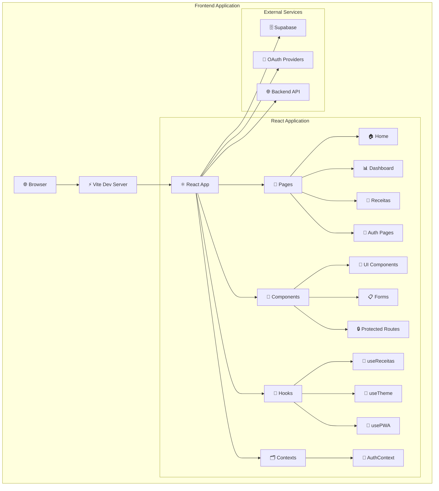
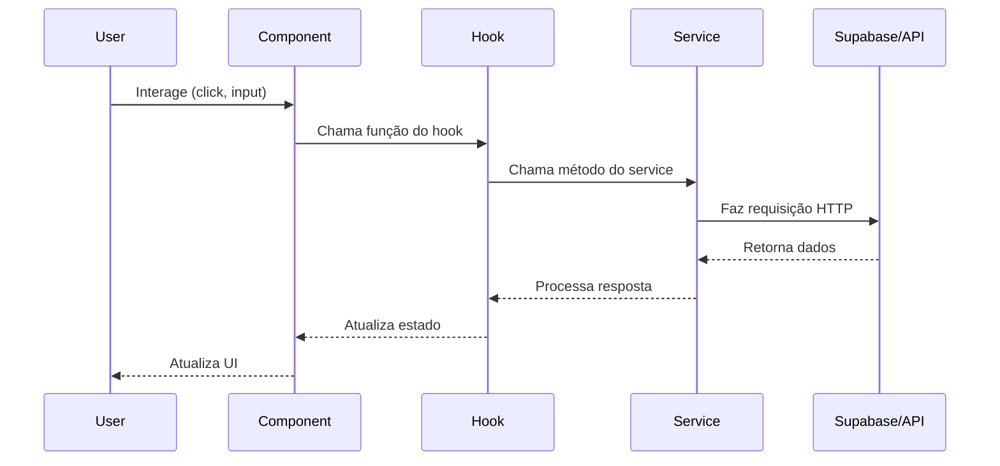

# 🏗️ Arquitetura Geral - Frontend ReciboFast

**Autor:** David Assef  
**Data:** 29-08-2025  
**Licença:** MIT License  

## 📋 Visão Geral

O frontend do ReciboFast é uma aplicação React moderna construída com TypeScript, utilizando Vite como bundler e Tailwind CSS para estilização. A arquitetura segue princípios de componentização, separação de responsabilidades e desenvolvimento orientado a componentes.

## 🏛️ Arquitetura de Alto Nível



## 🎯 Princípios Arquiteturais

### 1. **Component-Driven Development**
- Desenvolvimento orientado a componentes reutilizáveis
- Separação clara entre componentes de UI e lógica de negócio
- Composição sobre herança

### 2. **Separation of Concerns**
- **Pages**: Componentes de página que orquestram outros componentes
- **Components**: Componentes reutilizáveis de UI
- **Hooks**: Lógica de negócio e estado encapsulados
- **Contexts**: Estado global da aplicação

### 3. **Unidirectional Data Flow**
- Fluxo de dados descendente (top-down)
- Estado gerenciado em níveis apropriados
- Comunicação via props e callbacks

### 4. **Progressive Web App (PWA)**
- Funcionalidades offline
- Instalação nativa
- Service Workers para cache

## 🏗️ Camadas da Arquitetura

### 📱 **Presentation Layer (UI)**

```typescript
// Estrutura típica de um componente de página
interface PageProps {
  // Props específicas da página
}

const PageComponent: React.FC<PageProps> = () => {
  // Hooks para estado e lógica
  const { data, loading, error } = useCustomHook();
  
  // Renderização condicional
  if (loading) return <LoadingSpinner />;
  if (error) return <ErrorMessage error={error} />;
  
  return (
    <Layout>
      <PageContent data={data} />
    </Layout>
  );
};
```

**Responsabilidades:**
- Renderização de componentes
- Interação com usuário
- Navegação entre páginas
- Feedback visual (loading, errors)

### 🧠 **Logic Layer (Hooks)**

```typescript
// Hook customizado para lógica de negócio
export const useReceitas = () => {
  const [receitas, setReceitas] = useState<Receita[]>([]);
  const [loading, setLoading] = useState(false);
  const [error, setError] = useState<string | null>(null);
  
  const fetchReceitas = useCallback(async () => {
    setLoading(true);
    try {
      const data = await receitaService.getAll();
      setReceitas(data);
    } catch (err) {
      setError(err.message);
    } finally {
      setLoading(false);
    }
  }, []);
  
  return {
    receitas,
    loading,
    error,
    fetchReceitas,
    createReceita: receitaService.create,
    updateReceita: receitaService.update,
    deleteReceita: receitaService.delete,
  };
};
```

**Responsabilidades:**
- Lógica de negócio
- Gerenciamento de estado local
- Integração com APIs
- Validação de dados

### 🗂️ **State Layer (Contexts)**

```typescript
// Context para estado global
interface AuthContextType {
  user: User | null;
  loading: boolean;
  login: (email: string, password: string) => Promise<void>;
  logout: () => void;
  register: (userData: RegisterData) => Promise<void>;
}

const AuthContext = createContext<AuthContextType | undefined>(undefined);

export const AuthProvider: React.FC<{ children: ReactNode }> = ({ children }) => {
  const [user, setUser] = useState<User | null>(null);
  const [loading, setLoading] = useState(true);
  
  // Implementação dos métodos...
  
  return (
    <AuthContext.Provider value={{ user, loading, login, logout, register }}>
      {children}
    </AuthContext.Provider>
  );
};
```

**Responsabilidades:**
- Estado global da aplicação
- Autenticação e autorização
- Configurações do usuário
- Tema e preferências

### 🌐 **Service Layer (API Integration)**

```typescript
// Serviço para integração com API
class ReceitaService {
  private supabase = createClient(SUPABASE_URL, SUPABASE_ANON_KEY);
  
  async getAll(filters?: ReceitaFilters): Promise<Receita[]> {
    let query = this.supabase
      .from('receitas')
      .select('*, clientes(*)');
    
    if (filters?.status) {
      query = query.eq('status', filters.status);
    }
    
    const { data, error } = await query;
    
    if (error) throw new Error(error.message);
    return data || [];
  }
  
  async create(receita: CreateReceitaData): Promise<Receita> {
    const { data, error } = await this.supabase
      .from('receitas')
      .insert(receita)
      .select()
      .single();
    
    if (error) throw new Error(error.message);
    return data;
  }
  
  // Outros métodos...
}

export const receitaService = new ReceitaService();
```

**Responsabilidades:**
- Comunicação com APIs externas
- Transformação de dados
- Cache de requisições
- Tratamento de erros de rede

## 🔄 Fluxo de Dados

### 📊 **Fluxo Típico de uma Operação**



### 🔄 **Gerenciamento de Estado**

```typescript
// Exemplo de fluxo de estado
const ReceitasPage: React.FC = () => {
  // Estado local do componente
  const [filters, setFilters] = useState<ReceitaFilters>({});
  const [selectedReceita, setSelectedReceita] = useState<Receita | null>(null);
  
  // Hook para lógica de negócio
  const { receitas, loading, error, fetchReceitas, createReceita } = useReceitas();
  
  // Context para estado global
  const { user } = useAuth();
  
  // Efeitos para sincronização
  useEffect(() => {
    if (user) {
      fetchReceitas(filters);
    }
  }, [user, filters, fetchReceitas]);
  
  // Handlers para interações
  const handleCreateReceita = async (data: CreateReceitaData) => {
    try {
      await createReceita(data);
      await fetchReceitas(filters); // Recarrega lista
    } catch (error) {
      // Tratamento de erro
    }
  };
  
  return (
    <Layout>
      <ReceitaFilters filters={filters} onChange={setFilters} />
      <ReceitaList 
        receitas={receitas} 
        loading={loading}
        onSelect={setSelectedReceita}
      />
      <ReceitaForm onSubmit={handleCreateReceita} />
    </Layout>
  );
};
```

## 🎨 Padrões de Design

### 1. **Container/Presentational Pattern**

```typescript
// Container Component (lógica)
const ReceitaListContainer: React.FC = () => {
  const { receitas, loading, error } = useReceitas();
  
  if (loading) return <LoadingSpinner />;
  if (error) return <ErrorMessage error={error} />;
  
  return <ReceitaListPresentation receitas={receitas} />;
};

// Presentational Component (UI)
interface ReceitaListPresentationProps {
  receitas: Receita[];
}

const ReceitaListPresentation: React.FC<ReceitaListPresentationProps> = ({ receitas }) => {
  return (
    <div className="grid gap-4">
      {receitas.map(receita => (
        <ReceitaCard key={receita.id} receita={receita} />
      ))}
    </div>
  );
};
```

### 2. **Higher-Order Components (HOCs)**

```typescript
// HOC para autenticação
const withAuth = <P extends object>(Component: React.ComponentType<P>) => {
  return (props: P) => {
    const { user, loading } = useAuth();
    
    if (loading) return <LoadingSpinner />;
    if (!user) return <Navigate to="/login" />;
    
    return <Component {...props} />;
  };
};

// Uso do HOC
const ProtectedDashboard = withAuth(Dashboard);
```

### 3. **Render Props Pattern**

```typescript
// Componente com render prop
interface DataFetcherProps<T> {
  url: string;
  children: (data: T | null, loading: boolean, error: string | null) => ReactNode;
}

const DataFetcher = <T,>({ url, children }: DataFetcherProps<T>) => {
  const [data, setData] = useState<T | null>(null);
  const [loading, setLoading] = useState(true);
  const [error, setError] = useState<string | null>(null);
  
  useEffect(() => {
    // Lógica de fetch...
  }, [url]);
  
  return <>{children(data, loading, error)}</>;
};

// Uso do render prop
const ReceitasPage = () => (
  <DataFetcher<Receita[]> url="/api/receitas">
    {(receitas, loading, error) => {
      if (loading) return <LoadingSpinner />;
      if (error) return <ErrorMessage error={error} />;
      return <ReceitaList receitas={receitas || []} />;
    }}
  </DataFetcher>
);
```

### 4. **Compound Components Pattern**

```typescript
// Componente composto
interface ModalProps {
  isOpen: boolean;
  onClose: () => void;
  children: ReactNode;
}

const Modal: React.FC<ModalProps> & {
  Header: React.FC<{ children: ReactNode }>;
  Body: React.FC<{ children: ReactNode }>;
  Footer: React.FC<{ children: ReactNode }>;
} = ({ isOpen, onClose, children }) => {
  if (!isOpen) return null;
  
  return (
    <div className="modal-overlay" onClick={onClose}>
      <div className="modal-content" onClick={e => e.stopPropagation()}>
        {children}
      </div>
    </div>
  );
};

Modal.Header = ({ children }) => (
  <div className="modal-header">{children}</div>
);

Modal.Body = ({ children }) => (
  <div className="modal-body">{children}</div>
);

Modal.Footer = ({ children }) => (
  <div className="modal-footer">{children}</div>
);

// Uso do componente composto
const App = () => {
  const [isModalOpen, setIsModalOpen] = useState(false);
  
  return (
    <Modal isOpen={isModalOpen} onClose={() => setIsModalOpen(false)}>
      <Modal.Header>
        <h2>Título do Modal</h2>
      </Modal.Header>
      <Modal.Body>
        <p>Conteúdo do modal...</p>
      </Modal.Body>
      <Modal.Footer>
        <button onClick={() => setIsModalOpen(false)}>Fechar</button>
      </Modal.Footer>
    </Modal>
  );
};
```

## 🔧 Tecnologias e Ferramentas

### **Core Technologies**
- **React 18**: Biblioteca principal para UI
- **TypeScript**: Tipagem estática
- **Vite**: Build tool e dev server
- **Tailwind CSS**: Framework de CSS utilitário

### **State Management**
- **React Context**: Estado global
- **React Hooks**: Estado local e lógica
- **Custom Hooks**: Lógica reutilizável

### **Routing**
- **React Router**: Navegação SPA
- **Protected Routes**: Controle de acesso

### **Data Fetching**
- **Supabase Client**: Backend-as-a-Service
- **Fetch API**: Requisições HTTP
- **Custom Services**: Abstração de APIs

### **Styling**
- **Tailwind CSS**: Utilitários CSS
- **CSS Modules**: Estilos locais quando necessário
- **Responsive Design**: Mobile-first

### **PWA Features**
- **Service Workers**: Cache e offline
- **Web App Manifest**: Instalação nativa
- **Push Notifications**: Engajamento

## 🚀 Performance e Otimização

### **Code Splitting**
```typescript
// Lazy loading de páginas
const Dashboard = lazy(() => import('./pages/Dashboard'));
const Receitas = lazy(() => import('./pages/Receitas'));

const App = () => (
  <Router>
    <Suspense fallback={<LoadingSpinner />}>
      <Routes>
        <Route path="/dashboard" element={<Dashboard />} />
        <Route path="/receitas" element={<Receitas />} />
      </Routes>
    </Suspense>
  </Router>
);
```

### **Memoization**
```typescript
// Otimização com React.memo
const ReceitaCard = React.memo<ReceitaCardProps>(({ receita, onEdit, onDelete }) => {
  return (
    <div className="receita-card">
      {/* Conteúdo do card */}
    </div>
  );
});

// Otimização com useMemo
const ReceitaList: React.FC<ReceitaListProps> = ({ receitas, filters }) => {
  const filteredReceitas = useMemo(() => {
    return receitas.filter(receita => {
      // Lógica de filtro...
    });
  }, [receitas, filters]);
  
  return (
    <div>
      {filteredReceitas.map(receita => (
        <ReceitaCard key={receita.id} receita={receita} />
      ))}
    </div>
  );
};
```

### **Bundle Optimization**
```typescript
// vite.config.ts
export default defineConfig({
  build: {
    rollupOptions: {
      output: {
        manualChunks: {
          vendor: ['react', 'react-dom'],
          supabase: ['@supabase/supabase-js'],
          ui: ['@headlessui/react', '@heroicons/react'],
        },
      },
    },
  },
});
```

## 🔒 Segurança

### **Autenticação e Autorização**
```typescript
// Proteção de rotas
const ProtectedRoute: React.FC<{ children: ReactNode }> = ({ children }) => {
  const { user, loading } = useAuth();
  
  if (loading) return <LoadingSpinner />;
  if (!user) return <Navigate to="/login" />;
  
  return <>{children}</>;
};

// Verificação de permissões
const usePermissions = () => {
  const { user } = useAuth();
  
  return {
    canCreateReceita: user?.role === 'admin' || user?.role === 'user',
    canDeleteReceita: user?.role === 'admin',
    canViewReports: user?.role === 'admin',
  };
};
```

### **Sanitização de Dados**
```typescript
// Sanitização de inputs
const sanitizeInput = (input: string): string => {
  return input
    .replace(/<script[^>]*>.*?<\/script>/gi, '')
    .replace(/<[^>]*>/g, '')
    .trim();
};

// Validação de formulários
const receitaSchema = z.object({
  numero: z.string().min(1, 'Número é obrigatório'),
  valor: z.number().positive('Valor deve ser positivo'),
  descricao: z.string().max(500, 'Descrição muito longa'),
});
```

## 📊 Monitoramento e Analytics

### **Error Boundary**
```typescript
class ErrorBoundary extends React.Component<
  { children: ReactNode },
  { hasError: boolean; error?: Error }
> {
  constructor(props: { children: ReactNode }) {
    super(props);
    this.state = { hasError: false };
  }
  
  static getDerivedStateFromError(error: Error) {
    return { hasError: true, error };
  }
  
  componentDidCatch(error: Error, errorInfo: ErrorInfo) {
    // Log do erro para serviço de monitoramento
    console.error('Error caught by boundary:', error, errorInfo);
  }
  
  render() {
    if (this.state.hasError) {
      return <ErrorFallback error={this.state.error} />;
    }
    
    return this.props.children;
  }
}
```

### **Performance Monitoring**
```typescript
// Hook para métricas de performance
const usePerformanceMonitoring = () => {
  useEffect(() => {
    // Monitorar Core Web Vitals
    const observer = new PerformanceObserver((list) => {
      list.getEntries().forEach((entry) => {
        // Enviar métricas para serviço de analytics
        console.log(entry.name, entry.value);
      });
    });
    
    observer.observe({ entryTypes: ['measure', 'navigation'] });
    
    return () => observer.disconnect();
  }, []);
};
```

## 🎯 Próximos Passos

### 🔄 **Melhorias Planejadas**

1. **State Management Avançado**
   - Implementar Zustand ou Redux Toolkit
   - Otimizar re-renders desnecessários
   - Cache inteligente de dados

2. **Performance**
   - Implementar Virtual Scrolling
   - Otimizar bundle size
   - Implementar Service Workers avançados

3. **Testing**
   - Aumentar cobertura de testes
   - Implementar testes E2E
   - Testes de performance automatizados

4. **Acessibilidade**
   - Auditoria completa de acessibilidade
   - Implementar navegação por teclado
   - Melhorar suporte a screen readers

### 📋 **Roadmap Técnico**

- [ ] Migração para React 19 (quando estável)
- [ ] Implementação de Micro-frontends
- [ ] Integração com GraphQL
- [ ] Implementação de Design Tokens
- [ ] Otimização para Core Web Vitals

## 📚 Referências

- [React Documentation](https://react.dev/)
- [TypeScript Handbook](https://www.typescriptlang.org/docs/)
- [Vite Guide](https://vitejs.dev/guide/)
- [Tailwind CSS Documentation](https://tailwindcss.com/docs)
- [React Patterns](https://reactpatterns.com/)
- [Clean Architecture Frontend](https://blog.cleancoder.com/uncle-bob/2012/08/13/the-clean-architecture.html)

---

*Última atualização: 29-08-2025*