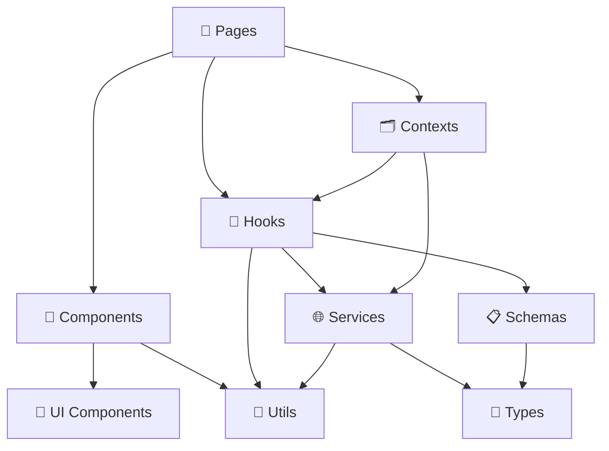

# MIT License
# Autor atual: David Assef
# Descrição: 02 estrutura projeto
# Data: 07-09-2025

# 📁 Estrutura do Projeto - Frontend ReciboFast

**Autor:** David Assef  
**Data:** 29-08-2025  
**Licença:** MIT License  

## 📋 Visão Geral

Este documento detalha a organização de pastas e arquivos do frontend do ReciboFast, explicando a estrutura do projeto, convenções de nomenclatura e organização modular.

## 🏗️ Estrutura Atual do Diretório

```
frontend/
├── 📁 public/                     # Arquivos estáticos
│   ├── 🖼️ favicon.ico
│   ├── 📱 manifest.json           # PWA manifest
│   └── 🤖 robots.txt
│
├── 📁 src/                        # Código fonte principal
│   ├── 📁 components/             # Componentes reutilizáveis
│   │   ├── 📁 ui/                 # Componentes base de UI
│   │   │   ├── Button.tsx
│   │   │   ├── Input.tsx
│   │   │   ├── Modal.tsx
│   │   │   ├── Card.tsx
│   │   │   ├── LoadingSpinner.tsx
│   │   │   └── ErrorMessage.tsx
│   │   ├── 📁 forms/              # Componentes de formulário
│   │   │   ├── ReceitaForm.tsx
│   │   │   ├── ClienteForm.tsx
│   │   │   ├── LoginForm.tsx
│   │   │   └── RegisterForm.tsx
│   │   ├── 📁 layout/             # Componentes de layout
│   │   │   ├── Header.tsx
│   │   │   ├── Sidebar.tsx
│   │   │   ├── Footer.tsx
│   │   │   └── Layout.tsx
│   │   └── 📁 common/             # Componentes comuns
│   │       ├── ProtectedRoute.tsx
│   │       ├── ErrorBoundary.tsx
│   │       └── ThemeProvider.tsx
│   │
│   ├── 📁 pages/                  # Páginas da aplicação
│   │   ├── 🏠 Home.tsx
│   │   ├── 📊 Dashboard.tsx
│   │   ├── 📄 Receitas.tsx
│   │   ├── 👥 Clientes.tsx
│   │   ├── 📈 Relatorios.tsx
│   │   ├── ⚙️ Configuracoes.tsx
│   │   ├── 🔐 Login.tsx
│   │   ├── 📝 Register.tsx
│   │   └── ❌ NotFound.tsx
│   │
│   ├── 📁 hooks/                  # Hooks customizados
│   │   ├── 🔄 useReceitas.ts
│   │   ├── 👥 useClientes.ts
│   │   ├── 🔐 useAuth.ts
│   │   ├── 🎨 useTheme.ts
│   │   ├── 📱 usePWA.ts
│   │   ├── 🌐 useApi.ts
│   │   └── 💾 useLocalStorage.ts
│   │
│   ├── 📁 contexts/               # Contextos React
│   │   ├── 🔐 AuthContext.tsx
│   │   ├── 🎨 ThemeContext.tsx
│   │   └── 📱 PWAContext.tsx
│   │
│   ├── 📁 services/               # Serviços e APIs
│   │   ├── 🌐 api.ts              # Configuração base da API
│   │   ├── 🔐 auth.service.ts     # Serviços de autenticação
│   │   ├── 📄 receita.service.ts  # Serviços de receitas
│   │   ├── 👥 cliente.service.ts  # Serviços de clientes
│   │   ├── 📊 relatorio.service.ts # Serviços de relatórios
│   │   └── 💾 storage.service.ts  # Serviços de armazenamento
│   │
│   ├── 📁 schemas/                # Schemas de validação
│   │   ├── 📄 receita.schema.ts
│   │   ├── 👥 cliente.schema.ts
│   │   ├── 🔐 auth.schema.ts
│   │   └── ⚙️ config.schema.ts
│   │
│   ├── 📁 types/                  # Definições de tipos
│   │   ├── 📄 receita.types.ts
│   │   ├── 👥 cliente.types.ts
│   │   ├── 🔐 auth.types.ts
│   │   ├── 🌐 api.types.ts
│   │   └── 🎨 theme.types.ts
│   │
│   ├── 📁 utils/                  # Funções utilitárias
│   │   ├── 📅 date.utils.ts
│   │   ├── 💰 currency.utils.ts
│   │   ├── 📝 validation.utils.ts
│   │   ├── 🔧 format.utils.ts
│   │   └── 🎯 constants.ts
│   │
│   ├── 📁 styles/                 # Estilos globais
│   │   ├── 🎨 globals.css
│   │   ├── 🎯 components.css
│   │   └── 📱 responsive.css
│   │
│   ├── 📁 assets/                 # Assets estáticos
│   │   ├── 📁 images/
│   │   ├── 📁 icons/
│   │   └── 📁 fonts/
│   │
│   ├── ⚛️ App.tsx                 # Componente raiz
│   ├── 🚀 main.tsx               # Ponto de entrada
│   └── 🌍 vite-env.d.ts          # Tipos do Vite
│
├── 📁 docs/                       # Documentação técnica
│   ├── 📋 INDICE.md
│   ├── 🏗️ 01-arquitetura-geral.md
│   ├── 📁 02-estrutura-projeto.md
│   └── ...
│
├── 📁 tests/                      # Testes
│   ├── 📁 __mocks__/             # Mocks para testes
│   ├── 📁 components/            # Testes de componentes
│   ├── 📁 hooks/                 # Testes de hooks
│   ├── 📁 pages/                 # Testes de páginas
│   ├── 📁 services/              # Testes de serviços
│   ├── 📁 utils/                 # Testes de utilitários
│   └── ⚙️ setup.ts               # Configuração de testes
│
├── ⚙️ package.json               # Dependências e scripts
├── 📝 tsconfig.json              # Configuração TypeScript
├── ⚡ vite.config.ts             # Configuração Vite
├── 🎨 tailwind.config.js         # Configuração Tailwind
├── 📦 postcss.config.js          # Configuração PostCSS
├── 🧹 .eslintrc.json             # Configuração ESLint
├── 💅 .prettierrc                # Configuração Prettier
├── 🚫 .gitignore                 # Arquivos ignorados pelo Git
├── 🌍 .env.example               # Exemplo de variáveis de ambiente
└── 📖 README.md                  # Documentação do projeto
```

## 📂 Detalhamento das Pastas

### 🎯 **`/src/components/`**

Organização hierárquica de componentes reutilizáveis:

#### 🎨 **`/ui/`** - Componentes Base de Interface
```typescript
// Exemplo: Button.tsx
interface ButtonProps {
  variant?: 'primary' | 'secondary' | 'danger';
  size?: 'sm' | 'md' | 'lg';
  loading?: boolean;
  disabled?: boolean;
  children: ReactNode;
  onClick?: () => void;
}

export const Button: React.FC<ButtonProps> = ({
  variant = 'primary',
  size = 'md',
  loading = false,
  disabled = false,
  children,
  onClick,
}) => {
  const baseClasses = 'font-medium rounded-lg transition-colors';
  const variantClasses = {
    primary: 'bg-blue-600 hover:bg-blue-700 text-white',
    secondary: 'bg-gray-200 hover:bg-gray-300 text-gray-900',
    danger: 'bg-red-600 hover:bg-red-700 text-white',
  };
  const sizeClasses = {
    sm: 'px-3 py-1.5 text-sm',
    md: 'px-4 py-2 text-base',
    lg: 'px-6 py-3 text-lg',
  };
  
  return (
    <button
      className={`${baseClasses} ${variantClasses[variant]} ${sizeClasses[size]}`}
      disabled={disabled || loading}
      onClick={onClick}
    >
      {loading ? <LoadingSpinner size="sm" /> : children}
    </button>
  );
};
```

#### 📋 **`/forms/`** - Componentes de Formulário
```typescript
// Exemplo: ReceitaForm.tsx
interface ReceitaFormProps {
  initialData?: Partial<Receita>;
  onSubmit: (data: CreateReceitaData) => Promise<void>;
  onCancel?: () => void;
}

export const ReceitaForm: React.FC<ReceitaFormProps> = ({
  initialData,
  onSubmit,
  onCancel,
}) => {
  const {
    register,
    handleSubmit,
    formState: { errors, isSubmitting },
    reset,
  } = useForm<CreateReceitaData>({
    resolver: zodResolver(receitaSchema),
    defaultValues: initialData,
  });
  
  const handleFormSubmit = async (data: CreateReceitaData) => {
    try {
      await onSubmit(data);
      reset();
    } catch (error) {
      // Tratamento de erro
    }
  };
  
  return (
    <form onSubmit={handleSubmit(handleFormSubmit)} className="space-y-4">
      <Input
        label="Número da Receita"
        {...register('numero')}
        error={errors.numero?.message}
      />
      <Input
        label="Valor"
        type="number"
        step="0.01"
        {...register('valor', { valueAsNumber: true })}
        error={errors.valor?.message}
      />
      <div className="flex gap-2">
        <Button type="submit" loading={isSubmitting}>
          Salvar
        </Button>
        {onCancel && (
          <Button type="button" variant="secondary" onClick={onCancel}>
            Cancelar
          </Button>
        )}
      </div>
    </form>
  );
};
```

#### 🏗️ **`/layout/`** - Componentes de Layout
```typescript
// Exemplo: Layout.tsx
interface LayoutProps {
  children: ReactNode;
  title?: string;
  showSidebar?: boolean;
}

export const Layout: React.FC<LayoutProps> = ({
  children,
  title,
  showSidebar = true,
}) => {
  const { user } = useAuth();
  const { theme } = useTheme();
  
  return (
    <div className={`min-h-screen ${theme === 'dark' ? 'dark' : ''}`}>
      <Header title={title} />
      <div className="flex">
        {showSidebar && user && <Sidebar />}
        <main className="flex-1 p-6">
          {children}
        </main>
      </div>
      <Footer />
    </div>
  );
};
```

### 📱 **`/src/pages/`**

Páginas da aplicação organizadas por funcionalidade:

```typescript
// Exemplo: Dashboard.tsx
export const Dashboard: React.FC = () => {
  const { receitas, loading: receitasLoading } = useReceitas();
  const { clientes, loading: clientesLoading } = useClientes();
  
  const stats = useMemo(() => ({
    totalReceitas: receitas.length,
    receitasPendentes: receitas.filter(r => r.status === 'pendente').length,
    totalClientes: clientes.length,
    faturamentoMes: receitas
      .filter(r => isCurrentMonth(r.data_emissao))
      .reduce((sum, r) => sum + r.valor, 0),
  }), [receitas, clientes]);
  
  if (receitasLoading || clientesLoading) {
    return <LoadingSpinner />;
  }
  
  return (
    <Layout title="Dashboard">
      <div className="grid grid-cols-1 md:grid-cols-2 lg:grid-cols-4 gap-6 mb-8">
        <StatsCard
          title="Total de Receitas"
          value={stats.totalReceitas}
          icon={DocumentIcon}
        />
        <StatsCard
          title="Receitas Pendentes"
          value={stats.receitasPendentes}
          icon={ClockIcon}
        />
        <StatsCard
          title="Total de Clientes"
          value={stats.totalClientes}
          icon={UsersIcon}
        />
        <StatsCard
          title="Faturamento do Mês"
          value={formatCurrency(stats.faturamentoMes)}
          icon={CurrencyDollarIcon}
        />
      </div>
      
      <div className="grid grid-cols-1 lg:grid-cols-2 gap-6">
        <RecentReceitasChart receitas={receitas} />
        <TopClientesChart clientes={clientes} />
      </div>
    </Layout>
  );
};
```

### 🎣 **`/src/hooks/`**

Hooks customizados para lógica reutilizável:

```typescript
// Exemplo: useReceitas.ts
export const useReceitas = (filters?: ReceitaFilters) => {
  const [receitas, setReceitas] = useState<Receita[]>([]);
  const [loading, setLoading] = useState(false);
  const [error, setError] = useState<string | null>(null);
  
  const fetchReceitas = useCallback(async () => {
    setLoading(true);
    setError(null);
    
    try {
      const data = await receitaService.getAll(filters);
      setReceitas(data);
    } catch (err) {
      setError(err instanceof Error ? err.message : 'Erro desconhecido');
    } finally {
      setLoading(false);
    }
  }, [filters]);
  
  const createReceita = useCallback(async (data: CreateReceitaData) => {
    const newReceita = await receitaService.create(data);
    setReceitas(prev => [newReceita, ...prev]);
    return newReceita;
  }, []);
  
  const updateReceita = useCallback(async (id: string, data: UpdateReceitaData) => {
    const updatedReceita = await receitaService.update(id, data);
    setReceitas(prev => prev.map(r => r.id === id ? updatedReceita : r));
    return updatedReceita;
  }, []);
  
  const deleteReceita = useCallback(async (id: string) => {
    await receitaService.delete(id);
    setReceitas(prev => prev.filter(r => r.id !== id));
  }, []);
  
  useEffect(() => {
    fetchReceitas();
  }, [fetchReceitas]);
  
  return {
    receitas,
    loading,
    error,
    fetchReceitas,
    createReceita,
    updateReceita,
    deleteReceita,
  };
};
```

### 🗂️ **`/src/contexts/`**

Contextos para estado global:

```typescript
// Exemplo: AuthContext.tsx
interface AuthContextType {
  user: User | null;
  loading: boolean;
  login: (email: string, password: string) => Promise<void>;
  logout: () => void;
  register: (data: RegisterData) => Promise<void>;
}

const AuthContext = createContext<AuthContextType | undefined>(undefined);

export const AuthProvider: React.FC<{ children: ReactNode }> = ({ children }) => {
  const [user, setUser] = useState<User | null>(null);
  const [loading, setLoading] = useState(true);
  
  const login = useCallback(async (email: string, password: string) => {
    const { user, session } = await authService.login(email, password);
    setUser(user);
    localStorage.setItem('token', session.access_token);
  }, []);
  
  const logout = useCallback(() => {
    authService.logout();
    setUser(null);
    localStorage.removeItem('token');
  }, []);
  
  const register = useCallback(async (data: RegisterData) => {
    const { user } = await authService.register(data);
    setUser(user);
  }, []);
  
  useEffect(() => {
    const initAuth = async () => {
      try {
        const session = await authService.getSession();
        if (session?.user) {
          setUser(session.user);
        }
      } catch (error) {
        console.error('Erro ao inicializar autenticação:', error);
      } finally {
        setLoading(false);
      }
    };
    
    initAuth();
  }, []);
  
  return (
    <AuthContext.Provider value={{ user, loading, login, logout, register }}>
      {children}
    </AuthContext.Provider>
  );
};

export const useAuth = () => {
  const context = useContext(AuthContext);
  if (context === undefined) {
    throw new Error('useAuth deve ser usado dentro de um AuthProvider');
  }
  return context;
};
```

### 🌐 **`/src/services/`**

Serviços para integração com APIs:

```typescript
// Exemplo: receita.service.ts
class ReceitaService {
  private supabase = createClient(
    import.meta.env.VITE_SUPABASE_URL,
    import.meta.env.VITE_SUPABASE_ANON_KEY
  );
  
  async getAll(filters?: ReceitaFilters): Promise<Receita[]> {
    let query = this.supabase
      .from('receitas')
      .select(`
        *,
        clientes (
          id,
          nome,
          email,
          telefone
        )
      `);
    
    if (filters?.status) {
      query = query.eq('status', filters.status);
    }
    
    if (filters?.data_inicio && filters?.data_fim) {
      query = query
        .gte('data_emissao', filters.data_inicio)
        .lte('data_emissao', filters.data_fim);
    }
    
    if (filters?.cliente_id) {
      query = query.eq('cliente_id', filters.cliente_id);
    }
    
    const { data, error } = await query.order('data_emissao', { ascending: false });
    
    if (error) {
      throw new Error(`Erro ao buscar receitas: ${error.message}`);
    }
    
    return data || [];
  }
  
  async getById(id: string): Promise<Receita> {
    const { data, error } = await this.supabase
      .from('receitas')
      .select(`
        *,
        clientes (*),
        anexos (*)
      `)
      .eq('id', id)
      .single();
    
    if (error) {
      throw new Error(`Erro ao buscar receita: ${error.message}`);
    }
    
    return data;
  }
  
  async create(receita: CreateReceitaData): Promise<Receita> {
    const { data, error } = await this.supabase
      .from('receitas')
      .insert({
        ...receita,
        numero: await this.generateNumero(),
        data_emissao: new Date().toISOString(),
        status: 'pendente',
      })
      .select()
      .single();
    
    if (error) {
      throw new Error(`Erro ao criar receita: ${error.message}`);
    }
    
    return data;
  }
  
  async update(id: string, receita: UpdateReceitaData): Promise<Receita> {
    const { data, error } = await this.supabase
      .from('receitas')
      .update(receita)
      .eq('id', id)
      .select()
      .single();
    
    if (error) {
      throw new Error(`Erro ao atualizar receita: ${error.message}`);
    }
    
    return data;
  }
  
  async delete(id: string): Promise<void> {
    const { error } = await this.supabase
      .from('receitas')
      .delete()
      .eq('id', id);
    
    if (error) {
      throw new Error(`Erro ao excluir receita: ${error.message}`);
    }
  }
  
  private async generateNumero(): Promise<string> {
    const { count } = await this.supabase
      .from('receitas')
      .select('*', { count: 'exact', head: true });
    
    return `REC-${String((count || 0) + 1).padStart(6, '0')}`;
  }
}

export const receitaService = new ReceitaService();
```

### 📋 **`/src/schemas/`**

Schemas de validação com Zod:

```typescript
// Exemplo: receita.schema.ts
export const receitaSchema = z.object({
  numero: z.string().min(1, 'Número é obrigatório'),
  valor: z.number().positive('Valor deve ser positivo'),
  descricao: z.string().max(500, 'Descrição muito longa'),
  cliente_id: z.string().uuid('Cliente inválido'),
  data_vencimento: z.string().refine(
    (date) => new Date(date) > new Date(),
    'Data de vencimento deve ser futura'
  ),
  observacoes: z.string().optional(),
});

export const createReceitaSchema = receitaSchema.omit({ numero: true });
export const updateReceitaSchema = receitaSchema.partial();

export type CreateReceitaData = z.infer<typeof createReceitaSchema>;
export type UpdateReceitaData = z.infer<typeof updateReceitaSchema>;
```

### 🎯 **`/src/types/`**

Definições de tipos TypeScript:

```typescript
// Exemplo: receita.types.ts
export interface Receita {
  id: string;
  numero: string;
  valor: number;
  descricao: string;
  cliente_id: string;
  data_emissao: string;
  data_vencimento: string;
  status: ReceitaStatus;
  observacoes?: string;
  created_at: string;
  updated_at: string;
  
  // Relacionamentos
  clientes?: Cliente;
  anexos?: Anexo[];
}

export type ReceitaStatus = 'pendente' | 'paga' | 'vencida' | 'cancelada';

export interface ReceitaFilters {
  status?: ReceitaStatus;
  cliente_id?: string;
  data_inicio?: string;
  data_fim?: string;
  valor_min?: number;
  valor_max?: number;
}

export interface ReceitaStats {
  total: number;
  pendentes: number;
  pagas: number;
  vencidas: number;
  valor_total: number;
  valor_pendente: number;
}
```

### 🔧 **`/src/utils/`**

Funções utilitárias:

```typescript
// Exemplo: currency.utils.ts
export const formatCurrency = (value: number): string => {
  return new Intl.NumberFormat('pt-BR', {
    style: 'currency',
    currency: 'BRL',
  }).format(value);
};

export const parseCurrency = (value: string): number => {
  return parseFloat(value.replace(/[^\d,-]/g, '').replace(',', '.'));
};

// Exemplo: date.utils.ts
export const formatDate = (date: string | Date): string => {
  return new Intl.DateTimeFormat('pt-BR').format(new Date(date));
};

export const isCurrentMonth = (date: string | Date): boolean => {
  const now = new Date();
  const targetDate = new Date(date);
  
  return (
    now.getFullYear() === targetDate.getFullYear() &&
    now.getMonth() === targetDate.getMonth()
  );
};

export const addDays = (date: Date, days: number): Date => {
  const result = new Date(date);
  result.setDate(result.getDate() + days);
  return result;
};
```

## 📋 Convenções de Nomenclatura

### 📁 **Arquivos e Pastas**

- **Componentes**: PascalCase (`Button.tsx`, `ReceitaForm.tsx`)
- **Hooks**: camelCase com prefixo `use` (`useReceitas.ts`, `useAuth.ts`)
- **Serviços**: camelCase com sufixo `.service` (`receita.service.ts`)
- **Tipos**: camelCase com sufixo `.types` (`receita.types.ts`)
- **Utilitários**: camelCase com sufixo `.utils` (`date.utils.ts`)
- **Schemas**: camelCase com sufixo `.schema` (`receita.schema.ts`)
- **Páginas**: PascalCase (`Dashboard.tsx`, `Login.tsx`)
- **Pastas**: kebab-case ou camelCase (`components/`, `hooks/`)

### 🏷️ **Variáveis e Funções**

- **Variáveis**: camelCase (`userName`, `isLoading`)
- **Funções**: camelCase (`handleSubmit`, `fetchData`)
- **Constantes**: UPPER_SNAKE_CASE (`API_BASE_URL`, `MAX_FILE_SIZE`)
- **Interfaces**: PascalCase (`UserData`, `ApiResponse`)
- **Types**: PascalCase (`ReceitaStatus`, `ThemeMode`)
- **Enums**: PascalCase (`UserRole`, `PaymentStatus`)

### 🎯 **Componentes**

```typescript
// ✅ Bom
const UserProfile: React.FC<UserProfileProps> = ({ user, onEdit }) => {
  const [isEditing, setIsEditing] = useState(false);
  
  const handleEditClick = () => {
    setIsEditing(true);
  };
  
  return (
    <div className="user-profile">
      {/* Conteúdo */}
    </div>
  );
};

// ❌ Evitar
const userprofile = ({ user, onEdit }) => {
  const [editing, setEditing] = useState(false);
  
  const edit = () => {
    setEditing(true);
  };
  
  return <div>{/* Conteúdo */}</div>;
};
```

## 🏗️ Organização por Domínio

### 📊 **Estrutura Alternativa (Feature-Based)**

Para projetos maiores, considere organização por domínio:

```
src/
├── 📁 features/
│   ├── 📁 auth/
│   │   ├── components/
│   │   ├── hooks/
│   │   ├── services/
│   │   ├── types/
│   │   └── index.ts
│   ├── 📁 receitas/
│   │   ├── components/
│   │   ├── hooks/
│   │   ├── services/
│   │   ├── types/
│   │   └── index.ts
│   └── 📁 clientes/
│       ├── components/
│       ├── hooks/
│       ├── services/
│       ├── types/
│       └── index.ts
├── 📁 shared/
│   ├── components/
│   ├── hooks/
│   ├── utils/
│   └── types/
└── 📁 app/
    ├── App.tsx
    ├── router.tsx
    └── store.ts
```

### 🔄 **Fluxo de Dependências**



**Regras de Dependência:**

1. **Pages** podem importar de qualquer camada
2. **Components** não devem importar de Pages
3. **Hooks** podem importar Services, Utils e Types
4. **Services** podem importar Utils e Types
5. **Utils** podem importar apenas Types
6. **Types** não importam de nenhuma camada

## ✅ Checklist de Organização

### 🎯 **Implementado**

- [x] Estrutura de pastas padronizada
- [x] Componentes organizados por categoria
- [x] Hooks customizados para lógica reutilizável
- [x] Serviços para integração com APIs
- [x] Tipos TypeScript bem definidos
- [x] Utilitários para funções comuns
- [x] Schemas de validação com Zod
- [x] Contextos para estado global

### 🔄 **Em Desenvolvimento**

- [ ] Testes para todos os componentes
- [ ] Documentação de componentes com Storybook
- [ ] Otimização de bundle com code splitting
- [ ] Implementação de lazy loading

### 📋 **Próximos Passos**

- [ ] Migração para organização por domínio
- [ ] Implementação de micro-frontends
- [ ] Configuração de monorepo
- [ ] Implementação de Design System

## 🛠️ Ferramentas de Desenvolvimento

### 📦 **Scripts do Package.json**

```json
{
  "scripts": {
    "dev": "vite",
    "build": "tsc && vite build",
    "preview": "vite preview",
    "test": "vitest",
    "test:ui": "vitest --ui",
    "test:coverage": "vitest --coverage",
    "lint": "eslint src --ext ts,tsx --report-unused-disable-directives --max-warnings 0",
    "lint:fix": "eslint src --ext ts,tsx --fix",
    "format": "prettier --write src/**/*.{ts,tsx,css,md}",
    "type-check": "tsc --noEmit",
    "analyze": "npx vite-bundle-analyzer"
  }
}
```

### 🔧 **Configurações de Desenvolvimento**

```typescript
// vite.config.ts
export default defineConfig({
  plugins: [react()],
  resolve: {
    alias: {
      '@': path.resolve(__dirname, './src'),
      '@components': path.resolve(__dirname, './src/components'),
      '@pages': path.resolve(__dirname, './src/pages'),
      '@hooks': path.resolve(__dirname, './src/hooks'),
      '@services': path.resolve(__dirname, './src/services'),
      '@utils': path.resolve(__dirname, './src/utils'),
      '@types': path.resolve(__dirname, './src/types'),
    },
  },
  build: {
    rollupOptions: {
      output: {
        manualChunks: {
          vendor: ['react', 'react-dom'],
          supabase: ['@supabase/supabase-js'],
          ui: ['@headlessui/react', '@heroicons/react'],
        },
      },
    },
  },
});
```

## 📊 Métricas de Qualidade

### 📈 **Métricas de Código**

- **Cobertura de Testes**: > 80%
- **Complexidade Ciclomática**: < 10 por função
- **Tamanho de Componentes**: < 200 linhas
- **Tamanho de Hooks**: < 100 linhas
- **Dependências por Módulo**: < 10

### 🎯 **Métricas de Performance**

- **Bundle Size**: < 500KB (gzipped)
- **First Contentful Paint**: < 1.5s
- **Largest Contentful Paint**: < 2.5s
- **Cumulative Layout Shift**: < 0.1
- **Time to Interactive**: < 3s

### 🔍 **Ferramentas de Análise**

```bash
# Análise de bundle
npm run analyze

# Análise de dependências
npx depcheck

# Análise de duplicação
npx jscpd src/

# Análise de complexidade
npx complexity-report src/
```

## 📚 Referências

- [React File Structure Best Practices](https://reactjs.org/docs/faq-structure.html)
- [TypeScript Project Structure](https://www.typescriptlang.org/docs/handbook/project-references.html)
- [Vite Project Structure](https://vitejs.dev/guide/)
- [Clean Architecture Frontend](https://blog.cleancoder.com/uncle-bob/2012/08/13/the-clean-architecture.html)
- [Feature-Driven Development](https://en.wikipedia.org/wiki/Feature-driven_development)

---

*Última atualização: 29-08-2025*