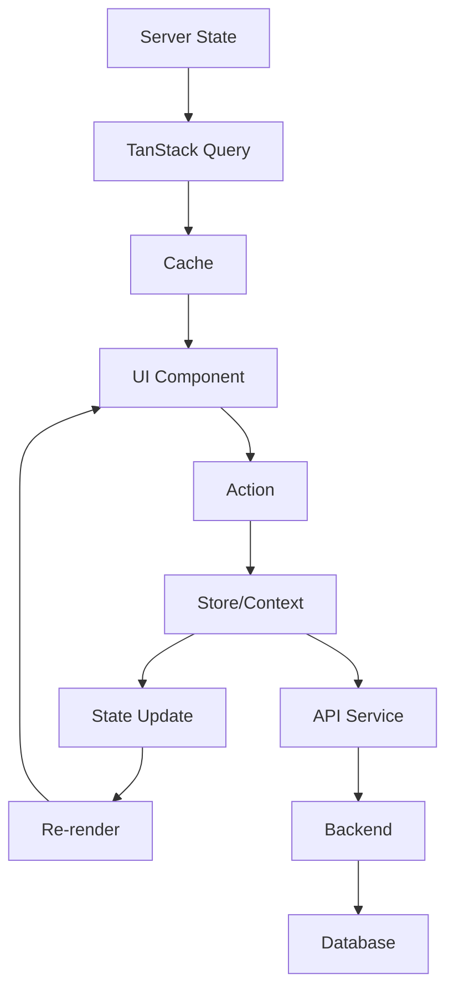

# MIT License
# Autor atual: David Assef
# Descrição: 06 gerenciamento estado
# Data: 07-09-2025

# 🗃️ Gerenciamento de Estado - Frontend ReciboFast

**Autor:** David Assef  
**Data:** 29-08-2025  
**Licença:** MIT License  

## 📋 Visão Geral

Este documento detalha a estratégia de gerenciamento de estado do ReciboFast, incluindo arquitetura, padrões, stores, contextos e sincronização de dados entre cliente e servidor.

## 🏗️ Arquitetura de Estado

### 🎯 **Princípios**

1. **Single Source of Truth** - Estado centralizado e consistente
2. **Imutabilidade** - Estados são imutáveis e atualizados via reducers
3. **Previsibilidade** - Fluxo de dados unidirecional
4. **Separação de Responsabilidades** - Estado local vs global
5. **Performance** - Otimização de re-renders
6. **Persistência** - Estado crítico persistido localmente

### 🔄 **Fluxo de Dados**



## 🏪 Stores Zustand

### 🔐 **Auth Store**

```typescript
// src/stores/auth.ts
import { create } from 'zustand';
import { persist, createJSONStorage } from 'zustand/middleware';
import { immer } from 'zustand/middleware/immer';
import { authService } from '@/services/auth';
import { User, LoginCredentials, RegisterData } from '@/types/auth';

interface AuthState {
  // Estado
  user: User | null;
  token: string | null;
  isAuthenticated: boolean;
  isLoading: boolean;
  error: string | null;
  
  // Ações
  login: (credentials: LoginCredentials) => Promise<void>;
  register: (data: RegisterData) => Promise<void>;
  logout: () => void;
  refreshToken: () => Promise<void>;
  clearError: () => void;
  updateProfile: (data: Partial<User>) => Promise<void>;
  
  // Getters
  isDoctor: () => boolean;
  hasPermission: (permission: string) => boolean;
}

export const useAuthStore = create<AuthState>()()
  persist(
    immer((set, get) => ({
      // Estado inicial
      user: null,
      token: null,
      isAuthenticated: false,
      isLoading: false,
      error: null,
      
      // Ações
      login: async (credentials) => {
        set((state) => {
          state.isLoading = true;
          state.error = null;
        });
        
        try {
          const response = await authService.login(credentials);
          
          set((state) => {
            state.user = response.user;
            state.token = response.token;
            state.isAuthenticated = true;
            state.isLoading = false;
          });
        } catch (error) {
          set((state) => {
            state.error = error instanceof Error ? error.message : 'Erro no login';
            state.isLoading = false;
          });
          throw error;
        }
      },
      
      register: async (data) => {
        set((state) => {
          state.isLoading = true;
          state.error = null;
        });
        
        try {
          const response = await authService.register(data);
          
          set((state) => {
            state.user = response.user;
            state.token = response.token;
            state.isAuthenticated = true;
            state.isLoading = false;
          });
        } catch (error) {
          set((state) => {
            state.error = error instanceof Error ? error.message : 'Erro no registro';
            state.isLoading = false;
          });
          throw error;
        }
      },
      
      logout: () => {
        set((state) => {
          state.user = null;
          state.token = null;
          state.isAuthenticated = false;
          state.error = null;
        });
        
        // Limpar outros stores se necessário
        useReceitasStore.getState().reset();
        useUIStore.getState().reset();
      },
      
      refreshToken: async () => {
        const { token } = get();
        if (!token) return;
        
        try {
          const response = await authService.refreshToken(token);
          
          set((state) => {
            state.token = response.token;
            state.user = response.user;
          });
        } catch (error) {
          // Token inválido, fazer logout
          get().logout();
          throw error;
        }
      },
      
      clearError: () => {
        set((state) => {
          state.error = null;
        });
      },
      
      updateProfile: async (data) => {
        set((state) => {
          state.isLoading = true;
          state.error = null;
        });
        
        try {
          const updatedUser = await authService.updateProfile(data);
          
          set((state) => {
            state.user = updatedUser;
            state.isLoading = false;
          });
        } catch (error) {
          set((state) => {
            state.error = error instanceof Error ? error.message : 'Erro ao atualizar perfil';
            state.isLoading = false;
          });
          throw error;
        }
      },
      
      // Getters
      isDoctor: () => {
        const { user } = get();
        return user?.role === 'doctor';
      },
      
      hasPermission: (permission) => {
        const { user } = get();
        return user?.permissions?.includes(permission) ?? false;
      },
    })),
    {
      name: 'auth-storage',
      storage: createJSONStorage(() => localStorage),
      partialize: (state) => ({
        user: state.user,
        token: state.token,
        isAuthenticated: state.isAuthenticated,
      }),
    }
  )
);
```

### 📋 **Receitas Store**

```typescript
// src/stores/receitas.ts
import { create } from 'zustand';
import { immer } from 'zustand/middleware/immer';
import { receitasService } from '@/services/receitas';
import { Receita, ReceitaFilters, CreateReceitaData } from '@/types/receita';

interface ReceitasState {
  // Estado
  receitas: Receita[];
  selectedReceita: Receita | null;
  filters: ReceitaFilters;
  isLoading: boolean;
  error: string | null;
  pagination: {
    page: number;
    limit: number;
    total: number;
    totalPages: number;
  };
  
  // Ações
  fetchReceitas: (filters?: ReceitaFilters) => Promise<void>;
  createReceita: (data: CreateReceitaData) => Promise<Receita>;
  updateReceita: (id: string, data: Partial<Receita>) => Promise<void>;
  deleteReceita: (id: string) => Promise<void>;
  selectReceita: (receita: Receita | null) => void;
  setFilters: (filters: Partial<ReceitaFilters>) => void;
  setPage: (page: number) => void;
  reset: () => void;
  
  // Getters
  getReceitaById: (id: string) => Receita | undefined;
  getReceitasByStatus: (status: string) => Receita[];
  getTotalByStatus: () => Record<string, number>;
}

const initialState = {
  receitas: [],
  selectedReceita: null,
  filters: {
    status: undefined,
    paciente: '',
    dataInicio: undefined,
    dataFim: undefined,
  },
  isLoading: false,
  error: null,
  pagination: {
    page: 1,
    limit: 10,
    total: 0,
    totalPages: 0,
  },
};

export const useReceitasStore = create<ReceitasState>()()
  immer((set, get) => ({
    ...initialState,
    
    fetchReceitas: async (filters) => {
      set((state) => {
        state.isLoading = true;
        state.error = null;
        if (filters) {
          state.filters = { ...state.filters, ...filters };
        }
      });
      
      try {
        const { filters: currentFilters, pagination } = get();
        const response = await receitasService.getReceitas({
          ...currentFilters,
          page: pagination.page,
          limit: pagination.limit,
        });
        
        set((state) => {
          state.receitas = response.data;
          state.pagination = {
            ...state.pagination,
            total: response.total,
            totalPages: response.totalPages,
          };
          state.isLoading = false;
        });
      } catch (error) {
        set((state) => {
          state.error = error instanceof Error ? error.message : 'Erro ao carregar receitas';
          state.isLoading = false;
        });
      }
    },
    
    createReceita: async (data) => {
      set((state) => {
        state.isLoading = true;
        state.error = null;
      });
      
      try {
        const newReceita = await receitasService.createReceita(data);
        
        set((state) => {
          state.receitas.unshift(newReceita);
          state.isLoading = false;
        });
        
        return newReceita;
      } catch (error) {
        set((state) => {
          state.error = error instanceof Error ? error.message : 'Erro ao criar receita';
          state.isLoading = false;
        });
        throw error;
      }
    },
    
    updateReceita: async (id, data) => {
      set((state) => {
        state.isLoading = true;
        state.error = null;
      });
      
      try {
        const updatedReceita = await receitasService.updateReceita(id, data);
        
        set((state) => {
          const index = state.receitas.findIndex(r => r.id === id);
          if (index !== -1) {
            state.receitas[index] = updatedReceita;
          }
          
          if (state.selectedReceita?.id === id) {
            state.selectedReceita = updatedReceita;
          }
          
          state.isLoading = false;
        });
      } catch (error) {
        set((state) => {
          state.error = error instanceof Error ? error.message : 'Erro ao atualizar receita';
          state.isLoading = false;
        });
        throw error;
      }
    },
    
    deleteReceita: async (id) => {
      set((state) => {
        state.isLoading = true;
        state.error = null;
      });
      
      try {
        await receitasService.deleteReceita(id);
        
        set((state) => {
          state.receitas = state.receitas.filter(r => r.id !== id);
          
          if (state.selectedReceita?.id === id) {
            state.selectedReceita = null;
          }
          
          state.isLoading = false;
        });
      } catch (error) {
        set((state) => {
          state.error = error instanceof Error ? error.message : 'Erro ao excluir receita';
          state.isLoading = false;
        });
        throw error;
      }
    },
    
    selectReceita: (receita) => {
      set((state) => {
        state.selectedReceita = receita;
      });
    },
    
    setFilters: (filters) => {
      set((state) => {
        state.filters = { ...state.filters, ...filters };
        state.pagination.page = 1; // Reset page when filters change
      });
    },
    
    setPage: (page) => {
      set((state) => {
        state.pagination.page = page;
      });
    },
    
    reset: () => {
      set(() => ({ ...initialState }));
    },
    
    // Getters
    getReceitaById: (id) => {
      const { receitas } = get();
      return receitas.find(r => r.id === id);
    },
    
    getReceitasByStatus: (status) => {
      const { receitas } = get();
      return receitas.filter(r => r.status === status);
    },
    
    getTotalByStatus: () => {
      const { receitas } = get();
      return receitas.reduce((acc, receita) => {
        acc[receita.status] = (acc[receita.status] || 0) + 1;
        return acc;
      }, {} as Record<string, number>);
    },
  }))
);
```

---

*Última atualização: 29-08-2025*